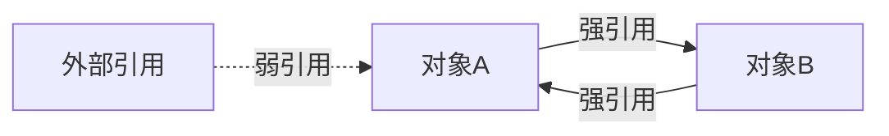

# Python 弱引用

在Python中，对象的内存管理主要依赖引用计数机制。当对象被引用时，其引用计数增加；当引用被删除时，计数减少。当引用计数降为零时，对象会被垃圾回收器回收。然而，这种机制可能导致循环引用问题，而弱引用提供了一种解决方案。

## 什么是弱引用？

弱引用是指不会增加对象引用计数的引用。这意味着，即使一个对象还有弱引用指向它，如果没有强引用（普通引用），该对象仍然可以被垃圾回收。

Python中的弱引用通过`weakref`模块实现，主要有以下特点：

1. 不会阻止对象被垃圾回收
2. 可以检测对象是否已被回收
3. 适用于避免循环引用问题
4. 适合实现缓存和观察者模式等设计模式

## 为什么需要弱引用？

### 循环引用问题

考虑以下代码：

```python
class Node:
    def __init__(self, value):
        self.value = value
        self.next = None

# 创建两个节点
node1 = Node(1)
node2 = Node(2)

# 创建循环引用
node1.next = node2
node2.next = node1

# 删除外部引用
del node1
del node2
```

即使我们删除了`node1`和`node2`的引用，由于它们互相引用，引用计数不会降为零，这两个对象不会被回收，导致内存泄漏。

### 使用弱引用解决循环引用

```python
import weakref

class Node:
    def __init__(self, value):
        self.value = value
        self.next = None

# 创建两个节点
node1 = Node(1)
node2 = Node(2)

# 创建循环引用，但其中一个是弱引用
node1.next = node2
node2.next = weakref.ref(node1)  # 弱引用

# 访问弱引用指向的对象
print(node2.next())  # 输出: <__main__.Node object at 0x...>

# 删除外部引用
del node1

# 现在弱引用指向的对象已被回收
print(node2.next())  # 输出: None
```

:::note
当使用弱引用访问对象时，需要使用()调用弱引用对象，如果原对象已被回收，则返回None。
:::

## Python 弱引用的基本用法

### weakref.ref

`weakref.ref`是创建弱引用最基本的方法：

```python
import weakref

class MyClass:
    def __init__(self, name):
        self.name = name
    
    def __str__(self):
        return f"MyClass({self.name})"

# 创建对象
obj = MyClass("example")

# 创建弱引用
weak_ref = weakref.ref(obj)

# 通过弱引用访问对象
print(weak_ref())  # 输出: MyClass(example)

# 删除原始引用
del obj

# 检查对象是否还存在
print(weak_ref())  # 输出: None
```

### weakref.proxy

`weakref.proxy`创建一个可以直接访问的代理对象：

```python
import weakref

class MyClass:
    def __init__(self, name):
        self.name = name
    
    def say_hello(self):
        return f"Hello, my name is {self.name}"

# 创建对象
obj = MyClass("example")

# 创建弱引用代理
proxy = weakref.proxy(obj)

# 直接通过代理访问对象方法
print(proxy.say_hello())  # 输出: Hello, my name is example

# 删除原始引用
del obj

try:
    # 尝试通过代理访问已删除的对象
    print(proxy.say_hello())
except ReferenceError as e:
    print("对象已被回收")  # 输出: 对象已被回收
```

:::caution
使用`proxy`时，如果原对象已被回收，访问代理会引发`ReferenceError`异常。
:::

### 弱引用集合

Python提供了几种弱引用集合类型：

#### WeakValueDictionary

字典的值是弱引用，当值对象没有强引用时会被自动从字典中移除。

```python
import weakref

class MyClass:
    def __init__(self, name):
        self.name = name

# 创建一个WeakValueDictionary
weak_dict = weakref.WeakValueDictionary()

# 创建一些对象
obj1 = MyClass("Object 1")
obj2 = MyClass("Object 2")

# 将对象添加到字典中
weak_dict['obj1'] = obj1
weak_dict['obj2'] = obj2

print(list(weak_dict.keys()))  # 输出: ['obj1', 'obj2']

# 删除一个原始引用
del obj1

# 对象1已从字典中自动移除
print(list(weak_dict.keys()))  # 输出: ['obj2']
```

#### WeakKeyDictionary

字典的键是弱引用，当键对象没有强引用时会自动从字典中移除。

```python
import weakref

class MyClass:
    def __init__(self, name):
        self.name = name
    
    def __str__(self):
        return f"MyClass({self.name})"

# 创建一个WeakKeyDictionary
weak_key_dict = weakref.WeakKeyDictionary()

# 创建一些对象
obj1 = MyClass("Object 1")
obj2 = MyClass("Object 2")

# 将对象用作字典的键
weak_key_dict[obj1] = "Value for obj1"
weak_key_dict[obj2] = "Value for obj2"

print(len(weak_key_dict))  # 输出: 2

# 删除一个原始引用
del obj1

# obj1作为键的项已从字典中自动移除
print(len(weak_key_dict))  # 输出: 1
```

#### WeakSet

集合中的元素是弱引用，当元素没有强引用时会自动从集合中移除。

```python
import weakref

class MyClass:
    def __init__(self, name):
        self.name = name

# 创建一个WeakSet
weak_set = weakref.WeakSet()

# 创建一些对象
obj1 = MyClass("Object 1")
obj2 = MyClass("Object 2")
obj3 = MyClass("Object 3")

# 将对象添加到集合中
weak_set.add(obj1)
weak_set.add(obj2)
weak_set.add(obj3)

print(len(weak_set))  # 输出: 3

# 删除一个原始引用
del obj2

# obj2已从集合中自动移除
print(len(weak_set))  # 输出: 2
```

## 弱引用的实际应用场景

### 实现缓存系统

使用`WeakValueDictionary`实现一个简单的缓存系统，可以在不再需要时自动释放对象：

```python
import weakref
import time

class DataManager:
    def __init__(self):
        # 使用弱引用字典作为缓存
        self.cache = weakref.WeakValueDictionary()
    
    def get_data(self, key):
        if key in self.cache:
            print(f"从缓存中获取 {key}")
            return self.cache[key]
        
        print(f"从数据源获取 {key}")
        # 模拟从数据源获取数据
        data = self._fetch_from_data_source(key)
        
        # 存入缓存
        self.cache[key] = data
        return data
    
    def _fetch_from_data_source(self, key):
        # 模拟耗时操作
        time.sleep(0.1)
        return f"Data for {key}"

# 使用示例
manager = DataManager()

# 第一次获取数据，从数据源加载
data1 = manager.get_data("key1")
print(data1)

# 再次获取同一数据，从缓存加载
data1_again = manager.get_data("key1")
print(data1_again)

# 创建一个局部变量引用数据
def use_data():
    local_data = manager.get_data("key2")
    print(f"使用数据: {local_data}")

use_data()
# 函数结束后，key2对应的数据没有其他引用，将被自动回收

# 稍等一会儿让垃圾回收器运行
import gc
gc.collect()
time.sleep(0.1)

# 再次获取key2数据，将从数据源重新加载
data2_again = manager.get_data("key2")
print(data2_again)
```

输出：
```
从数据源获取 key1
Data for key1
从缓存中获取 key1
Data for key1
从数据源获取 key2
使用数据: Data for key2
从数据源获取 key2
Data for key2
```

### 观察者模式实现

使用弱引用实现观察者模式，避免观察者和被观察者之间的循环引用：

```python
import weakref

class Subject:
    def __init__(self):
        self._observers = []
    
    def register_observer(self, observer):
        # 存储观察者的弱引用
        self._observers.append(weakref.ref(observer))
    
    def notify_observers(self, message):
        # 通知所有活跃的观察者
        for observer_ref in self._observers[:]:
            observer = observer_ref()
            if observer is None:
                # 如果观察者已被回收，则从列表中移除
                self._observers.remove(observer_ref)
            else:
                observer.update(message)

class Observer:
    def __init__(self, name):
        self.name = name
    
    def update(self, message):
        print(f"观察者 {self.name} 收到消息: {message}")

# 创建主题
subject = Subject()

# 创建观察者
observer1 = Observer("Observer 1")
observer2 = Observer("Observer 2")
observer3 = Observer("Observer 3")

# 注册观察者
subject.register_observer(observer1)
subject.register_observer(observer2)
subject.register_observer(observer3)

# 通知所有观察者
subject.notify_observers("Hello, observers!")

# 删除observer2的引用
del observer2

# 再次通知观察者
subject.notify_observers("Second notification")
```

输出：
```
观察者 Observer 1 收到消息: Hello, observers!
观察者 Observer 2 收到消息: Hello, observers!
观察者 Observer 3 收到消息: Hello, observers!
观察者 Observer 1 收到消息: Second notification
观察者 Observer 3 收到消息: Second notification
```

## 弱引用的限制

并非所有Python对象都可以使用弱引用。基本类型如`int`、`float`、`str`、`tuple`等不支持弱引用：

```python
import weakref

# 这些会引发TypeError
try:
    weak_int = weakref.ref(42)
except TypeError as e:
    print(f"整数不支持弱引用: {e}")

try:
    weak_str = weakref.ref("hello")
except TypeError as e:
    print(f"字符串不支持弱引用: {e}")

# 自定义类的对象支持弱引用
class MyClass:
    pass

obj = MyClass()
weak_obj = weakref.ref(obj)  # 正常工作
print(weak_obj() is obj)  # 输出: True
```

输出：
```
整数不支持弱引用: cannot create weak reference to 'int' object
字符串不支持弱引用: cannot create weak reference to 'str' object
True
```

## 弱引用与垃圾回收的关系

Python的垃圾回收机制主要基于引用计数，但也有循环垃圾收集器来处理循环引用。弱引用提供了一种方式，让对象可以被引用而不增加引用计数：



在上图中，对象A和B之间存在循环引用，但如果其中一个引用是弱引用，当外部引用C被删除时，引用计数会正确地减少，对象可以被回收。

## 总结

弱引用是Python内存管理中的重要工具，它可以：

1. 避免循环引用导致的内存泄漏
2. 实现缓存系统，在对象不再需要时自动释放内存
3. 实现观察者模式等设计模式，避免对象之间的强耦合
4. 帮助实现更灵活的垃圾回收策略

通过使用`weakref`模块，Python开发者可以更精确地控制对象的生命周期，提高程序的内存效率。

## 练习

1. 创建一个使用`WeakValueDictionary`的图像缓存系统，当图像不再被使用时自动从缓存中移除。
2. 使用弱引用实现一个事件系统，允许对象注册和接收事件，但不阻止对象被垃圾回收。
3. 分析一个现有的项目，找出可能存在循环引用的地方，并使用弱引用重构这些部分。

## 额外资源

- [Python官方文档 - weakref模块](https://docs.python.org/3/library/weakref.html)
- [Python垃圾回收机制详解](https://docs.python.org/3/library/gc.html)
- 《Fluent Python》中关于弱引用的章节
- 《Python Cookbook》中的内存管理部分

:::tip
在实际开发中，应谨慎使用弱引用，只在真正需要的地方使用它们。大多数情况下，Python的垃圾回收器已经足够高效，直接使用强引用就足够了。
:::