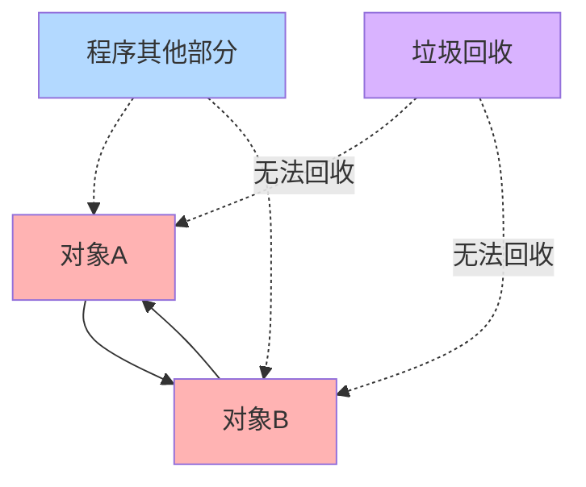

# Python 内存泄漏

## 什么是内存泄漏？

内存泄漏是指程序在运行过程中分配的内存空间未被正确释放，导致这些内存无法被重新使用。尽管Python拥有垃圾回收机制，但仍然可能出现内存泄漏问题，特别是在长时间运行的应用程序中，这可能导致程序性能下降，甚至崩溃。

:::note 内存泄漏的简单定义
当程序不再需要某块内存，但由于某些原因，这块内存没有被释放回系统，我们就说发生了内存泄漏。
:::

## Python 中的内存管理机制简介

在深入探讨内存泄漏之前，让我们先了解Python是如何管理内存的：

1. **引用计数**：Python中的每个对象都有一个引用计数器，记录有多少个引用指向该对象。当引用计数为0时，对象被销毁。
2. **垃圾回收**：处理循环引用的问题，确保即使对象之间相互引用，仍能被正确回收。
3. **内存池**：为小对象预先分配内存块，提高内存分配和释放的效率。

## 常见的Python内存泄漏原因

### 1. 循环引用

当两个或多个对象相互引用，并且都不再被程序其他部分引用时，如果仅依靠引用计数，这些对象将无法被回收。

```python
def create_cycle():
    # 创建两个相互引用的列表
    l1 = []
    l2 = []
    l1.append(l2)
    l2.append(l1)
    
    # 函数结束后，l1和l2虽然相互引用，但Python的垃圾回收器能够识别并回收它们
    # 如果禁用了垃圾回收，则会导致内存泄漏

# 循环引用示例
create_cycle()
```

虽然Python的垃圾回收器能处理上面的简单循环引用，但当涉及自定义类的循环引用时，特别是包含`__del__`方法的类，可能会出现问题：

```python
class Node:
    def __init__(self):
        self.reference = None
    
    def __del__(self):
        print("Deleting node")

# 创建循环引用
node1 = Node()
node2 = Node()
node1.reference = node2
node2.reference = node1

# 删除外部引用
del node1
del node2
# 注意：这里可能会导致内存泄漏，因为__del__方法会阻止垃圾回收器回收循环引用
```

### 2. 全局变量和单例模式

全局变量和单例对象在程序运行期间一直存在，如果它们持续积累数据而不释放，会导致内存泄漏。

```python
# 全局列表不断增长
global_list = []

def add_to_global_list(item):
    global_list.append(item)
    # 如果从不清理global_list，它会不断增长

# 模拟程序运行过程中多次调用
for i in range(1000):
    add_to_global_list("数据" + str(i))
```

### 3. 闭包和函数装饰器

闭包中引用的变量可能会比预期存活更长时间：

```python
def create_multipliers():
    multipliers = []
    
    # 创建5个闭包函数
    for i in range(5):
        def multiplier(x, i=i):  # 使用默认参数避免闭包问题
            return x * i
        multipliers.append(multiplier)
    
    return multipliers

# 生成乘法函数
multipliers = create_multipliers()
print(multipliers[0](10))  # 输出: 0
print(multipliers[1](10))  # 输出: 10
```

如果不使用默认参数`i=i`，所有闭包将引用同一个`i`，这不是内存泄漏，但可能导致意外行为。

### 4. 缓存机制未设置上限

实现缓存但没有设置上限时，可能导致内存不断增长：

```python
# 无限增长的缓存
cache = {}

def compute_with_cache(n):
    if n not in cache:
        # 假设这是一个耗时计算
        cache[n] = n * n
    return cache[n]

# 随着不同输入的增加，cache会不断增长
for i in range(1000000):
    compute_with_cache(i)
```

### 5. 大型对象未及时释放

处理大型数据结构时，如果不及时释放，会占用大量内存：

```python
def process_large_file(filename):
    # 读取大文件到内存
    with open(filename, 'r') as f:
        content = f.read()  # 整个文件加载到内存
    
    # 处理数据
    result = content.count('python')
    
    # 此处content仍在内存中
    return result

# 更好的方式是按行处理
def process_large_file_by_line(filename):
    count = 0
    with open(filename, 'r') as f:
        for line in f:  # 一次只处理一行
            count += line.count('python')
    return count
```

## 如何检测内存泄漏

### 1. 使用`tracemalloc`模块

Python 3.4+ 内置的`tracemalloc`模块可以跟踪Python对象的内存分配：

```python
import tracemalloc

# 开始跟踪内存分配
tracemalloc.start()

# 运行代码
def potential_leak():
    big_list = [0] * 1000000
    return "函数结束"

result = potential_leak()

# 获取当前内存快照
snapshot = tracemalloc.take_snapshot()
top_stats = snapshot.statistics('lineno')

# 输出内存使用情况
print("[ 内存使用Top 10 ]")
for stat in top_stats[:10]:
    print(stat)
```

### 2. 使用第三方库

`memory_profiler`是一个流行的Python内存分析工具：

```python
# 需要先安装: pip install memory_profiler
from memory_profiler import profile

@profile
def potential_leak():
    big_list = [0] * 1000000
    return "函数结束"

potential_leak()
```

执行时会显示代码每行的内存使用情况。

### 3. 使用`gc`模块

内置的`gc`模块可以帮助我们找到对象之间的引用：

```python
import gc

# 创建循环引用
a = {}
b = {}
a['b'] = b
b['a'] = a

# 移除引用
del a
del b

# 强制垃圾回收
gc.collect()

# 检查不可达但未回收的对象
print(gc.garbage)
```

## 实际案例：Web应用中的内存泄漏

假设我们有一个简单的Flask Web应用，用于记录用户访问：

```python
from flask import Flask, request

app = Flask(__name__)

# 这里存在潜在内存泄漏问题
all_requests = []

@app.route('/')
def index():
    # 记录每个请求
    request_info = {
        'ip': request.remote_addr,
        'path': request.path,
        'user_agent': request.user_agent.string,
        'time': request.time
    }
    all_requests.append(request_info)
    
    return f"已记录 {len(all_requests)} 个请求"

if __name__ == '__main__':
    app.run()
```

**问题**：随着请求数量增加，`all_requests`列表会无限增长，最终导致内存耗尽。

**解决方案**：

```python
from flask import Flask, request
from collections import deque

app = Flask(__name__)

# 使用固定大小的deque来保存最近的请求
max_requests = 1000
recent_requests = deque(maxlen=max_requests)

@app.route('/')
def index():
    request_info = {
        'ip': request.remote_addr,
        'path': request.path,
        'user_agent': request.user_agent.string,
        'time': request.time
    }
    recent_requests.append(request_info)
    
    return f"已记录 {len(recent_requests)} 个请求（最多保存 {max_requests} 个）"

if __name__ == '__main__':
    app.run()
```

这个改进版本使用了`deque`并设置了最大长度，确保内存使用不会无限增长。

## 如何避免内存泄漏

1. **及时释放引用**：使用完大型对象后，将其设置为`None`。
2. **使用弱引用**：当需要引用对象但不想增加引用计数时，使用`weakref`模块。
3. **限制缓存大小**：使用`functools.lru_cache`或设置缓存上限。
4. **注意循环引用**：特别是在定义了`__del__`方法的类中。
5. **分块处理数据**：处理大型数据时，采用流式或迭代方式，避免一次性加载全部数据。
6. **定期监控内存使用**：在长时间运行的应用中，定期检查内存使用情况。

```python
# 使用弱引用示例
import weakref

class Resource:
    def __init__(self, name):
        self.name = name
    
    def __del__(self):
        print(f"资源 {self.name} 被释放")

# 创建资源
resource = Resource("数据库连接")

# 创建弱引用
weak_ref = weakref.ref(resource)

# 访问原对象
print(weak_ref().name if weak_ref() else "资源已释放")  # 输出: 数据库连接

# 移除原引用
del resource

# 再次尝试访问
print(weak_ref().name if weak_ref() else "资源已释放")  # 输出: 资源已释放
```

## 内存泄漏的模式可视化

可以使用以下图表直观展示内存泄漏随时间的增长：


典型的循环引用内存泄漏模式：



## 总结

尽管Python有自动垃圾回收机制，内存泄漏仍可能发生，特别是在以下情况：

- 循环引用（尤其是包含`__del__`方法的类）
- 全局变量无限增长
- 缓存未设上限
- 闭包不当使用
- 大型对象未及时释放

检测和解决内存泄漏需要使用适当的工具（如`tracemalloc`、`memory_profiler`）和良好的编程习惯。理解Python内存管理机制是避免内存泄漏的关键。

## 练习

1. 创建一个故意引入内存泄漏的程序，然后使用`tracemalloc`检测它。
2. 修改以下代码以避免潜在的内存泄漏：
   ```python
   results = {}
   
   def compute_factorial(n):
       if n not in results:
           if n <= 1:
               results[n] = 1
           else:
               results[n] = n * compute_factorial(n-1)
       return results[n]
   
   # 计算1000个阶乘
   for i in range(1000):
       compute_factorial(i)
   ```
3. 使用`weakref`模块重写一个包含循环引用的例子。

## 额外资源

- Python官方文档：[垃圾回收](https://docs.python.org/zh-cn/3/library/gc.html)
- Python内存管理深度解析：[Python内存管理](https://realpython.com/python-memory-management/)
- 调试工具：[memory_profiler](https://pypi.org/project/memory-profiler/)和[objgraph](https://mg.pov.lt/objgraph/)

:::tip 实用建议
在开发长时间运行的应用（如Web服务器、数据处理管道）时，定期进行内存使用监控是个好习惯。这可以帮助你及早发现潜在的内存泄漏问题。
:::