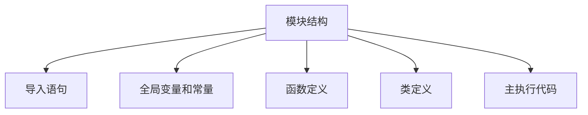

# Python 模块基础

## 什么是Python模块？

在Python编程中，随着你的程序越来越大，将代码拆分成多个文件是很有必要的。这些文件就是我们所说的**模块**。

模块是包含Python定义和语句的文件，文件名就是模块名加上`.py`后缀。模块让我们能够：

- 将相关的代码组织在一起
- 避免命名冲突
- 重用代码
- 控制代码的可见性和访问权限

:::tip 小提示
将代码分成模块不仅使代码更有条理，还能提高代码的可维护性和可重用性！
:::

## 创建你的第一个模块

创建一个Python模块非常简单。只需创建一个以`.py`结尾的Python文件，其中包含你想要封装的函数、类或变量。

让我们创建一个简单的模块示例：

1. 创建一个名为`mymath.py`的文件，其中包含一些基本的数学函数：

```python
# mymath.py
def add(a, b):
    """返回两个数的和"""
    return a + b

def subtract(a, b):
    """返回两个数的差"""
    return a - b

def multiply(a, b):
    """返回两个数的积"""
    return a * b

def divide(a, b):
    """返回两个数的商"""
    if b == 0:
        raise ValueError("除数不能为零")
    return a / b

# 定义一个常量
PI = 3.14159
```

现在，你已经创建了名为`mymath`的模块，它包含四个函数和一个常量。

## 导入和使用模块

### 基本导入

创建模块后，可以在其他Python程序中导入并使用它。导入模块的最基本方式是使用`import`语句：

```python
import mymath

# 使用模块中的函数
result1 = mymath.add(5, 3)      # 结果: 8
result2 = mymath.subtract(10, 4)  # 结果: 6
print(f"5 + 3 = {result1}")
print(f"10 - 4 = {result2}")
print(f"圆周率的近似值是 {mymath.PI}")
```

输出:
```
5 + 3 = 8
10 - 4 = 6
圆周率的近似值是 3.14159
```

### 从模块导入特定内容

如果你只需要模块中的某些特定函数或变量，可以使用`from ... import ...`语句：

```python
from mymath import add, PI

# 直接使用导入的函数和变量，无需模块名前缀
result = add(7, 2)  # 结果: 9
print(f"7 + 2 = {result}")
print(f"圆周率的近似值是 {PI}")

# 注意：subtract函数没有被导入，以下代码会引发错误
# result2 = subtract(10, 5)  # NameError: name 'subtract' is not defined
```

输出:
```
7 + 2 = 9
圆周率的近似值是 3.14159
```

### 导入全部内容

你可以使用`from ... import *`导入模块中的所有内容：

```python
from mymath import *

# 可以直接使用模块中的所有函数和变量
print(add(5, 5))        # 结果: 10
print(subtract(9, 3))   # 结果: 6
print(multiply(4, 3))   # 结果: 12
print(divide(8, 2))     # 结果: 4.0
print(PI)               # 结果: 3.14159
```

:::caution 警告
虽然`from module import *`很方便，但它可能导致命名冲突，并使代码难以理解。在实际开发中，最好明确导入你需要的内容或使用常规的`import module`语法。
:::

### 使用别名

如果模块名太长或者与现有名称冲突，可以使用别名：

```python
import mymath as mm

result = mm.add(10, 20)  # 结果: 30
print(f"10 + 20 = {result}")
```

输出:
```
10 + 20 = 30
```

## 模块的搜索路径

当你导入模块时，Python会按照以下顺序在各个位置查找模块：

1. 当前目录
2. 环境变量PYTHONPATH中列出的目录
3. Python的默认安装路径

你可以通过以下代码查看当前Python的搜索路径：

```python
import sys
print(sys.path)
```

## 模块的`__name__`属性

每个Python模块都有一个特殊的属性`__name__`。当模块被直接运行时，`__name__`被设置为`"__main__"`；而当模块被导入时，`__name__`被设置为模块的名称。

这个特性使我们能够确定模块是被直接运行还是被导入：

```python
# testmodule.py
def test_function():
    print("测试函数被调用")

print(f"模块的__name__是: {__name__}")

if __name__ == "__main__":
    print("此模块正在被直接运行")
    test_function()
else:
    print("此模块被导入到其他文件中")
```

如果直接运行`testmodule.py`，输出将是：
```
模块的__name__是: __main__
此模块正在被直接运行
测试函数被调用
```

如果从另一个文件导入`testmodule`：
```python
import testmodule
```

输出将是：
```
模块的__name__是: testmodule
此模块被导入到其他文件中
```

:::note
利用`if __name__ == "__main__"`的模式，我们可以让模块既能作为程序独立运行，又能被导入到其他模块中使用。
:::

## 模块内部结构和最佳实践

一个良好组织的模块通常包含以下几个部分：



### 示例：一个结构良好的模块

```python
# geometry.py - 处理几何计算的模块

# 1. 导入语句
import math

# 2. 全局变量和常量
PI = math.pi
DEFAULT_PRECISION = 2

# 3. 函数定义
def circle_area(radius):
    """计算圆的面积"""
    return PI * radius ** 2

def circle_circumference(radius):
    """计算圆的周长"""
    return 2 * PI * radius

def rectangle_area(length, width):
    """计算矩形的面积"""
    return length * width

# 4. 类定义
class Point:
    def __init__(self, x, y):
        self.x = x
        self.y = y
    
    def distance_to_origin(self):
        """计算点到原点的距离"""
        return math.sqrt(self.x ** 2 + self.y ** 2)
    
    def distance_to_point(self, other_point):
        """计算到另一点的距离"""
        dx = self.x - other_point.x
        dy = self.y - other_point.y
        return math.sqrt(dx ** 2 + dy ** 2)

# 5. 主执行代码
if __name__ == "__main__":
    # 测试代码
    print(f"圆周率: {PI}")
    print(f"半径为5的圆的面积: {circle_area(5)}")
    
    p1 = Point(3, 4)
    print(f"点(3, 4)到原点的距离: {p1.distance_to_origin()}")
```

## 实际案例：文件处理模块

下面是一个实际案例，展示了如何创建和使用一个文件处理模块：

```python
# fileutils.py - 文件处理工具模块

import os
import shutil
from datetime import datetime

def get_file_size(file_path):
    """返回文件大小（字节）"""
    if not os.path.exists(file_path):
        raise FileNotFoundError(f"文件不存在: {file_path}")
    return os.path.getsize(file_path)

def get_extension(file_path):
    """获取文件扩展名"""
    return os.path.splitext(file_path)[1]

def create_backup(file_path):
    """创建文件备份，添加时间戳"""
    if not os.path.exists(file_path):
        raise FileNotFoundError(f"文件不存在: {file_path}")
    
    timestamp = datetime.now().strftime("%Y%m%d_%H%M%S")
    filename, ext = os.path.splitext(file_path)
    backup_path = f"{filename}_backup_{timestamp}{ext}"
    
    shutil.copy2(file_path, backup_path)
    return backup_path

def count_lines(file_path):
    """计算文件行数"""
    if not os.path.exists(file_path):
        raise FileNotFoundError(f"文件不存在: {file_path}")
    
    with open(file_path, 'r', encoding='utf-8') as file:
        return sum(1 for _ in file)
```

使用这个模块的代码示例：

```python
import fileutils

try:
    # 获取Python文件的信息
    python_file = "example.py"
    
    print(f"文件大小: {fileutils.get_file_size(python_file)} 字节")
    print(f"文件扩展名: {fileutils.get_extension(python_file)}")
    print(f"文件行数: {fileutils.count_lines(python_file)}")
    
    # 创建备份
    backup_file = fileutils.create_backup(python_file)
    print(f"已创建备份: {backup_file}")
    
except FileNotFoundError as e:
    print(f"错误: {e}")
except Exception as e:
    print(f"发生未知错误: {e}")
```

## 总结

Python模块是组织和重用代码的强大工具。在本教程中，我们学习了：

- 什么是Python模块，以及它们为何如此重要
- 如何创建自己的模块
- 不同的导入模块方式
- 模块的搜索路径
- `__name__`属性的作用
- 模块的结构和最佳实践
- 实际案例中模块的应用

通过将代码组织成模块，你可以使你的Python程序更加模块化、可维护和可重用。

## 练习

为了巩固你对Python模块的理解，尝试以下练习：

1. 创建一个名为`stringutils.py`的模块，包含以下函数：
   - `reverse(text)`: 返回反转后的字符串
   - `count_vowels(text)`: 计算字符串中元音字母的数量
   - `is_palindrome(text)`: 检查字符串是否为回文（忽略大小写和空格）

2. 创建另一个Python文件，导入你的`stringutils`模块并测试其功能。

3. 修改`stringutils.py`，添加一个在直接运行时执行的测试用例。

:::tip 进一步学习
学习完模块基础后，你可以进一步探索Python的包系统，它允许你以层次结构组织多个模块。
:::