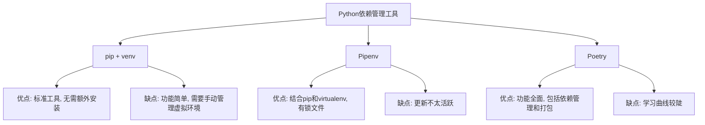

# Python 依赖管理

## 什么是依赖管理？

在开发Python项目时，我们经常需要使用各种第三方库和框架来加速开发过程。这些外部库就是我们项目的"依赖"。随着项目规模的增长，依赖的数量会逐渐增加，如何有效地管理这些依赖就成了一个重要问题。

依赖管理指的是控制和组织项目外部依赖的过程，包括安装、更新、删除和隔离这些依赖。良好的依赖管理可以帮助我们：

- 确保开发环境与生产环境一致
- 避免依赖版本冲突
- 简化项目的分发和部署
- 使团队成员能够快速搭建相同的开发环境

## pip：Python的包管理器

pip是Python的标准包管理工具，它允许你下载和安装来自Python包索引(PyPI)的包。

### 基本使用

以下是pip的一些基本命令：

```bash
# 安装包
pip install package-name

# 安装特定版本的包
pip install package-name==1.0.0

# 升级包
pip install --upgrade package-name

# 卸载包
pip uninstall package-name

# 列出已安装的包
pip list

# 查看特定包的详细信息
pip show package-name
```

### requirements.txt

`requirements.txt`文件是记录项目所有依赖的标准方式。它是一个文本文件，每行包含一个依赖及其版本要求。

例如，一个典型的requirements.txt可能如下所示：

```
flask==2.0.1
requests>=2.25.0
pandas
numpy==1.20.3
```

你可以使用以下命令生成requirements.txt：

```bash
pip freeze > requirements.txt
```

要根据requirements.txt安装依赖：

```bash
pip install -r requirements.txt
```

:::tip
在团队协作开发中，将`requirements.txt`文件添加到版本控制系统（如Git）中，可以帮助所有开发人员保持一致的开发环境。
:::

## 虚拟环境：隔离你的项目依赖

虚拟环境是一种隔离的Python环境，它可以拥有自己的依赖包和Python解释器。使用虚拟环境可以避免全局Python环境中的依赖冲突问题。

### venv：Python标准库中的虚拟环境工具

自Python 3.3起，Python在标准库中包含了venv模块：

```bash
# 创建虚拟环境
python -m venv myenv

# 激活虚拟环境（Windows）
myenv\Scripts\activate

# 激活虚拟环境（Linux/MacOS）
source myenv/bin/activate

# 退出虚拟环境
deactivate
```

激活虚拟环境后，你安装的所有包都将只在这个环境中可用。

### virtualenv：功能更强大的虚拟环境工具

virtualenv是venv的前身，提供了更多功能：

```bash
# 安装virtualenv
pip install virtualenv

# 创建虚拟环境
virtualenv myenv

# 激活和退出方式与venv相同
```

## 现代Python依赖管理工具

### Pipenv：结合pip和virtualenv的工具

Pipenv是一个更现代的依赖管理工具，它自动处理虚拟环境的创建和依赖管理。

```bash
# 安装Pipenv
pip install pipenv

# 在项目中安装依赖
pipenv install requests

# 安装开发依赖
pipenv install pytest --dev

# 激活虚拟环境
pipenv shell

# 运行命令（无需激活虚拟环境）
pipenv run python main.py
```

Pipenv使用`Pipfile`和`Pipfile.lock`来替代传统的requirements.txt：

- `Pipfile`：人类可读的依赖声明
- `Pipfile.lock`：确保可重现安装的锁文件，包含确切的版本和依赖的哈希值

### Poetry：现代Python包和依赖管理工具

Poetry是一个全面的依赖管理和打包工具：

```bash
# 安装Poetry
pip install poetry

# 创建新项目
poetry new my-project

# 添加依赖
poetry add requests

# 添加开发依赖
poetry add pytest --dev

# 激活虚拟环境
poetry shell

# 运行命令
poetry run python main.py
```

Poetry使用`pyproject.toml`文件来配置项目和管理依赖，这是Python官方推荐的项目配置方式。

## 实际案例：使用依赖管理工具开发Web应用

假设我们要开发一个使用Flask框架的Web应用。以下是使用不同工具管理依赖的方法：

### 使用pip和venv

```bash
# 创建并激活虚拟环境
python -m venv flask_app_env
source flask_app_env/bin/activate  # Linux/Mac
# 或 flask_app_env\Scripts\activate  # Windows

# 安装依赖
pip install flask flask-sqlalchemy gunicorn

# 保存依赖
pip freeze > requirements.txt
```

### 使用Pipenv

```bash
# 初始化项目
mkdir flask_app && cd flask_app
pipenv install flask flask-sqlalchemy gunicorn

# Pipenv会自动创建虚拟环境并生成Pipfile和Pipfile.lock
```

### 使用Poetry

```bash
# 创建新项目
poetry new flask_app
cd flask_app

# 添加依赖
poetry add flask flask-sqlalchemy gunicorn
```

## 依赖管理最佳实践

1. **总是使用虚拟环境**：无论项目大小，都应该使用隔离的虚拟环境。

2. **指定精确的版本**：尽量在依赖声明中指定精确版本或版本范围，避免意外升级带来的问题。

3. **使用锁文件**：锁文件（如Pipfile.lock或poetry.lock）可以确保在所有环境中安装完全相同的依赖版本。

4. **区分生产和开发依赖**：将测试工具、代码检查工具等仅在开发时需要的包标记为开发依赖。

5. **定期更新依赖**：定期更新依赖可以获得安全补丁和新功能，但要小心测试更新后的应用。

6. **使用依赖扫描工具**：使用如Safety或Dependabot等工具来检测依赖中的安全漏洞。

## 各工具的对比

下面的表格总结了各个依赖管理工具的特点：



## 总结

依赖管理是Python项目开发中不可或缺的一部分。从基本的pip和venv，到更现代化的Pipenv和Poetry，这些工具都旨在帮助开发者有效管理项目依赖。

选择哪种工具取决于你的项目需求和团队偏好：
- 对于小型项目或个人项目，pip+venv可能已经足够
- 中等规模项目可以考虑Pipenv
- 大型或需要发布为包的项目可以使用Poetry

无论选择哪种工具，重要的是建立一个一致的依赖管理流程，保证项目的可重现性和可维护性。

## 练习

1. 创建一个虚拟环境，并在其中安装Flask和Requests库。然后，生成一个requirements.txt文件。

2. 使用Pipenv创建一个新的Python项目，添加一些依赖，并尝试使用`pipenv graph`命令查看依赖关系图。

3. 如果你已经有一个使用requirements.txt的项目，尝试将其转换为使用Poetry管理依赖。

## 额外资源

- [pip官方文档](https://pip.pypa.io/)
- [Python虚拟环境官方指南](https://docs.python.org/3/tutorial/venv.html)
- [Pipenv文档](https://pipenv.pypa.io/)
- [Poetry文档](https://python-poetry.org/docs/)
- [PyPI - Python包索引](https://pypi.org/)

:::note
依赖管理是一项重要技能，会随着你的Python开发经验增长而变得越来越重要。开始可能只需要基本的pip命令，但随着项目复杂度增加，掌握更高级的工具将帮助你更有效地管理项目。
:::