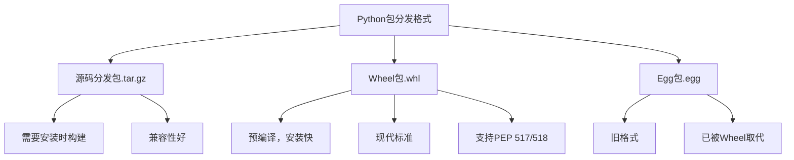

# Python Wheel文件

## 什么是Python Wheel文件？

Wheel是Python的一种打包格式，文件扩展名为`.whl`。它是Python包分发的新标准，旨在替代传统的`.tar.gz`源码分发方式。Wheel本质上是一个ZIP格式文件，但遵循特定的命名约定和内部结构。

:::tip
Wheel的名称来源于奶酪轮（cheese wheel），这是对Python包索引PyPI（Python Package Index，曾被非正式地称为"Cheese Shop"）的致敬。
:::

## 为什么使用Wheel？

相比传统的源码分发方式，Wheel有以下显著优势：

1. **安装速度更快**：Wheel是预编译的包格式，无需在安装时再次构建
2. **一致性更好**：消除了不同环境下构建差异导致的问题
3. **依赖处理更简单**：明确声明依赖关系，避免安装时的冲突
4. **支持二进制分发**：可以包含预编译的二进制文件，简化C扩展的分发
5. **更安全**：提供内置的签名和验证机制

## Wheel文件的命名规则

Wheel文件的命名遵循一个特定的格式：
```
{distribution}-{version}(-{build tag})?-{python tag}-{abi tag}-{platform tag}.whl
```

例如：
```
numpy-1.20.3-cp39-cp39-win_amd64.whl
```

这表示：
- `numpy`: 包名
- `1.20.3`: 版本号
- `cp39`: 兼容Python 3.9
- `cp39`: 使用C API的Python 3.9 ABI
- `win_amd64`: 适用于Windows 64位平台

## 使用Wheel

### 安装Wheel

首先确保你有最新版的pip：

```bash
pip install --upgrade pip
```

然后可以从PyPI安装包：

```bash
pip install some-package
```

现代版本的pip会优先选择Wheel格式（如果可用）。

你也可以直接安装一个下载好的wheel文件：

```bash
pip install some-package-1.0-py3-none-any.whl
```

### Wheel的兼容性

Wheel文件名中的标签指示了兼容性：

- **通用Wheel**: `py3-none-any.whl` 适用于任何Python 3版本和平台
- **特定Python版本**: `cp39-cp39-win_amd64.whl` 只适用于特定Python版本和平台

## 创建自己的Wheel包

### 准备工作

首先安装必要的工具：

```bash
pip install wheel setuptools build
```

### 项目结构

一个典型的可打包Python项目结构如下：

```
project_root/
├── setup.py
├── setup.cfg (可选)
├── pyproject.toml (推荐)
├── README.md
├── LICENSE
└── your_package/
    ├── __init__.py
    └── module.py
```

### 配置文件

**setup.py (基本配置):**

```python
from setuptools import setup, find_packages

setup(
    name="your-package",
    version="0.1.0",
    description="A simple example package",
    author="Your Name",
    author_email="your.email@example.com",
    packages=find_packages(),
    classifiers=[
        "Programming Language :: Python :: 3",
        "License :: OSI Approved :: MIT License",
        "Operating System :: OS Independent",
    ],
    python_requires=">=3.6",
)
```

**更现代的方式是使用pyproject.toml:**

```toml
[build-system]
requires = ["setuptools>=42", "wheel"]
build-backend = "setuptools.build_meta"

[project]
name = "your-package"
version = "0.1.0"
description = "A simple example package"
authors = [{name = "Your Name", email = "your.email@example.com"}]
requires-python = ">=3.6"
classifiers = [
    "Programming Language :: Python :: 3",
    "License :: OSI Approved :: MIT License",
    "Operating System :: OS Independent",
]
```

### 构建Wheel包

使用Python的build模块构建（推荐）:

```bash
python -m build
```

这将在`dist/`目录下创建源码分发包和wheel包。

或使用传统方式:

```bash
python setup.py bdist_wheel
```

## 实际案例：创建一个简单的数学工具包

假设我们要创建一个名为`mathtools`的简单数学工具包，提供基本数学操作。

### 步骤1：创建项目结构

```
mathtools/
├── pyproject.toml
├── README.md
└── mathtools/
    ├── __init__.py
    └── calculator.py
```

### 步骤2：编写代码

**mathtools/\_\_init\_\_.py**
```python
from .calculator import add, subtract, multiply, divide

__version__ = "0.1.0"
```

**mathtools/calculator.py**
```python
def add(a, b):
    """Add two numbers."""
    return a + b

def subtract(a, b):
    """Subtract b from a."""
    return a - b

def multiply(a, b):
    """Multiply two numbers."""
    return a * b

def divide(a, b):
    """Divide a by b."""
    if b == 0:
        raise ValueError("Cannot divide by zero")
    return a / b
```

### 步骤3：配置包元数据

**pyproject.toml**
```toml
[build-system]
requires = ["setuptools>=42", "wheel"]
build-backend = "setuptools.build_meta"

[project]
name = "mathtools"
version = "0.1.0"
description = "Simple math utilities"
readme = "README.md"
authors = [{name = "Your Name", email = "your.email@example.com"}]
requires-python = ">=3.6"
classifiers = [
    "Programming Language :: Python :: 3",
    "License :: OSI Approved :: MIT License",
    "Operating System :: OS Independent",
]
```

### 步骤4：构建wheel包

```bash
python -m build
```

### 步骤5：安装和测试

```bash
pip install dist/mathtools-0.1.0-py3-none-any.whl
```

**使用示例:**
```python
import mathtools

print(mathtools.add(5, 3))  # 输出: 8
print(mathtools.multiply(4, 2))  # 输出: 8
```

## Wheel vs 其他打包格式

Wheel与其他Python打包格式的对比：



:::caution
Egg格式现已被认为是过时的，应优先使用Wheel格式。
:::

## 常见问题解答

### 为什么我的包安装很慢？
如果包没有提供Wheel，pip会从源码构建，这通常比直接安装Wheel慢很多。特别是对于含有C扩展的包。

### 如何检查一个包是否有Wheel？
可以在PyPI页面查看该包是否提供了Wheel文件，或者使用`pip index versions package-name`命令。

### 如何创建纯平台的Wheel？
添加`--plat-name`选项：
```bash
python setup.py bdist_wheel --plat-name=win-amd64
```

## 总结

Wheel文件是Python的现代打包标准，提供了比传统源码分发更快、更可靠的安装体验。作为Python程序员，理解和使用Wheel可以:

1. 加速依赖项安装
2. 简化项目分发过程
3. 提高包的兼容性和可靠性
4. 改善最终用户的安装体验

## 练习

1. 安装并探索一个流行的Python包（如`requests`），观察pip是否下载了wheel文件
2. 为一个简单的自建项目创建wheel包并安装测试
3. 尝试为不同Python版本创建兼容的wheel包

## 延伸资源

- [Python Packaging User Guide](https://packaging.python.org/)
- [PEP 427 – The Wheel Binary Package Format](https://peps.python.org/pep-0427/)
- [pip documentation](https://pip.pypa.io/)
- [setuptools documentation](https://setuptools.pypa.io/)

通过掌握Wheel文件，你将能更有效地管理Python项目的依赖和分发，这是成为熟练Python开发者的重要一步。