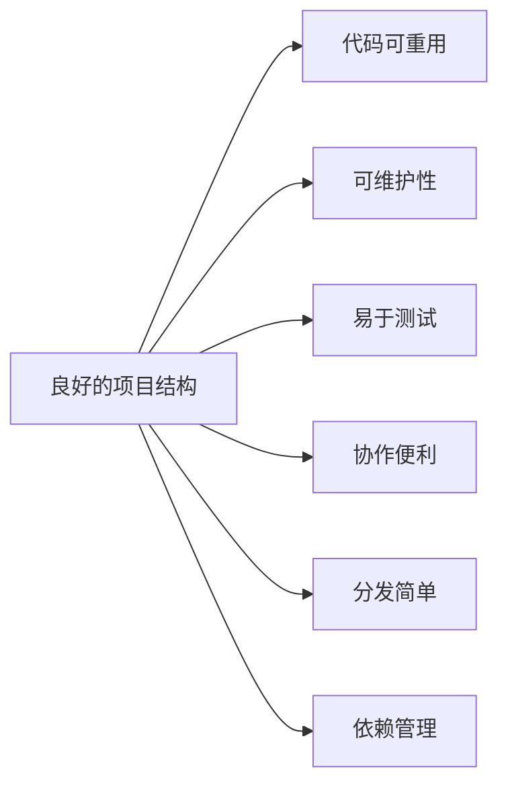

# Python 项目结构

当你开始使用Python开发更大型的应用程序时，如何组织你的代码文件变得至关重要。一个良好的项目结构不仅可以提高代码的可读性和可维护性，还能简化团队协作过程。本文将介绍Python项目结构的基础知识，帮助你从简单脚本过渡到结构化的项目开发。

## 为什么项目结构很重要？

在开始学习Python时，我们通常只需编写单个`.py`文件来完成任务。然而，随着项目规模的扩大，这种方法很快就会变得难以管理。良好的项目结构提供以下好处：

- **可维护性**：代码组织清晰，更容易维护和更新
- **可重用性**：模块化设计使代码能在不同项目中重用
- **可扩展性**：更容易添加新功能而不破坏现有功能
- **协作**：团队成员可以同时处理不同模块
- **测试**：结构化项目更容易编写和运行测试

## 基础项目结构

最简单的Python项目可能包含以下基本结构：

```
my_project/
├── README.md
├── setup.py
├── my_package/
│   ├── __init__.py
│   ├── module1.py
│   └── module2.py
└── tests/
    ├── __init__.py
    ├── test_module1.py
    └── test_module2.py
```

让我们解释这个结构的各个部分：

### README.md

`README.md` 是项目的门面，应该包含：
- 项目描述
- 安装说明
- 使用示例
- 贡献指南
- 许可信息

### setup.py

`setup.py` 文件是Python包的安装脚本，使用`setuptools`库使包可安装：

```python
from setuptools import setup, find_packages

setup(
    name="my_package",
    version="0.1.0",
    author="Your Name",
    author_email="your.email@example.com",
    description="A short description of your package",
    packages=find_packages(),
    install_requires=[
        "numpy>=1.18.0",
        "pandas>=1.0.0",
    ],
)
```

### my_package/

这是存放实际代码的主包目录：

- **`__init__.py`**: 这个文件（即使为空）告诉Python该目录应被视为一个包
- **`module1.py`, `module2.py`**: 包含实际代码的模块文件

### tests/

`tests/` 目录包含所有测试代码，通常使用如`pytest`或`unittest`等框架。

## 高级项目结构

对于更复杂的项目，你可能需要更丰富的目录结构：

```
complex_project/
├── README.md
├── setup.py
├── requirements.txt
├── docs/
│   ├── conf.py
│   └── index.rst
├── my_package/
│   ├── __init__.py
│   ├── core/
│   │   ├── __init__.py
│   │   └── models.py
│   ├── utils/
│   │   ├── __init__.py
│   │   └── helpers.py
│   └── cli.py
├── tests/
│   ├── __init__.py
│   ├── test_models.py
│   └── test_helpers.py
├── examples/
│   └── demo.py
└── data/
    ├── raw/
    └── processed/
```

这个结构包含了以下额外元素：

- **`requirements.txt`**: 列出项目依赖的包
- **`docs/`**: 项目文档
- **子包目录** (`core/`, `utils/`): 组织相关模块
- **`cli.py`**: 命令行接口
- **`examples/`**: 使用示例
- **`data/`**: 项目数据

## \_\_init\_\_.py 文件的作用

`__init__.py` 文件在项目结构中扮演着关键角色：

1. **将目录标记为包**：即使是空文件，也告诉Python这是一个包
2. **公开API**：控制使用 `from package import *` 时导入的内容
3. **自动执行代码**：包被导入时会执行此文件
4. **提供包级文档**：可以包含包的文档字符串

### 示例：使用 \_\_init\_\_.py 控制导入

```python
# my_package/__init__.py
from .module1 import useful_function
from .module2 import AnotherClass

__all__ = ['useful_function', 'AnotherClass']
```

这样，用户可以直接从包导入这些组件：

```python
from my_package import useful_function
# 而不是
# from my_package.module1 import useful_function
```

## 实际案例：数据分析项目

让我们看一个数据分析项目的实例结构：

```
data_analysis_project/
├── README.md
├── setup.py
├── requirements.txt
├── data_analyzer/
│   ├── __init__.py
│   ├── data/
│   │   ├── __init__.py
│   │   ├── loader.py
│   │   └── cleaner.py
│   ├── analysis/
│   │   ├── __init__.py
│   │   ├── statistics.py
│   │   └── visualization.py
│   └── utils/
│       ├── __init__.py
│       └── helpers.py
├── tests/
│   ├── test_loader.py
│   ├── test_cleaner.py
│   └── test_statistics.py
├── notebooks/
│   └── exploratory_analysis.ipynb
└── data/
    ├── raw/
    │   └── dataset.csv
    └── processed/
        └── clean_dataset.csv
```

### 使用示例

假设我们要创建一个数据加载和分析的小应用：

```python
# data_analyzer/data/loader.py
import pandas as pd

def load_data(filepath):
    """Load data from a CSV file."""
    return pd.read_csv(filepath)

def get_sample(data, n=5):
    """Return a sample of n rows."""
    return data.sample(n)
```

```python
# data_analyzer/data/cleaner.py
import pandas as pd
import numpy as np

def remove_nulls(df):
    """Remove rows with null values."""
    return df.dropna()

def normalize_column(df, column):
    """Normalize values in a column."""
    df[column] = (df[column] - df[column].mean()) / df[column].std()
    return df
```

```python
# data_analyzer/analysis/statistics.py
def describe_dataset(df):
    """Return summary statistics of the dataset."""
    return df.describe()

def correlation_matrix(df):
    """Calculate correlation matrix between numerical columns."""
    return df.corr()
```

```python
# data_analyzer/__init__.py
from .data.loader import load_data, get_sample
from .data.cleaner import remove_nulls, normalize_column
from .analysis.statistics import describe_dataset, correlation_matrix

__all__ = [
    'load_data', 'get_sample', 'remove_nulls', 'normalize_column',
    'describe_dataset', 'correlation_matrix'
]
```

使用这个包分析数据：

```python
from data_analyzer import load_data, remove_nulls, normalize_column, describe_dataset

# 加载数据
data = load_data("data/raw/dataset.csv")

# 清洗数据
clean_data = remove_nulls(data)
normalized_data = normalize_column(clean_data, "temperature")

# 分析数据
stats = describe_dataset(normalized_data)
print(stats)
```

## 项目结构最佳实践

:::tip 项目结构的最佳实践
- **保持简单**：不要过度设计，从简单结构开始，随需求增长演化
- **逻辑分组**：将相关功能放在同一包中
- **避免循环导入**：设计依赖图时防止模块间循环引用
- **使用相对导入**：在包内使用相对导入（如 `from .module import x`）
- **不要过深**：避免超过3层的嵌套包结构
- **明确的API**：使用 `__init__.py` 定义清晰的公共API
:::

## 使用虚拟环境

项目结构的另一个重要方面是使用虚拟环境隔离依赖：

```bash
# 创建虚拟环境
python -m venv env

# Windows激活
env\Scripts\activate

# macOS/Linux激活
source env/bin/activate

# 安装依赖
pip install -r requirements.txt
```

## 常见错误和解决方案

1. **导入错误**

```python
# 错误: 尝试从非包目录导入
from utils import helper  # 如果utils不是一个包，这将失败

# 解决方案: 添加__init__.py文件或使用正确的导入路径
from .utils import helper  # 如果utils是当前包的子包
```

2. **找不到模块**

```python
# 错误: 运行脚本时找不到自己的模块
# 解决方案: 使用以下方法之一

# 选项1: 将项目根目录添加到PYTHONPATH
import sys
sys.path.append('/path/to/project')

# 选项2: 安装你的包为开发模式
# pip install -e .
```

3. **\_\_init\_\_.py 中导入过多**

```python
# 问题: __init__.py中导入太多会导致性能问题
# 解决方案: 使用延迟导入

# 替代这种方式:
# from .heavy_module import resource_intensive_function

# 使用:
def resource_intensive_function(*args, **kwargs):
    from .heavy_module import resource_intensive_function as _func
    return _func(*args, **kwargs)
```

## 将项目组织为包的优势

使用良好的项目结构组织代码成为包有以下优势：



## 总结

一个良好的Python项目结构使代码更易于理解、维护和扩展。随着你从编写简单脚本过渡到开发更复杂的应用程序，掌握这些结构化原则将帮助你创建更专业、更高质量的软件。

记住以下关键点：
- 使用包和模块组织代码
- 创建清晰的目录结构
- 正确使用 `__init__.py` 文件
- 遵循最佳实践，保持结构清晰简洁
- 使用虚拟环境管理依赖

## 练习

1. 创建一个简单的项目结构，包含一个主包和两个子包
2. 实现一个 `__init__.py` 文件，定义清晰的公共API
3. 将一个现有的单文件脚本重构为结构化项目
4. 创建一个可安装的包，包含 `setup.py` 和所需的项目文件

## 延伸阅读

- [Python官方打包用户指南](https://packaging.python.org/)
- [Hitchhiker's Guide to Python: 项目结构](https://docs.python-guide.org/writing/structure/)
- [Python项目模板](https://github.com/pyscaffold/pyscaffold)
- [Python模块和包介绍](https://realpython.com/python-modules-packages/)

掌握项目结构是从Python初学者过渡到中级和高级开发者的重要步骤。随着实践的增加，你将能够设计出既实用又优雅的项目结构。