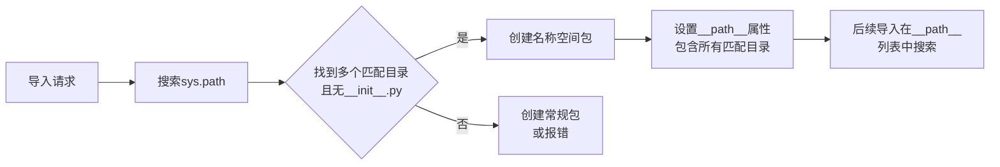

# Python 名称空间包

## 什么是名称空间包？

名称空间包(Namespace Package)是Python 3.3及以上版本中引入的一种特殊包类型，它允许一个包可以被分散到多个目录中。与常规包不同，名称空间包没有`__init__.py`文件，它可以跨越多个路径，让不同目录下的模块看起来像是同一个包的组成部分。

名称空间包解决了以下问题：
- 允许不同团队独立开发同一个包的不同部分
- 支持包的分布式开发
- 让包结构更加灵活和可扩展

:::note
名称空间包是从Python 3.3（PEP 420）开始正式支持的功能，虽然在之前的版本中有类似概念。
:::

## 名称空间包与常规包的区别

下面是名称空间包和常规包的主要区别：

| 特性 | 常规包 | 名称空间包 |
|------|-------|------------|
| `__init__.py` | 必需 | 不需要 |
| 目录分布 | 单一目录 | 可跨多个目录 |
| 导入机制 | 常规导入 | 特殊的查找算法 |
| 适用场景 | 一般模块组织 | 分布式模块组织 |

## 如何创建名称空间包

创建名称空间包非常简单，只需遵循以下步骤：

1. 在不同的目录中创建相同名称的包目录
2. 不要在这些目录中放置`__init__.py`文件
3. 将这些目录添加到`sys.path`或Python路径中

### 示例：创建名称空间包

假设我们要创建一个名为`animals`的名称空间包，分布在两个不同的位置：

```
project1/
└── animals/
    ├── mammals/
    │   ├── dog.py
    │   └── cat.py

project2/
└── animals/
    ├── birds/
    │   ├── parrot.py
    │   └── eagle.py
```

注意，两个`animals`目录中都没有`__init__.py`文件。

### 使用名称空间包

现在，我们可以如下使用这个名称空间包：

```python
# 确保project1和project2在Python搜索路径上
import sys
sys.path.extend(['path/to/project1', 'path/to/project2'])

# 导入模块
from animals.mammals import dog
from animals.birds import parrot

# 使用模块
dog.bark()
parrot.speak()
```

## 名称空间包的工作原理

名称空间包的导入机制遵循以下流程：

1. 当Python解释器导入一个包时，它会在`sys.path`中搜索匹配的目录名
2. 如果找到多个匹配目录，且这些目录中没有`__init__.py`文件，Python会创建一个名称空间包
3. 名称空间包的`__path__`属性包含了所有匹配目录的列表
4. 当导入子包或模块时，Python会在`__path__`列表中的所有目录搜索



## 实际应用场景

### 场景1：插件系统

名称空间包非常适合构建插件系统：

```python
# 核心系统
myapp/
└── plugins/  # 名称空间包，无__init__.py
    └── core/
        ├── plugin1.py
        └── plugin2.py

# 第三方插件
third_party_extensions/
└── myapp/
    └── plugins/  # 同名目录，无__init__.py
        └── extra/
            ├── plugin3.py
            └── plugin4.py
```

使用示例：

```python
# 加载所有插件
from myapp.plugins.core import plugin1, plugin2
from myapp.plugins.extra import plugin3, plugin4

# 插件注册
plugins = [plugin1, plugin2, plugin3, plugin4]
for plugin in plugins:
    plugin.register()
```

### 场景2：分布式开发

大型项目中，不同团队负责不同的功能模块：

```
team_a_code/
└── bigproject/
    └── frontend/
        ├── ui.py
        └── forms.py

team_b_code/
└── bigproject/
    └── backend/
        ├── database.py
        └── api.py
```

使用示例：

```python
# 团队A的开发环境
from bigproject.frontend import ui
from bigproject.backend import api  # 可以使用团队B的代码

# 团队B的开发环境
from bigproject.backend import database
from bigproject.frontend import forms  # 可以使用团队A的代码
```

## 名称空间包的限制与最佳实践

### 限制

1. 名称空间包不能有`__init__.py`文件
2. 不能在名称空间包级别定义包级变量或函数
3. 导入时的解析顺序可能会影响结果

### 最佳实践

1. **清晰的目录结构**：保持目录结构简单明了
   
2. **避免名称冲突**：确保不同路径下的同名包不会有同名模块

3. **文档说明**：在项目文档中明确指出使用了名称空间包

4. **版本兼容性**：记得指明需要Python 3.3+

5. **显式导入**：使用明确的导入语句，避免使用`import *`

:::tip
如果你不需要名称空间包的特性，建议使用常规包（带有`__init__.py`文件的包）来避免潜在的复杂性。
:::

## 实战练习：构建一个简单的名称空间包

### 步骤1：创建目录结构

创建以下目录结构：

```
math_tools/
└── mathlib/
    └── basic/
        ├── arithmetic.py
        
stats_tools/
└── mathlib/
    └── stats/
        ├── average.py
```

### 步骤2：添加代码

`math_tools/mathlib/basic/arithmetic.py`:
```python
def add(a, b):
    return a + b

def subtract(a, b):
    return a - b
```

`stats_tools/mathlib/stats/average.py`:
```python
def mean(numbers):
    return sum(numbers) / len(numbers)

def median(numbers):
    sorted_numbers = sorted(numbers)
    n = len(sorted_numbers)
    if n % 2 == 0:
        return (sorted_numbers[n//2-1] + sorted_numbers[n//2]) / 2
    else:
        return sorted_numbers[n//2]
```

### 步骤3：使用名称空间包

```python
import sys
sys.path.extend(['path/to/math_tools', 'path/to/stats_tools'])

# 导入模块
from mathlib.basic.arithmetic import add, subtract
from mathlib.stats.average import mean, median

# 使用函数
print(add(5, 3))  # 输出: 8
print(subtract(10, 4))  # 输出: 6

numbers = [1, 5, 3, 9, 2]
print(mean(numbers))  # 输出: 4.0
print(median(numbers))  # 输出: 3
```

## 总结

名称空间包是Python中一个强大而灵活的功能，它允许:

- 将一个包分散到多个物理位置
- 支持分布式开发和插件系统
- 让大型项目的组织更加灵活

虽然名称空间包强大，但也需要谨慎使用，确保项目结构清晰，避免不必要的复杂性。对于大多数小型到中型项目，常规包通常已经足够使用。

## 附加资源

1. Python官方文档: [PEP 420 -- Implicit Namespace Packages](https://www.python.org/dev/peps/pep-0420/)
2. 《Python Cookbook》中的相关章节
3. Python导入系统详解: [The Import System](https://docs.python.org/3/reference/import.html)

## 练习

1. 创建一个名为`myshop`的名称空间包，包含两个部分：`products`和`orders`，分布在不同目录中。
2. 实现一个简单的插件系统，允许第三方开发者为你的应用添加新功能。
3. 将一个现有的大型包重构为名称空间包，使其更易于维护和扩展。