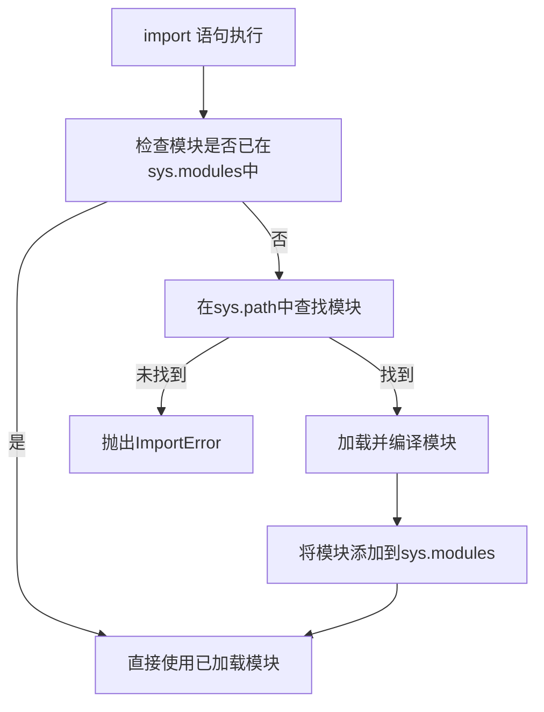
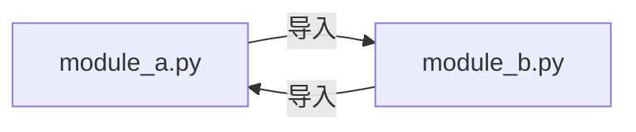

# Python 导入机制

在Python编程过程中，你经常会遇到需要使用其他文件中定义的功能的情况。Python的导入机制让我们能够轻松地复用代码，这是Python模块化编程的核心。本文将全面介绍Python的导入机制，帮助你理解模块是如何被查找和加载的。

## 什么是导入机制

Python导入机制是指Python解释器如何找到并加载模块的过程。当你在代码中使用`import`语句时，Python会按照特定的规则去查找并加载你请求的模块。



## 基本导入语法

Python提供了多种方式来导入模块：

### 1. 导入整个模块

```python
import math
print(math.sqrt(16))  # 输出: 4.0
```

### 2. 从模块导入特定对象

```python
from math import sqrt
print(sqrt(16))  # 输出: 4.0
```

### 3. 从模块导入多个对象

```python
from math import sqrt, pi
print(sqrt(16))  # 输出: 4.0
print(pi)  # 输出: 3.141592653589793
```

### 4. 导入所有对象（不推荐）

```python
from math import *
print(sqrt(16))  # 输出: 4.0
print(pi)  # 输出: 3.141592653589793
```

:::caution
使用`from module import *`可能导致名称空间污染，不利于代码可读性和维护，一般不推荐使用。
:::

### 5. 使用别名

```python
import math as m
print(m.sqrt(16))  # 输出: 4.0

from math import sqrt as square_root
print(square_root(16))  # 输出: 4.0
```

## 模块搜索路径

当Python执行`import`语句时，它会按照特定顺序在多个位置查找模块：

1. 当前目录
2. `PYTHONPATH`环境变量指定的目录列表
3. Python标准库目录
4. 任何`.pth`文件中指定的路径

这些路径组合构成了`sys.path`列表，你可以查看它：

```python
import sys
print(sys.path)
```

输出示例：
```
['', '/usr/lib/python38.zip', '/usr/lib/python3.8', '/usr/lib/python3.8/lib-dynload', '/usr/local/lib/python3.8/dist-packages', '/usr/lib/python3/dist-packages']
```

## 重新加载模块

默认情况下，Python只会导入一个模块一次，即使你在代码中多次使用`import`语句。如果你需要重新加载一个模块（例如，该模块的代码已经更改），可以使用`importlib.reload()`函数：

```python
import math
import importlib

# 重新加载模块
importlib.reload(math)
```

## 相对导入与绝对导入

在包结构中，你可以使用相对导入和绝对导入。

### 绝对导入

绝对导入从项目的根目录开始，指定完整的导入路径：

```python
# 假设有包结构：mypackage/subpackage/module.py
from mypackage.subpackage.module import function
```

### 相对导入

相对导入使用点号（`.`）表示相对于当前模块的位置：

```python
# 在mypackage/subpackage/another_module.py中
from . import module  # 导入同级的module.py
from .. import top_module  # 导入上一级的top_module.py
from ..sibling import sibling_module  # 导入上一级的sibling包中的sibling_module.py
```

:::note
相对导入只能用于包内的模块，不能在顶级脚本中使用。
:::

## 循环导入问题

循环导入是指两个或多个模块相互导入，这可能导致问题：



### 示例问题代码

**module_a.py**:
```python
from module_b import func_b

def func_a():
    return "Function A"

print("Module A imported")
func_b()
```

**module_b.py**:
```python
from module_a import func_a

def func_b():
    return "Function B"

print("Module B imported")
func_a()
```

当你尝试导入其中任一模块时，会得到错误。

### 解决方案

1. 重构代码结构
2. 将导入语句移到函数内部
3. 使用延迟导入

**修改后的module_b.py**:
```python
def func_b():
    # 延迟导入
    from module_a import func_a
    print(func_a())
    return "Function B"

print("Module B imported")
```

## 导入机制的实际应用

### 案例1：创建插件系统

你可以使用导入机制动态加载插件：

```python
import importlib
import os

def load_plugins(plugin_dir):
    plugins = []
    for filename in os.listdir(plugin_dir):
        if filename.endswith('.py') and not filename.startswith('__'):
            module_name = filename[:-3]  # 移除.py后缀
            try:
                # 动态导入插件模块
                module = importlib.import_module(f"plugins.{module_name}")
                plugins.append(module)
                print(f"成功加载插件: {module_name}")
            except ImportError as e:
                print(f"加载插件 {module_name} 失败: {e}")
    return plugins
```

### 案例2：创建模块化应用

在大型应用中，你可以使用导入机制组织模块化代码：

```python
# main.py
from app.database import db
from app.routes import setup_routes
from app.models import User, Product

def initialize_app():
    db.connect()
    setup_routes()
    print("应用初始化完成")

if __name__ == "__main__":
    initialize_app()
```

## `__name__`与`__main__`

理解`__name__`变量对于编写可导入且可执行的模块很重要：

```python
# my_module.py
def some_function():
    return "Hello from function"

if __name__ == "__main__":
    # 这部分代码只在直接运行此文件时执行
    # 导入此模块时不会执行
    print("直接运行")
    print(some_function())
```

当直接运行：`python my_module.py`
输出:
```
直接运行
Hello from function
```

当导入该模块时:
```python
import my_module
# 没有输出，因为if __name__ == "__main__"部分未执行
```

## 导入机制高级特性

### 1. `sys.meta_path` 和导入钩子

你可以自定义导入逻辑，创建自己的导入器：

```python
import sys

class MyImporter:
    def find_spec(self, fullname, path, target=None):
        print(f"尝试导入: {fullname}")
        return None  # 让正常导入继续进行

# 添加自定义导入器
sys.meta_path.insert(0, MyImporter())

# 现在每次导入都会打印出模块名
import math  # 输出: 尝试导入: math
```

### 2. 懒导入

在大型应用中，可以使用懒导入来提高启动性能：

```python
# 传统方式
import numpy as np  # 立即导入，可能拖慢启动时间

# 懒导入方式
np = None
def get_numpy():
    global np
    if np is None:
        import numpy as np
    return np

# 只有在实际需要numpy时才导入
data = get_numpy().array([1, 2, 3])
```

## 总结

Python的导入机制是其模块化编程的核心部分。本文介绍了：

- 基本的导入语法和方法
- 模块搜索路径和查找顺序
- 相对导入与绝对导入
- 解决循环导入问题
- 实际应用案例
- 高级导入特性

掌握导入机制对于编写可维护、模块化的Python程序至关重要，尤其是在处理大型项目时。

## 实践练习

1. 创建一个简单的包含多个模块的包，并尝试各种导入方式
2. 模拟循环导入问题并解决它
3. 编写一个使用动态导入加载配置文件的程序
4. 尝试创建一个懒导入装饰器

## 扩展阅读

- [Python官方文档: The import system](https://docs.python.org/3/reference/import.html)
- [PEP 328 – Imports: Multi-Line and Absolute/Relative](https://peps.python.org/pep-0328/)
- [PEP 302 – New Import Hooks](https://peps.python.org/pep-0302/)

通过系统学习Python的导入机制，你将能够更高效地组织和复用你的代码，编写出更加模块化、可维护的Python程序。