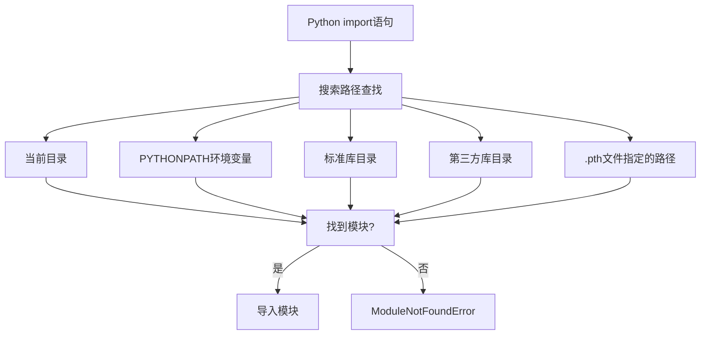

# Python 模块搜索路径

在Python中，当你使用`import`语句导入模块时，Python解释器会按照一定的搜索路径顺序查找模块。理解这个搜索路径机制对于组织和管理你的项目至关重要，尤其是当项目规模变大时。本文将详细介绍Python的模块搜索路径以及如何操作它。

## 什么是模块搜索路径？

当你执行一条`import`语句时，Python解释器会在一系列预定义的目录中寻找要导入的模块。这些目录的集合就是所谓的"模块搜索路径"。

:::note 理解要点
模块搜索路径就像一个"地址簿"，Python通过它来定位你想导入的模块文件。
:::

## 查看当前的模块搜索路径

你可以通过Python标准库中的`sys`模块来查看当前的模块搜索路径：

```python
import sys
print(sys.path)
```

输出示例：
```
['', 
 '/usr/lib/python39.zip', 
 '/usr/lib/python3.9', 
 '/usr/lib/python3.9/lib-dynload', 
 '/home/user/.local/lib/python3.9/site-packages', 
 '/usr/local/lib/python3.9/dist-packages']
```

这个列表中的每个字符串都代表一个目录路径。当你导入一个模块时，Python会按顺序在这些目录中查找该模块。

## 模块搜索路径的组成

Python模块搜索路径通常包含以下几部分：

1. **当前目录**：列表的第一个元素通常是空字符串`''`，代表当前工作目录。
2. **PYTHONPATH环境变量**：这是一个可选的环境变量，包含一系列目录路径。
3. **标准库目录**：Python安装时带有的标准库所在的目录。
4. **第三方库目录**：通过pip等工具安装的第三方包所在的目录。
5. **`.pth`文件指定的路径**：在site-packages目录中的`.pth`文件可以指定额外的搜索路径。



## 模块搜索顺序

当你执行`import module_name`时，Python按照以下顺序查找模块：

1. 首先检查是否有同名的内置模块
2. 然后在`sys.path`中按顺序查找名为`module_name.py`的文件或名为`module_name`的目录
3. 如果以上都找不到，则抛出`ModuleNotFoundError`异常

## 修改模块搜索路径

有时你可能需要修改模块搜索路径，以便Python能找到你自定义的模块。有几种方法可以做到这一点：

### 1. 临时修改sys.path

在脚本运行时，你可以动态地向`sys.path`添加新路径：

```python
import sys
# 在搜索路径开头添加新路径
sys.path.insert(0, '/path/to/your/modules')
# 在搜索路径末尾添加新路径
sys.path.append('/another/path/to/modules')

# 现在可以导入这些路径下的模块了
import my_custom_module
```

:::caution 注意事项
这种方法只在当前Python进程中有效。一旦程序结束，这些修改就会丢失。
:::

### 2. 设置PYTHONPATH环境变量

你可以通过设置PYTHONPATH环境变量来添加搜索路径：

在Linux/macOS系统中：
```bash
export PYTHONPATH=/path/to/your/modules:/another/path
```

在Windows系统中：
```cmd
set PYTHONPATH=C:\path\to\your\modules;C:\another\path
```

### 3. 创建.pth文件

你可以在site-packages目录下创建一个.pth文件（如mymodules.pth），文件内容为要添加的路径：

```
/path/to/your/modules
/another/path
```

### 4. 创建和安装自定义包

最规范的方法是将你的代码组织成Python包，并使用setup.py进行安装：

```python
# setup.py
from setuptools import setup, find_packages

setup(
    name="mypackage",
    version="0.1",
    packages=find_packages(),
)
```

然后执行：
```bash
pip install -e .
```

## 实际应用案例

### 案例1：开发多模块项目

假设你正在开发一个数据分析项目，包含多个模块：

```
data_analysis_project/
├── main.py
├── data_processing/
│   ├── __init__.py
│   ├── cleaner.py
│   └── transformer.py
└── visualization/
    ├── __init__.py
    └── plotter.py
```

在`main.py`中，你需要从这些模块导入函数：

```python
# 方法1：修改sys.path
import sys
import os
# 获取当前文件的目录路径
current_dir = os.path.dirname(os.path.abspath(__file__))
# 将项目根目录添加到sys.path
sys.path.insert(0, current_dir)

# 现在可以导入子模块
from data_processing.cleaner import clean_data
from visualization.plotter import plot_results

# 使用导入的函数
data = [1, 2, 3, None, 4]
cleaned_data = clean_data(data)
plot_results(cleaned_data)
```

### 案例2：使用不同环境中的模块

假设你有两个不同版本的库需要在不同环境中使用：

```python
# 检查当前环境，并动态添加适当的模块路径
import sys
import os

if os.environ.get('ENVIRONMENT') == 'development':
    sys.path.insert(0, '/path/to/dev/modules')
else:
    sys.path.insert(0, '/path/to/prod/modules')

# 现在导入模块，会根据环境选择不同的版本
import config_module
```

## Python 包的__path__属性

对于包（而不是简单的模块），Python提供了`__path__`属性，允许更细粒度地控制子包和模块的搜索路径：

```python
# 在包的__init__.py文件中
import os.path

# 扩展包的搜索路径
__path__ = [os.path.join(os.path.dirname(__file__), 'subfolder')] + __path__
```

这样，当Python搜索这个包中的子模块时，也会查找`subfolder`目录。

## 排查模块导入问题

当你遇到`ModuleNotFoundError`时，可以按照以下步骤排查：

1. 检查模块名是否拼写正确
2. 打印`sys.path`检查搜索路径是否包含模块所在目录
3. 检查目录中是否真的存在该模块文件
4. 检查是否有命名冲突（模块名与Python内置模块或已安装包相同）

```python
import sys
print(sys.path)

# 检查模块是否可访问
import importlib.util
module_name = 'my_module'
module_path = '/path/to/my_module.py'
spec = importlib.util.spec_from_file_location(module_name, module_path)
if spec is None:
    print(f"无法访问模块: {module_path}")
else:
    print(f"模块可访问")
```

## 总结

理解Python的模块搜索路径对于有效地组织和维护Python项目至关重要：

1. Python使用`sys.path`列表作为查找模块的路径
2. 搜索路径包含当前目录、PYTHONPATH环境变量中的路径、标准库目录等
3. 可以通过多种方式修改搜索路径：`sys.path.append/insert`、PYTHONPATH环境变量、.pth文件等
4. 模块导入问题通常与搜索路径有关，可以通过检查和调整路径来解决

## 练习

1. 编写一个脚本，打印出当前的模块搜索路径，并解释每个路径的用途。
2. 创建两个不同目录下的同名模块，然后尝试通过修改`sys.path`来控制导入哪一个。
3. 创建一个简单的包结构，并使用`.pth`文件将其添加到Python的搜索路径中。
4. 尝试写一个函数，检查给定的模块名称是否可以被当前Python环境导入，以及它将从哪个路径导入。

## 扩展资源

- [Python官方文档：模块搜索路径](https://docs.python.org/3/tutorial/modules.html#the-module-search-path)
- [Python官方文档：sys.path](https://docs.python.org/3/library/sys.html#sys.path)
- [Python官方文档：site模块](https://docs.python.org/3/library/site.html)

掌握Python模块搜索路径的工作原理，将帮助你更有效地组织代码，避免导入错误，并构建更易于维护的项目结构。