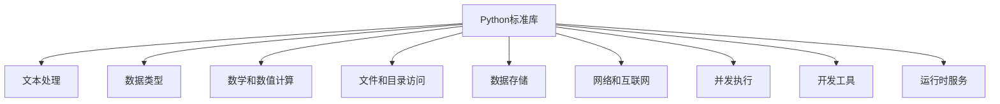

# Python 标准库概览

## 什么是Python标准库?

Python标准库是Python语言自带的一组模块和包的集合，它提供了丰富的工具和功能，可以帮助你完成各种任务，从文本处理到网络通信，从数据分析到图形用户界面开发。这些库是Python安装时自带的，无需额外安装即可使用。

:::tip
标准库是Python强大的原因之一 - 它体现了"开箱即用"的哲学，让你能够快速构建复杂的应用程序。
:::

## 为什么要了解标准库?

1. **避免重复造轮子** - 很多常见功能已经在标准库中实现
2. **保证代码质量** - 标准库经过严格测试和广泛使用
3. **提高开发效率** - 利用现有工具可以更快地解决问题
4. **增强可维护性** - 使用标准库的代码对其他Python开发者更友好

## 标准库分类概览

Python标准库非常庞大，我们可以按功能将其分为以下几类：



## 常用标准库模块一览

### 1. 文本处理

#### `string` - 字符串常量和模板

```python
import string

# 使用字符串常量
print(string.ascii_lowercase)  # 输出: abcdefghijklmnopqrstuvwxyz

# 使用字符串模板
template = string.Template("你好，$name！今天是$day。")
result = template.substitute(name="小明", day="星期一")
print(result)  # 输出: 你好，小明！今天是星期一。
```

#### `re` - 正则表达式

```python
import re

text = "我的电话号码是：13812345678，办公室电话是：010-12345678"
pattern = r'1\d{10}'  # 匹配11位手机号
mobile_numbers = re.findall(pattern, text)
print(mobile_numbers)  # 输出: ['13812345678']
```

### 2. 数据类型

#### `datetime` - 日期和时间处理

```python
from datetime import datetime, timedelta

# 获取当前日期时间
now = datetime.now()
print(f"当前时间：{now}")  # 例如输出：当前时间：2023-05-10 15:30:45.123456

# 日期计算
tomorrow = now + timedelta(days=1)
print(f"明天：{tomorrow.date()}")  # 例如输出：明天：2023-05-11
```

#### `collections` - 特殊容器数据类型

```python
from collections import Counter, defaultdict

# 计数器
words = ["苹果", "香蕉", "苹果", "橙子", "苹果", "香蕉"]
word_counts = Counter(words)
print(word_counts)  # 输出: Counter({'苹果': 3, '香蕉': 2, '橙子': 1})

# 默认字典
fruit_colors = defaultdict(list)
fruit_colors["红色"].append("苹果")
fruit_colors["红色"].append("草莓")
fruit_colors["黄色"].append("香蕉")
print(fruit_colors)  # 输出: defaultdict(<class 'list'>, {'红色': ['苹果', '草莓'], '黄色': ['香蕉']})
```

### 3. 数学和数值计算

#### `math` - 数学函数

```python
import math

# 使用数学常量
print(f"圆周率：{math.pi}")  # 输出: 圆周率：3.141592653589793

# 三角函数
print(f"45度的正弦值：{math.sin(math.radians(45))}")  # 输出: 45度的正弦值：0.7071067811865475

# 对数和幂
print(f"2的10次方：{math.pow(2, 10)}")  # 输出: 2的10次方：1024.0
```

#### `random` - 随机数生成

```python
import random

# 随机整数
print(f"1到10之间的随机整数: {random.randint(1, 10)}")

# 随机选择
fruits = ["苹果", "香蕉", "橙子", "草莓", "葡萄"]
print(f"随机选择的水果: {random.choice(fruits)}")

# 随机打乱列表
random.shuffle(fruits)
print(f"打乱后的列表: {fruits}")
```

### 4. 文件和目录操作

#### `os` - 操作系统接口

```python
import os

# 获取当前工作目录
print(f"当前目录: {os.getcwd()}")

# 列出目录内容
print(f"当前目录的文件和文件夹: {os.listdir('.')}")

# 创建目录
try:
    os.mkdir("test_folder")
    print("创建了test_folder目录")
except FileExistsError:
    print("test_folder目录已存在")
```

#### `pathlib` - 面向对象的文件系统路径

```python
from pathlib import Path

# 创建路径对象
current_file = Path(__file__)
print(f"当前文件: {current_file}")
print(f"父目录: {current_file.parent}")
print(f"文件名: {current_file.name}")

# 遍历目录中的所有Python文件
for python_file in Path('.').glob('*.py'):
    print(f"发现Python文件: {python_file}")
```

### 5. 数据存储

#### `json` - JSON数据处理

```python
import json

# 将Python对象转换为JSON字符串
data = {
    "名字": "小明",
    "年龄": 18,
    "爱好": ["编程", "读书", "篮球"]
}
json_str = json.dumps(data, ensure_ascii=False)
print(f"JSON字符串: {json_str}")

# 将JSON字符串转换为Python对象
restored_data = json.loads(json_str)
print(f"Python对象: {restored_data}")
print(f"名字: {restored_data['名字']}")
```

#### `csv` - CSV文件读写

```python
import csv
import io

# 创建一个示例CSV字符串（通常你会从文件读取）
csv_data = """姓名,年龄,城市
小明,18,北京
小红,20,上海
小李,19,广州
"""

# 读取CSV数据
csv_reader = csv.reader(io.StringIO(csv_data))
headers = next(csv_reader)  # 读取表头
print(f"表头: {headers}")

for row in csv_reader:
    print(f"{row[0]}是来自{row[2]}的{row[1]}岁学生")
```

### 6. 网络和互联网

#### `urllib` - URL处理

```python
from urllib.request import urlopen
from urllib.parse import urlparse

# 解析URL
url = "https://www.python.org/about/"
parsed_url = urlparse(url)
print(f"协议: {parsed_url.scheme}")
print(f"网站域名: {parsed_url.netloc}")
print(f"路径: {parsed_url.path}")

# 注意：以下代码需要网络连接，可能会失败
try:
    with urlopen("https://www.python.org/") as response:
        html = response.read().decode('utf-8')
        print(f"网页内容前100个字符: {html[:100]}...")
except Exception as e:
    print(f"获取网页失败: {e}")
```

### 7. 并发执行

#### `threading` - 线程操作

```python
import threading
import time

def worker(name, delay):
    """线程工作函数"""
    print(f"{name} 开始工作")
    time.sleep(delay)
    print(f"{name} 完成工作")

# 创建并启动两个线程
thread1 = threading.Thread(target=worker, args=("线程1", 1))
thread2 = threading.Thread(target=worker, args=("线程2", 2))

thread1.start()
thread2.start()

thread1.join()
thread2.join()
print("所有线程都已完成工作")
```

### 8. 开发工具

#### `logging` - 日志系统

```python
import logging

# 配置日志
logging.basicConfig(
    level=logging.INFO,
    format='%(asctime)s - %(name)s - %(levelname)s - %(message)s'
)

# 使用日志
logging.info("程序开始运行")
logging.warning("这是一个警告信息")

try:
    result = 10 / 0
except Exception as e:
    logging.error(f"发生错误: {e}")

logging.info("程序结束运行")
```

## 实际应用案例

### 案例1：文件整理工具

这个例子展示了如何使用标准库构建一个简单的文件整理工具，它可以按文件类型将文件分类到不同的文件夹中。

```python
import os
import shutil
from pathlib import Path
import logging

# 设置日志
logging.basicConfig(level=logging.INFO, format='%(asctime)s - %(message)s')

def organize_files(directory):
    """按文件类型整理文件"""
    # 确保目录存在
    directory = Path(directory)
    if not directory.exists():
        logging.error(f"目录 {directory} 不存在！")
        return
    
    # 文件类型及其对应的文件夹
    type_dirs = {
        'images': ['.jpg', '.jpeg', '.png', '.gif', '.bmp'],
        'documents': ['.pdf', '.doc', '.docx', '.txt', '.xlsx', '.pptx'],
        'audio': ['.mp3', '.wav', '.flac', '.aac'],
        'video': ['.mp4', '.avi', '.mov', '.mkv']
    }
    
    # 创建分类文件夹
    for folder in type_dirs:
        os.makedirs(directory / folder, exist_ok=True)
    
    # 遍历目录中的所有文件
    file_count = 0
    for file_path in directory.iterdir():
        if file_path.is_file():
            # 获取文件扩展名
            file_ext = file_path.suffix.lower()
            
            # 确定文件类型
            for folder, extensions in type_dirs.items():
                if file_ext in extensions:
                    # 移动文件到对应文件夹
                    dest_path = directory / folder / file_path.name
                    shutil.move(str(file_path), str(dest_path))
                    logging.info(f"移动 {file_path.name} 到 {folder} 文件夹")
                    file_count += 1
                    break
    
    logging.info(f"整理完成，共移动了 {file_count} 个文件。")

# 使用示例
# organize_files('/path/to/your/directory')  # 替换为你要整理的目录
```

### 案例2：天气数据分析工具

这个例子展示了如何使用标准库处理和分析CSV格式的天气数据。

```python
import csv
import statistics
import datetime
from collections import defaultdict
import matplotlib.pyplot as plt

def analyze_weather_data(csv_file):
    """分析天气数据CSV文件"""
    dates = []
    temperatures = []
    precipitation = []
    monthly_temps = defaultdict(list)
    
    # 读取CSV数据
    with open(csv_file, 'r') as file:
        reader = csv.DictReader(file)
        for row in reader:
            # 解析日期
            date = datetime.datetime.strptime(row['date'], '%Y-%m-%d')
            dates.append(date)
            
            # 获取温度和降水量
            temp = float(row['temperature'])
            temperatures.append(temp)
            precipitation.append(float(row['precipitation']))
            
            # 按月分组温度数据
            month_key = date.strftime('%Y-%m')
            monthly_temps[month_key].append(temp)
    
    # 计算统计信息
    avg_temp = statistics.mean(temperatures)
    max_temp = max(temperatures)
    min_temp = min(temperatures)
    total_precip = sum(precipitation)
    
    print(f"分析结果:")
    print(f"- 平均温度: {avg_temp:.1f}°C")
    print(f"- 最高温度: {max_temp:.1f}°C")
    print(f"- 最低温度: {min_temp:.1f}°C")
    print(f"- 总降水量: {total_precip:.1f}mm")
    
    # 计算每月平均温度
    monthly_avg_temps = {}
    for month, temps in monthly_temps.items():
        monthly_avg_temps[month] = statistics.mean(temps)
    
    print("\n月平均温度:")
    for month, avg in sorted(monthly_avg_temps.items()):
        print(f"- {month}: {avg:.1f}°C")

# 使用示例（需要CSV文件）：
# analyze_weather_data('weather_data.csv')
```

:::note
要运行上面的天气数据分析案例，你需要一个包含'date'、'temperature'和'precipitation'列的CSV文件。
:::

## 总结

Python标准库是一个丰富而强大的工具集，它能够帮助你解决各种各样的编程问题：

1. 文本处理：`string`, `re`
2. 数据类型：`datetime`, `collections`
3. 数学计算：`math`, `random`
4. 文件操作：`os`, `pathlib`
5. 数据存储：`json`, `csv`
6. 网络编程：`urllib`
7. 并发执行：`threading`
8. 开发工具：`logging`

学习和掌握Python标准库不仅可以提高你的编程效率，还可以让你的代码更加优雅、可靠。无需重新发明轮子，你可以站在巨人的肩膀上构建你的应用程序。

## 练习与进一步学习

### 练习

1. 尝试使用`datetime`模块创建一个简单的日历程序，显示当前月份的日历。
2. 使用`collections.Counter`统计一个文本文件中单词出现的频率。
3. 使用`os`和`pathlib`模块写一个脚本，查找指定目录中的所有空文件夹。
4. 尝试使用`json`模块解析一个包含天气数据的JSON文件，并提取其中的温度信息。

### 进一步学习资源

1. [Python官方文档 - 标准库](https://docs.python.org/zh-cn/3/library/index.html)
2. [Python Module of the Week](https://pymotw.com/3/) - 详细介绍Python标准库的各个模块
3. [Real Python - Python标准库教程](https://realpython.com/tutorials/standard-library/)
4. 《Python标准库》(Python Standard Library) by Fredrik Lundh

记住，学习标准库最好的方式是实践。找到感兴趣的模块，尝试编写小程序来使用它们，这样你会更快地掌握这些工具！