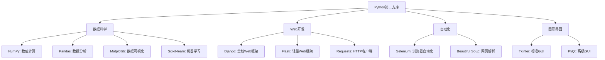

# Python 第三方库安装

## 什么是Python第三方库

Python的强大之处很大程度上来自于其丰富的第三方库生态系统。这些库是由社区成员开发的代码包，可以帮助你更高效地完成各种任务，从数据分析到网站开发，从机器学习到游戏开发。

:::tip
"不要重复造轮子"是Python社区的一个常见格言。在开始编写复杂功能前，先检查是否已有第三方库可以使用！
:::

## 为什么需要安装第三方库

- **节省时间**：利用别人已经写好并测试过的代码
- **提高效率**：使用优化的算法和功能
- **扩展功能**：赋予Python新的能力
- **专业开发**：真实世界的Python项目几乎总是依赖第三方库

## pip - Python的包安装工具

`pip`是Python的标准包管理工具，用于安装和管理第三方库。

### 检查pip是否已安装

在命令行中输入以下命令：

```bash
pip --version
```

或者：

```bash
python -m pip --version
```

这应该会显示pip的版本信息：

```
pip 23.1.2 from C:\Users\username\AppData\Local\Programs\Python\Python310\lib\site-packages\pip (python 3.10)
```

### 安装pip（如果尚未安装）

现代Python安装（从Python 3.4开始）通常已经包含pip。如果没有，可以通过以下方式安装：

1. 下载[get-pip.py](https://bootstrap.pypa.io/get-pip.py)脚本
2. 运行 `python get-pip.py`

## 使用pip安装包

### 基本安装命令

最简单的安装方式是：

```bash
pip install 包名
```

例如，要安装流行的数据分析库pandas：

```bash
pip install pandas
```

### 指定版本

```bash
# 安装特定版本
pip install pandas==1.4.2

# 安装最低版本
pip install pandas>=1.0.0

# 安装兼容版本
pip install pandas~=1.4.0  # 安装1.4.*版本
```

### 从requirements.txt文件安装

在团队项目中，通常会有一个`requirements.txt`文件列出所有依赖：

```bash
pip install -r requirements.txt
```

requirements.txt文件示例：

```
pandas==1.4.2
numpy>=1.20.0
matplotlib~=3.5.0
```

### 升级包

```bash
pip install --upgrade pandas
```

或简写为：

```bash
pip install -U pandas
```

### 卸载包

```bash
pip uninstall pandas
```

## 虚拟环境 - 项目隔离的最佳实践

虚拟环境是Python项目的隔离空间，使不同项目可以有不同的依赖而互不影响。

:::caution
不使用虚拟环境会导致系统Python环境混乱，甚至可能破坏操作系统的功能（如在Linux中）。
:::

### 为什么使用虚拟环境

- 避免项目间的库版本冲突
- 保持系统Python环境的干净
- 便于项目的移植和共享
- 更精确地控制项目依赖

### 使用venv创建虚拟环境（Python 3.3+内置模块）

创建虚拟环境：

```bash
python -m venv my_project_env
```

激活虚拟环境：

在Windows上：
```bash
my_project_env\Scripts\activate
```

在macOS/Linux上：
```bash
source my_project_env/bin/activate
```

你会注意到命令提示符前面出现了`(my_project_env)`，表明虚拟环境已激活。

退出虚拟环境：

```bash
deactivate
```

### 使用Conda管理环境

如果你使用Anaconda或Miniconda，可以通过Conda管理环境：

创建环境：
```bash
conda create --name my_env python=3.9
```

激活环境：
```bash
conda activate my_env
```

安装包：
```bash
conda install pandas
```

退出环境：
```bash
conda deactivate
```

## 常见的Python第三方库示例

以下是一些流行的Python库及其用途：



## 实际应用案例

### 案例1：使用requests和Beautiful Soup进行网络爬虫

```python
# 首先安装所需库
# pip install requests beautifulsoup4

import requests
from bs4 import BeautifulSoup

# 获取网页内容
response = requests.get('https://www.python.org')

# 解析HTML
soup = BeautifulSoup(response.text, 'html.parser')

# 提取所有标题
titles = soup.find_all('h2')
for title in titles:
    print(title.text.strip())
```

输出示例：
```
Latest News
Upcoming Events
```

### 案例2：使用pandas和matplotlib进行数据分析

```python
# 首先安装所需库
# pip install pandas matplotlib

import pandas as pd
import matplotlib.pyplot as plt

# 创建示例数据
data = {
    '年份': [2018, 2019, 2020, 2021, 2022],
    '销售额': [500, 650, 780, 920, 1050]
}

# 创建DataFrame
df = pd.DataFrame(data)
print(df)

# 创建折线图
plt.figure(figsize=(10, 6))
plt.plot(df['年份'], df['销售额'], marker='o')
plt.title('年度销售额趋势')
plt.xlabel('年份')
plt.ylabel('销售额（万元）')
plt.grid(True)
plt.savefig('sales_trend.png')  # 保存图表
plt.show()  # 显示图表
```

输出示例：
```
    年份   销售额
0  2018   500
1  2019   650
2  2020   780
3  2021   920
4  2022  1050
```

## 解决常见安装问题

### 权限问题

在macOS/Linux上可能需要sudo权限：
```bash
sudo pip install 包名
```

但更推荐的方式是使用用户安装：
```bash
pip install --user 包名
```

### 离线安装

1. 在有网络的电脑上下载包：
```bash
pip download 包名 -d ./packages
```

2. 将packages目录复制到目标电脑，然后安装：
```bash
pip install --no-index --find-links=./packages 包名
```

### 国内镜像加速

临时使用：
```bash
pip install -i https://pypi.tuna.tsinghua.edu.cn/simple 包名
```

永久配置：

创建或修改 `~/.pip/pip.conf` (Linux/macOS) 或 `%USERPROFILE%\pip\pip.ini` (Windows)：
```ini
[global]
index-url = https://pypi.tuna.tsinghua.edu.cn/simple
```

## 总结与最佳实践

- 总是使用虚拟环境来隔离项目依赖
- 记录项目依赖到`requirements.txt`或`setup.py`中
- 定期更新库以获取安全修复和新功能
- 在安装之前阅读库的文档，了解其功能和使用方法
- 在生产环境中固定依赖库的版本，避免自动更新带来的兼容性问题

## 练习

1. 创建一个虚拟环境，安装`requests`和`beautifulsoup4`库，然后编写一个简单的脚本爬取你喜欢的网站的标题。
2. 安装`pandas`和`matplotlib`，然后创建一个简单的数据可视化项目。
3. 创建一个`requirements.txt`文件，列出你项目所需的所有依赖。

## 进一步学习资源

- [Python Package Index (PyPI)](https://pypi.org/) - 查找Python包的官方仓库
- [pip文档](https://pip.pypa.io/) - pip的官方文档
- [virtualenv文档](https://virtualenv.pypa.io/) - 虚拟环境的详细指南
- [Awesome Python](https://github.com/vinta/awesome-python) - 精选的Python库和资源列表