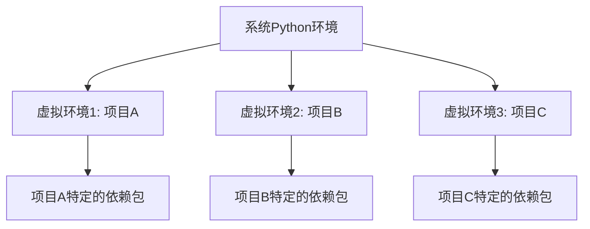

# Python 虚拟环境

## 什么是虚拟环境？

Python虚拟环境是一个独立的、隔离的Python解释器环境，它允许你在不影响系统全局Python环境的情况下，为特定项目安装和管理依赖包。当你在开发多个Python项目时，这些项目可能需要不同版本的相同库，虚拟环境可以帮助你解决这个问题。



## 为什么需要虚拟环境？

想象一下这种情况：

1. 你正在开发一个网站，使用Django 3.2
2. 同时，你还在维护一个旧项目，它使用Django 2.2
3. 你还想尝试Django 4.0的新功能

如果没有虚拟环境，这些不同版本的依赖会相互冲突，因为它们都会安装到系统的全局Python环境中。虚拟环境解决了这个问题，让你能够为每个项目创建独立的环境。

:::tip 虚拟环境的好处
- 避免依赖包版本冲突
- 确保项目的可移植性和可重复性
- 避免需要管理员权限安装包
- 使项目更容易分享和协作
:::

## Python 中的虚拟环境工具

Python提供了多种创建和管理虚拟环境的工具：

1. **venv** - Python 3.3+ 内置的虚拟环境模块
2. **virtualenv** - 功能更强大的第三方工具，兼容Python 2和3
3. **conda** - 用于科学计算的包管理器，也提供环境管理功能
4. **pipenv** - 结合了pip和virtualenv的功能
5. **poetry** - 现代化的Python包管理工具

本教程将主要介绍`venv`，因为它是Python标准库的一部分，不需要额外安装。

## 使用venv创建虚拟环境

### 创建虚拟环境

要创建一个新的虚拟环境，使用以下命令：

```bash
# Windows
python -m venv my_project_env

# macOS/Linux
python3 -m venv my_project_env
```

这会在当前目录下创建一个名为`my_project_env`的文件夹，其中包含了Python解释器、标准库和pip的副本。

### 激活虚拟环境

创建虚拟环境后，你需要激活它才能使用：

```bash
# Windows (CMD)
my_project_env\Scripts\activate.bat

# Windows (PowerShell)
my_project_env\Scripts\Activate.ps1

# macOS/Linux
source my_project_env/bin/activate
```

激活成功后，你的命令提示符会改变，显示当前活动的虚拟环境名称：

```bash
(my_project_env) C:\Users\username\projects\my_project>
```

### 在虚拟环境中安装包

激活虚拟环境后，你可以使用pip安装依赖包，它们将只安装到这个虚拟环境中：

```bash
(my_project_env) $ pip install numpy
```

你可以查看已安装的包：

```bash
(my_project_env) $ pip list
```

输出示例：
```
Package    Version
---------- -------
numpy      1.23.3
pip        22.2.2
setuptools 63.4.1
```

### 退出虚拟环境

当你完成工作后，可以使用以下命令退出虚拟环境：

```bash
(my_project_env) $ deactivate
```

命令提示符将恢复正常，表示你已经退出虚拟环境。

## requirements.txt: 管理项目依赖

在实际项目开发中，你通常需要记录项目所需的所有依赖包。Python项目通常使用`requirements.txt`文件来记录这些信息。

### 创建requirements.txt

你可以使用pip命令导出当前环境的所有包：

```bash
(my_project_env) $ pip freeze > requirements.txt
```

这会创建一个包含所有安装包及其版本的文件，例如：

```
numpy==1.23.3
pandas==1.5.0
matplotlib==3.6.0
```

### 从requirements.txt安装依赖

在新环境中，你可以使用以下命令安装所有依赖：

```bash
(new_env) $ pip install -r requirements.txt
```

## 实际案例：Web应用项目

让我们通过一个实际案例来了解虚拟环境的工作流程。假设我们要开发一个简单的Flask web应用：

```bash
# 创建项目目录
mkdir flask_project
cd flask_project

# 创建虚拟环境
python -m venv venv

# 激活虚拟环境
# Windows
venv\Scripts\activate
# macOS/Linux
source venv/bin/activate

# 安装Flask
(venv) $ pip install flask

# 创建app.py文件
```

现在创建一个简单的Flask应用（app.py）：

```python
from flask import Flask

app = Flask(__name__)

@app.route('/')
def hello():
    return "Hello from Flask in a virtual environment!"

if __name__ == '__main__':
    app.run(debug=True)
```

运行应用：

```bash
(venv) $ python app.py
```

你会看到输出类似：

```
 * Serving Flask app "app" (lazy loading)
 * Environment: production
   WARNING: This is a development server. Do not use it in a production deployment.
   Use a production WSGI server instead.
 * Debug mode: on
 * Running on http://127.0.0.1:5000/ (Press CTRL+C to quit)
 * Restarting with stat
 * Debugger is active!
 * Debugger PIN: 123-456-789
```

保存依赖：

```bash
(venv) $ pip freeze > requirements.txt
```

现在，如果其他开发者想要运行你的项目，他们只需要:

```bash
# 克隆项目（假设使用git）
git clone <project-url>
cd flask_project

# 创建和激活自己的虚拟环境
python -m venv venv
source venv/bin/activate  # 或Windows对应命令

# 安装依赖
pip install -r requirements.txt

# 运行应用
python app.py
```

## 高级虚拟环境工具

### virtualenvwrapper

`virtualenvwrapper`是一个用于管理多个虚拟环境的工具，它提供了额外的命令来简化虚拟环境的创建和管理。

安装：

```bash
pip install virtualenvwrapper
```

主要命令：

- `mkvirtualenv my_env` - 创建新环境
- `workon my_env` - 激活环境
- `deactivate` - 退出环境
- `rmvirtualenv my_env` - 删除环境

### pipenv

`pipenv`是一个更现代的依赖管理工具，它结合了`pip`和`virtualenv`的功能，自动为项目创建和管理虚拟环境。

安装：

```bash
pip install pipenv
```

基本用法：

```bash
# 在项目目录下
pipenv install flask

# 激活环境
pipenv shell

# 运行命令
pipenv run python app.py
```

:::note 
pipenv会自动创建一个Pipfile文件来替代requirements.txt，提供更强大的依赖管理功能。
:::

## 最佳实践

1. **为每个项目创建独立的虚拟环境**：不要在不同项目间共享虚拟环境
2. **将虚拟环境文件夹添加到.gitignore**：不要将虚拟环境文件提交到版本控制系统
3. **总是使用requirements.txt**：记录项目的依赖，确保可重复性
4. **考虑使用版本固定**：例如使用`flask==2.0.1`而不是仅仅`flask`
5. **为虚拟环境使用一致的命名约定**：如`venv`、`env`或项目名

## 总结

虚拟环境是Python开发中的重要工具，它能帮助你：

- 隔离不同项目的依赖
- 解决版本冲突问题
- 提高项目的可移植性
- 简化依赖管理

从今天开始，养成为每个Python项目创建虚拟环境的好习惯，你会发现它能让你的开发工作更加顺畅，减少环境问题带来的麻烦。

## 练习

1. 创建一个名为`learning_env`的虚拟环境
2. 激活环境并安装`requests`和`beautifulsoup4`库
3. 编写一个简单的脚本，使用这两个库从任意网站获取并解析内容
4. 创建requirements.txt文件
5. 删除虚拟环境，然后使用requirements.txt重新创建并安装依赖

## 进一步学习资源

- [Python venv 官方文档](https://docs.python.org/3/library/venv.html)
- [Pipenv 文档](https://pipenv.pypa.io/)
- [Poetry 文档](https://python-poetry.org/)
- [pip 用户指南](https://pip.pypa.io/en/stable/user_guide/)
- [Python项目结构最佳实践](https://docs.python-guide.org/writing/structure/)