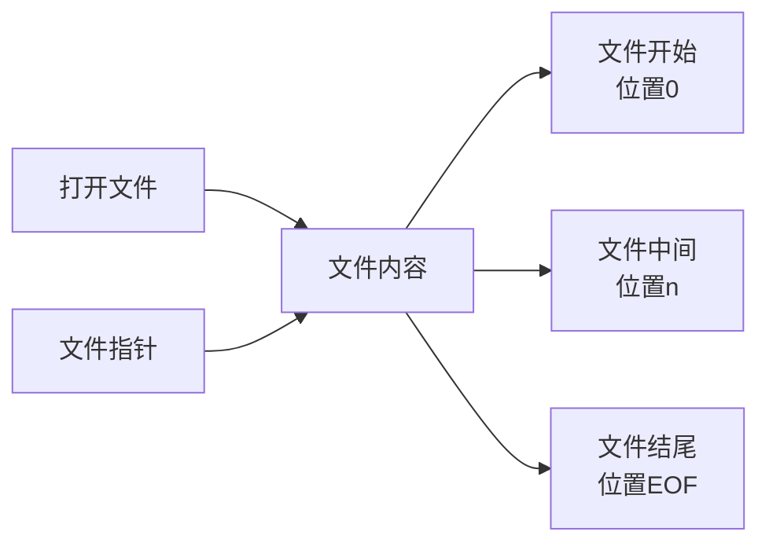

# Python 文件指针

## 什么是文件指针？

在Python中处理文件时，**文件指针**是一个非常重要的概念。简单来说，文件指针是一个标记，它指示当前在文件中的位置。无论何时我们打开文件进行读取或写入操作，Python都会维护一个指针来追踪当前的位置。

:::note
想象一下文件指针就像是一本书中的书签，它标记了你当前阅读到的位置。每当你读取文件内容时，指针就会向前移动，就像你翻阅书页一样。
:::

## 文件指针基础

当我们使用`open()`函数打开一个文件时，文件指针被自动放置在文件的特定位置：

- 对于读取模式(`'r'`)，指针位于文件的开始(位置0)
- 对于写入模式(`'w'`)，文件被截断，指针位于文件的开始
- 对于追加模式(`'a'`)，指针位于文件的结尾

以下是一个简单的图示，展示了文件指针的概念：



## 操作文件指针

Python提供了几个方法来操作文件指针的位置：

### 1. tell() 方法

`tell()`方法返回文件指针当前位置，即从文件开头算起的字节数。

```python
with open('example.txt', 'r') as file:
    print(f"当前指针位置: {file.tell()}")  # 输出: 当前指针位置: 0
    
    content = file.read(5)  # 读取5个字符
    print(f"读取的内容: {content}")
    print(f"读取后指针位置: {file.tell()}")  # 输出取决于读取内容的字节数
```

### 2. seek() 方法

`seek(offset, whence)`方法可以移动文件指针到指定位置。这个方法有两个参数：

- `offset`：表示偏移量（以字节为单位）
- `whence`：表示偏移量的参考位置
  - 0：文件开头（默认值）
  - 1：当前位置
  - 2：文件结尾

```python
with open('example.txt', 'r') as file:
    # 将指针移动到文件的第5个字节处
    file.seek(5)
    print(f"移动后指针位置: {file.tell()}")  # 输出: 移动后指针位置: 5
    
    # 从当前位置向前移动3个字节
    file.seek(3, 1)
    print(f"再次移动后指针位置: {file.tell()}")  # 输出: 再次移动后指针位置: 8
    
    # 从文件末尾向前移动5个字节
    file.seek(-5, 2)
    print(f"从末尾移动后指针位置: {file.tell()}")
```

:::caution
在文本模式下，只有`seek(0,0)`、`seek(0,1)`和`seek(0,2)`是有保证工作的。其他的`seek`操作可能不会如预期工作，因为文本模式会对换行符进行转换。
:::

## 实际应用示例

### 示例1：随机访问文件内容

假设我们有一个包含多行数据的文件，每行是一个记录。我们可以使用文件指针来直接访问特定的记录，而不必从头开始读取整个文件。

```python
def get_line_at_position(file_path, line_number):
    positions = []
    
    with open(file_path, 'r') as file:
        pos = 0
        positions.append(pos)
        
        # 记录每行的起始位置
        for i, line in enumerate(file):
            pos += len(line)
            positions.append(pos)
    
    if line_number < 0 or line_number >= len(positions) - 1:
        return "行号超出范围"
    
    with open(file_path, 'r') as file:
        # 将指针移动到目标行的起始位置
        file.seek(positions[line_number])
        # 读取整行
        return file.readline().strip()

# 使用示例
file_path = 'data.txt'
print(f"第3行内容: {get_line_at_position(file_path, 2)}")
```

### 示例2：日志文件追加和读取

当我们处理日志文件时，通常需要在不破坏现有内容的情况下追加新日志，然后可能需要读取最新的几条记录。

```python
def append_log(log_file, message):
    with open(log_file, 'a') as file:
        file.write(f"{message}\n")

def read_last_n_logs(log_file, n=10):
    lines = []
    
    with open(log_file, 'r') as file:
        # 移动到文件末尾
        file.seek(0, 2)
        # 获取文件大小
        file_size = file.tell()
        
        # 从文件末尾开始读取
        position = file_size
        line_count = 0
        
        # 向前读取n行
        while position > 0 and line_count < n:
            # 向前移动一个字符
            position -= 1
            file.seek(position)
            
            # 如果读取到换行符，说明找到了一行的开始
            if file.read(1) == '\n':
                line_count += 1
                if line_count == n:
                    break
        
        # 读取最后n行
        if position > 0:
            file.seek(position + 1)  # 移过换行符
        
        return file.read()

# 使用示例
log_file = 'app.log'
append_log(log_file, "这是一条新日志")
print(read_last_n_logs(log_file, 5))
```

### 示例3：处理大型CSV文件

当处理大型CSV文件时，我们可能只想读取特定列或特定行的数据，此时文件指针操作可以帮助我们高效处理数据。

```python
import csv

def get_column_from_csv(file_path, column_index):
    column_data = []
    
    with open(file_path, 'r', newline='') as file:
        csv_reader = csv.reader(file)
        for row in csv_reader:
            if column_index < len(row):
                column_data.append(row[column_index])
    
    return column_data

def get_rows_by_range(file_path, start_row, end_row):
    rows = []
    
    with open(file_path, 'r', newline='') as file:
        csv_reader = csv.reader(file)
        
        # 跳过开头的行
        for _ in range(start_row):
            next(csv_reader, None)
        
        # 读取指定范围的行
        for i in range(end_row - start_row):
            try:
                rows.append(next(csv_reader))
            except StopIteration:
                break
    
    return rows

# 使用示例
file_path = 'large_data.csv'
third_column = get_column_from_csv(file_path, 2)  # 获取第三列数据
rows_100_to_200 = get_rows_by_range(file_path, 100, 200)  # 获取100-200行
```

## 二进制文件与文件指针

处理二进制文件时，文件指针操作更为精确，因为没有字符编码转换的问题。

```python
def read_binary_file_chunk(file_path, start_position, chunk_size):
    with open(file_path, 'rb') as file:
        file.seek(start_position)
        return file.read(chunk_size)

# 例如读取图像文件的某个部分
chunk = read_binary_file_chunk('image.jpg', 1024, 512)  # 从1024字节位置开始读取512字节
```

## 常见问题与注意事项

1. **文本模式与二进制模式的区别**：
   - 文本模式下，换行符可能会被转换，影响seek()和tell()的准确性
   - 二进制模式更适合精确的指针操作

2. **文件指针溢出**：
   - 确保seek()的参数不超出文件范围
   - 在大文件中使用大的偏移量时，应注意可能的整数溢出

3. **线程安全性**：
   - 多线程环境下同时操作文件指针可能导致不可预期的结果
   - 应使用适当的锁机制确保文件操作的原子性

## 总结

文件指针是Python文件处理中的关键概念，它让我们能够控制文件读写的位置，实现更灵活、高效的文件操作。通过掌握文件指针的用法，我们可以：

- 随机访问文件内容，而不必从头到尾读取
- 高效处理大型文件，实现分块读取
- 实现更复杂的文件操作，如追加、插入和更新

熟练运用文件指针的相关方法（如`tell()`和`seek()`）将帮助你编写更高效的文件处理程序。

## 练习题

1. 编写一个函数，统计文本文件中每行的字符数，并返回一个列表。
2. 创建一个程序，将一个文本文件的内容逆序写入另一个文件。
3. 实现一个简单的文件切分器，可以将大文件分割成多个小文件。
4. 编写代码从二进制文件的中间位置读取特定长度的数据。
5. 创建一个函数，可以在文本文件的特定行后插入新内容，而不改变其他行。

:::tip
记住，文件操作完成后应该关闭文件或使用`with`语句来自动管理文件资源。良好的文件处理习惯可以避免资源泄露和文件损坏。
:::