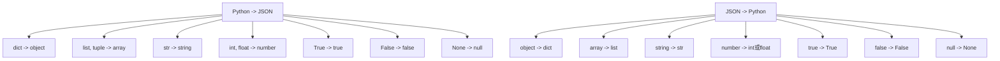

# Python JSON处理

在现代编程中，JSON (JavaScript Object Notation) 已成为数据交换的标准格式。无论是与Web API交互，还是配置文件管理，掌握Python中的JSON处理都是必不可少的技能。本文将全面介绍如何在Python中处理JSON数据。

## 什么是JSON？

JSON是一种轻量级的数据交换格式，易于人阅读和编写，也易于机器解析和生成。它基于JavaScript编程语言，但与语言无关，使得JSON成为理想的数据交换语言。

JSON有两种结构：
1. 名称/值对的集合（类似Python字典）
2. 值的有序列表（类似Python列表）

JSON的基本数据类型包括：
- 数字（整数或浮点数）
- 字符串（使用双引号包裹）
- 布尔值（true或false）
- null
- 对象（键值对集合，使用大括号）
- 数组（值的有序集合，使用方括号）

## Python 中的JSON模块

Python标准库提供了`json`模块，使我们能够轻松地编码和解码JSON数据。

```python
import json
```

### JSON编码（Python对象转JSON）

`json.dumps()`方法可将Python对象转换为JSON字符串：

```python
# 创建一个Python字典
person = {
    "name": "张三",
    "age": 30,
    "is_student": False,
    "courses": ["Python", "数据分析", "机器学习"],
    "address": {
        "city": "北京",
        "street": "朝阳区"
    }
}

# 转换为JSON字符串
json_string = json.dumps(person)
print(json_string)
```

输出：
```
{"name": "张三", "age": 30, "is_student": false, "courses": ["Python", "数据分析", "机器学习"], "address": {"city": "北京", "street": "朝阳区"}}
```

:::tip
注意观察输出：Python中的`False`被转换为JSON中的`false`，这是因为JSON规范中布尔值是小写的。
:::

#### 美化输出

为了使JSON字符串更易读，可以使用`indent`参数：

```python
# 美化输出的JSON字符串
pretty_json = json.dumps(person, indent=4)
print(pretty_json)
```

输出：
```json
{
    "name": "张三",
    "age": 30,
    "is_student": false,
    "courses": [
        "Python",
        "数据分析",
        "机器学习"
    ],
    "address": {
        "city": "北京",
        "street": "朝阳区"
    }
}
```

#### 处理中文

默认情况下，`json.dumps()` 会将非ASCII字符（如中文）转换为Unicode编码。如果需要保留中文字符，可以使用`ensure_ascii=False`参数：

```python
# 保留中文字符
chinese_json = json.dumps(person, ensure_ascii=False, indent=4)
print(chinese_json)
```

输出：
```json
{
    "name": "张三",
    "age": 30,
    "is_student": false,
    "courses": [
        "Python",
        "数据分析",
        "机器学习"
    ],
    "address": {
        "city": "北京",
        "street": "朝阳区"
    }
}
```

### JSON解码（JSON转Python对象）

`json.loads()`方法可将JSON字符串转换为Python对象：

```python
# JSON字符串
json_str = '{"name": "李四", "age": 25, "is_student": true, "scores": [90, 85, 88]}'

# 转换为Python对象
python_obj = json.loads(json_str)
print(type(python_obj))  # <class 'dict'>
print(python_obj)
```

输出：
```
<class 'dict'>
{'name': '李四', 'age': 25, 'is_student': True, 'scores': [90, 85, 88]}
```

现在我们可以像操作普通Python对象一样操作这个字典：

```python
# 访问JSON对象的属性
print(f"姓名: {python_obj['name']}")
print(f"年龄: {python_obj['age']}")
print(f"第一个分数: {python_obj['scores'][0]}")
```

输出：
```
姓名: 李四
年龄: 25
第一个分数: 90
```

## 读取和写入JSON文件

### 写入JSON文件

使用`json.dump()`方法可以将Python对象直接写入到文件中：

```python
# 要保存的Python对象
data = {
    "students": [
        {
            "name": "王五",
            "age": 22,
            "major": "计算机科学"
        },
        {
            "name": "赵六",
            "age": 21,
            "major": "数据科学"
        }
    ],
    "school": "示例大学"
}

# 写入JSON文件
with open('students.json', 'w', encoding='utf-8') as f:
    json.dump(data, f, ensure_ascii=False, indent=4)
    
print("JSON文件已保存")
```

### 读取JSON文件

使用`json.load()`方法可以从文件中读取JSON数据：

```python
# 从文件中读取JSON数据
with open('students.json', 'r', encoding='utf-8') as f:
    loaded_data = json.load(f)
    
print("从文件中读取的数据:")
print(loaded_data)
```

输出：
```
从文件中读取的数据:
{'students': [{'name': '王五', 'age': 22, 'major': '计算机科学'}, {'name': '赵六', 'age': 21, 'major': '数据科学'}], 'school': '示例大学'}
```

## Python 数据类型与JSON的对应关系

了解Python数据类型与JSON之间的转换关系非常重要：



## 处理复杂的JSON数据

### 嵌套JSON操作

在实际应用中，我们经常需要处理嵌套的JSON数据：

```python
# 复杂嵌套的JSON数据
complex_json = '''
{
    "company": {
        "name": "科技有限公司",
        "founded": 2010,
        "departments": [
            {
                "name": "研发部",
                "employees": [
                    {"id": 101, "name": "张工", "position": "高级工程师"},
                    {"id": 102, "name": "王工", "position": "助理工程师"}
                ]
            },
            {
                "name": "市场部",
                "employees": [
                    {"id": 201, "name": "李经理", "position": "市场总监"}
                ]
            }
        ]
    }
}
'''

# 解析JSON
data = json.loads(complex_json)

# 提取公司名称
company_name = data["company"]["name"]
print(f"公司名称: {company_name}")

# 提取所有员工姓名
all_employees = []
for department in data["company"]["departments"]:
    for employee in department["employees"]:
        all_employees.append(employee["name"])

print(f"所有员工: {all_employees}")
```

输出：
```
公司名称: 科技有限公司
所有员工: ['张工', '王工', '李经理']
```

### 自定义JSON编码器

有时候我们需要处理Python内置的`json`模块不能直接序列化的对象，比如日期时间对象：

```python
from datetime import datetime

class DateTimeEncoder(json.JSONEncoder):
    def default(self, obj):
        if isinstance(obj, datetime):
            return obj.isoformat()
        return super().default(obj)

# 包含日期时间的数据
event = {
    "name": "Python研讨会",
    "date": datetime(2023, 5, 15, 9, 30),
    "duration_hours": 2.5,
    "participants": ["张三", "李四", "王五"]
}

# 使用自定义编码器序列化
json_str = json.dumps(event, cls=DateTimeEncoder, indent=4, ensure_ascii=False)
print(json_str)
```

输出：
```json
{
    "name": "Python研讨会",
    "date": "2023-05-15T09:30:00",
    "duration_hours": 2.5,
    "participants": [
        "张三",
        "李四",
        "王五"
    ]
}
```

## 实际应用案例

### 案例1：处理API响应

使用JSON解析Web API的响应是一个常见场景：

```python
import json
import requests  # 需要安装: pip install requests

# 发送API请求
response = requests.get('https://jsonplaceholder.typicode.com/todos/1')

# 解析JSON响应
if response.status_code == 200:
    todo = json.loads(response.text)
    print(f"任务标题: {todo['title']}")
    print(f"完成状态: {'已完成' if todo['completed'] else '未完成'}")
else:
    print(f"请求失败，状态码: {response.status_code}")
```

可能的输出：
```
任务标题: delectus aut autem
完成状态: 未完成
```

### 案例2：配置文件管理

使用JSON存储和管理应用程序配置：

```python
import json
import os

# 默认配置
default_config = {
    "app_name": "我的Python应用",
    "version": "1.0",
    "theme": "light",
    "language": "zh_CN",
    "auto_save": True,
    "save_interval": 60
}

def load_config():
    config_path = "app_config.json"
    
    # 如果配置文件不存在，创建一个默认配置文件
    if not os.path.exists(config_path):
        with open(config_path, 'w', encoding='utf-8') as f:
            json.dump(default_config, f, ensure_ascii=False, indent=4)
        return default_config
    
    # 加载配置文件
    try:
        with open(config_path, 'r', encoding='utf-8') as f:
            return json.load(f)
    except json.JSONDecodeError:
        print("配置文件格式错误，使用默认配置")
        return default_config

def update_config(key, value):
    config = load_config()
    config[key] = value
    
    with open("app_config.json", 'w', encoding='utf-8') as f:
        json.dump(config, f, ensure_ascii=False, indent=4)
    
    return config

# 使用示例
config = load_config()
print(f"当前主题: {config['theme']}")

# 更新配置
new_config = update_config("theme", "dark")
print(f"更新后的主题: {new_config['theme']}")
```

可能的输出：
```
当前主题: light
更新后的主题: dark
```

## 常见错误及解决方案

### JSONDecodeError

当JSON格式不正确时，会遇到解析错误：

```python
try:
    # 不正确的JSON格式
    bad_json = '{"name": "张三", age: 30}'
    data = json.loads(bad_json)
except json.JSONDecodeError as e:
    print(f"JSON解析错误: {e}")
```

输出：
```
JSON解析错误: Expecting ':' delimiter: line 1 column 18 (char 17)
```

:::warning
处理JSON数据时，务必确保JSON格式正确，尤其是检查引号、括号是否匹配，以及键名是否使用双引号。
:::

### 安全地处理JSON数据

在实际应用中，建议使用异常处理来确保JSON处理的安全性：

```python
def safe_parse_json(json_str):
    try:
        return json.loads(json_str), None
    except json.JSONDecodeError as e:
        return None, str(e)

# 测试函数
valid_json = '{"name": "张三", "age": 30}'
invalid_json = '{name: "张三", "age": 30}'

data1, error1 = safe_parse_json(valid_json)
data2, error2 = safe_parse_json(invalid_json)

print(f"有效JSON解析结果: {data1}, 错误: {error1}")
print(f"无效JSON解析结果: {data2}, 错误: {error2}")
```

输出：
```
有效JSON解析结果: {'name': '张三', 'age': 30}, 错误: None
无效JSON解析结果: None, 错误: Expecting property name enclosed in double quotes: line 1 column 2 (char 1)
```

## 性能考虑

在处理大型JSON数据时，性能可能成为一个问题。如果需要更高的性能，可以考虑使用`ujson`或`orjson`等第三方库：

```python
# 使用ujson提高性能
# 需要先安装: pip install ujson
import ujson

data = {"large": ["dataset"] * 10000}

# 比较性能
import time

start = time.time()
json.dumps(data)
print(f"标准json模块: {time.time() - start:.4f}秒")

start = time.time()
ujson.dumps(data)
print(f"ujson模块: {time.time() - start:.4f}秒")
```

可能的输出：
```
标准json模块: 0.0032秒
ujson模块: 0.0008秒
```

## 总结

Python的JSON处理功能强大而灵活，`json`模块提供了将Python对象与JSON格式相互转换的关键功能。在本文中，我们涵盖了：

1. JSON基础知识和格式规则
2. 使用`json.dumps()`和`json.loads()`进行序列化和反序列化
3. 使用`json.dump()`和`json.load()`读写JSON文件
4. 处理中文和格式化JSON输出
5. Python数据类型与JSON的对应关系
6. 处理复杂嵌套的JSON结构
7. 自定义JSON编码器
8. 实际应用案例和错误处理

通过掌握这些技能，你将能够有效地处理现代应用程序中的JSON数据交换需求。

## 练习题

1. 创建一个包含个人信息的Python字典（包括姓名、年龄、爱好列表等），并将其转换为格式化的JSON字符串。
2. 编写程序从GitHub API获取某个用户的基本信息，并打印出用户名、关注者数量等信息。
3. 创建一个程序，从JSON文件读取学生信息，并计算所有学生的平均年龄。
4. 编写一个自定义JSON编码器，能够处理Python的`set`类型。
5. 创建一个简单的通讯录应用，使用JSON文件存储联系人信息，并提供添加、查找、删除联系人的功能。

## 额外资源

- [Python官方文档 - JSON模块](https://docs.python.org/3/library/json.html)
- [JSON官方网站](https://www.json.org/)
- [Python ujson库](https://github.com/ultrajson/ultrajson)
- [Python orjson库](https://github.com/ijl/orjson)

通过上述学习和实践，你将能够自信地在各种Python应用中处理JSON数据，无论是Web开发、数据分析还是配置管理。