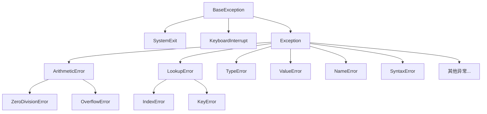

# Python 异常类型

## 什么是Python异常？

在Python编程中，异常是程序执行期间发生的错误。当Python解释器遇到无法处理的情况时，会抛出一个异常。如果这个异常没有被适当地处理，程序将会终止运行并显示一个错误消息。

异常处理是编写健壮代码的关键部分，它允许我们优雅地处理错误情况，而不是让程序崩溃。

## Python 异常层次结构

Python的所有内置异常都继承自`BaseException`类，形成了一个层次结构。下面是一个简化的异常层次图：



在实际编程中，最常见的异常都是`Exception`的子类。

## 常见的Python异常类型

### 语法和解析错误

#### SyntaxError

当Python解释器遇到语法错误时，会引发`SyntaxError`。这通常是由于代码中存在语法问题，如缺少括号、冒号等。

```python
# 错误示例：缺少右括号
print("Hello World"
```

输出：
```
  File "<stdin>", line 1
    print("Hello World"
                      ^
SyntaxError: unexpected EOF while parsing
```

#### IndentationError

Python使用缩进来定义代码块，当缩进不正确时，会引发`IndentationError`。

```python
# 错误示例：缩进不一致
def my_function():
print("Indentation error")
```

输出：
```
  File "<stdin>", line 2
    print("Indentation error")
    ^
IndentationError: expected an indented block
```

### 运行时错误

#### TypeError

当操作或函数应用于不适当类型的对象时，会引发`TypeError`。

```python
# 错误示例：尝试将字符串和整数相加
result = "5" + 5
```

输出：
```
Traceback (most recent call last):
  File "<stdin>", line 1, in <module>
TypeError: can only concatenate str (not "int") to str
```

#### ValueError

当函数接收到正确类型但值不适当的参数时，会引发`ValueError`。

```python
# 错误示例：尝试将非数字字符串转换为整数
num = int("hello")
```

输出：
```
Traceback (most recent call last):
  File "<stdin>", line 1, in <module>
ValueError: invalid literal for int() with base 10: 'hello'
```

#### NameError

当访问一个未定义的变量时，会引发`NameError`。

```python
# 错误示例：使用未定义的变量
print(undefined_variable)
```

输出：
```
Traceback (most recent call last):
  File "<stdin>", line 1, in <module>
NameError: name 'undefined_variable' is not defined
```

#### ZeroDivisionError

当除数为零时，会引发`ZeroDivisionError`。

```python
# 错误示例：除以零
result = 10 / 0
```

输出：
```
Traceback (most recent call last):
  File "<stdin>", line 1, in <module>
ZeroDivisionError: division by zero
```

### 容器和访问错误

#### IndexError

当尝试访问超出序列范围的索引时，会引发`IndexError`。

```python
# 错误示例：访问列表中不存在的索引
my_list = [1, 2, 3]
print(my_list[5])
```

输出：
```
Traceback (most recent call last):
  File "<stdin>", line 2, in <module>
IndexError: list index out of range
```

#### KeyError

当尝试访问字典中不存在的键时，会引发`KeyError`。

```python
# 错误示例：访问字典中不存在的键
my_dict = {"name": "John", "age": 30}
print(my_dict["address"])
```

输出：
```
Traceback (most recent call last):
  File "<stdin>", line 2, in <module>
KeyError: 'address'
```

#### AttributeError

当尝试访问对象不存在的属性时，会引发`AttributeError`。

```python
# 错误示例：访问字符串对象不存在的方法
text = "Hello"
text.append(" World")
```

输出：
```
Traceback (most recent call last):
  File "<stdin>", line 2, in <module>
AttributeError: 'str' object has no attribute 'append'
```

### 文件和I/O错误

#### FileNotFoundError

当尝试打开不存在的文件时，会引发`FileNotFoundError`。

```python
# 错误示例：尝试打开不存在的文件
with open("nonexistent_file.txt", "r") as file:
    content = file.read()
```

输出：
```
Traceback (most recent call last):
  File "<stdin>", line 1, in <module>
FileNotFoundError: [Errno 2] No such file or directory: 'nonexistent_file.txt'
```

#### PermissionError

当尝试执行没有权限的操作时，会引发`PermissionError`。

```python
# 错误示例：尝试写入只读文件（假设该文件是只读的）
with open("/etc/passwd", "w") as file:
    file.write("Something")
```

输出：
```
Traceback (most recent call last):
  File "<stdin>", line 1, in <module>
PermissionError: [Errno 13] Permission denied: '/etc/passwd'
```

## 实际应用案例

### 案例1：用户输入验证

在用户输入处理中，我们经常需要验证输入的类型和有效性。以下是一个简单的计算器程序，展示了如何处理可能的异常：

```python
def calculator():
    try:
        num1 = float(input("请输入第一个数字: "))
        num2 = float(input("请输入第二个数字: "))
        operation = input("请输入运算符(+, -, *, /): ")
        
        if operation == "+":
            result = num1 + num2
        elif operation == "-":
            result = num1 - num2
        elif operation == "*":
            result = num1 * num2
        elif operation == "/":
            result = num1 / num2
        else:
            raise ValueError("不支持的运算符")
            
        print(f"结果: {result}")
        
    except ValueError as e:
        if str(e).startswith("不支持的"):
            print(e)
        else:
            print("请输入有效的数字!")
    except ZeroDivisionError:
        print("除数不能为零!")
    except Exception as e:
        print(f"发生错误: {e}")

calculator()
```

当用户输入不当时，程序会给出友好的错误提示，而不是崩溃。

### 案例2：文件处理

在文件处理中，异常处理可以帮助我们处理各种可能的错误情况：

```python
def read_and_process_file(filename):
    try:
        with open(filename, 'r') as file:
            content = file.read()
            # 处理文件内容
            word_count = len(content.split())
            return f"文件包含 {word_count} 个单词"
    except FileNotFoundError:
        return f"文件 '{filename}' 不存在"
    except PermissionError:
        return f"没有权限读取文件 '{filename}'"
    except UnicodeDecodeError:
        return f"无法解码文件 '{filename}'，可能不是文本文件"
    except Exception as e:
        return f"处理文件时发生错误: {e}"

print(read_and_process_file("sample.txt"))
print(read_and_process_file("nonexistent.txt"))
```

这个例子展示了如何处理文件操作中可能遇到的各种异常，使程序更加健壮。

## 自定义异常类

有时候，内置异常可能无法满足我们的需求，此时我们可以创建自定义异常类：

```python
class InsufficientFundsError(Exception):
    """当账户余额不足时引发的异常"""
    def __init__(self, balance, amount):
        self.balance = balance
        self.amount = amount
        self.message = f"余额不足。当前余额: {balance}，尝试提取: {amount}"
        super().__init__(self.message)

class BankAccount:
    def __init__(self, owner, balance=0):
        self.owner = owner
        self.balance = balance
        
    def deposit(self, amount):
        if amount <= 0:
            raise ValueError("存款金额必须为正数")
        self.balance += amount
        return self.balance
    
    def withdraw(self, amount):
        if amount <= 0:
            raise ValueError("提款金额必须为正数")
        if amount > self.balance:
            raise InsufficientFundsError(self.balance, amount)
        self.balance -= amount
        return self.balance

# 使用示例
account = BankAccount("John", 100)
try:
    account.withdraw(150)
except InsufficientFundsError as e:
    print(e)
```

输出：
```
余额不足。当前余额: 100，尝试提取: 150
```

通过创建自定义异常，我们可以提供更具体的错误信息，使代码更易于理解和维护。

## 总结

1. **异常是程序执行过程中发生的错误情况**，Python提供了丰富的异常类型来描述不同的错误。

2. **所有异常都继承自BaseException类**，但我们通常只关注Exception及其子类。

3. **常见的异常类型**包括：
   - 语法错误：SyntaxError, IndentationError
   - 运算错误：TypeError, ValueError, ZeroDivisionError
   - 命名错误：NameError
   - 访问错误：IndexError, KeyError, AttributeError
   - 文件错误：FileNotFoundError, PermissionError

4. **正确处理异常可以增强程序的健壮性**，防止因小错误导致整个程序崩溃。

5. **当内置异常无法满足需求时**，我们可以创建自定义异常类。

:::tip 学习建议
理解不同的异常类型只是第一步。真正掌握异常处理需要通过大量实践，了解何时捕获异常，何时让异常传播，以及如何设计适当的异常处理策略。
:::

## 练习

1. 编写一个函数，尝试将用户输入转换为整数，并处理可能的ValueError。
2. 创建一个程序，尝试读取一个文件并计算其中的行数，处理可能的文件相关异常。
3. 实现一个简单的除法计算器，处理可能的ZeroDivisionError和TypeError。
4. 创建一个自定义异常类"NegativeNumberError"，并在一个函数中使用它来验证输入是否为正数。
5. 编写一个程序，尝试访问列表和字典中的元素，并处理可能的IndexError和KeyError。

## 延伸阅读

- [Python官方文档 - 内置异常](https://docs.python.org/zh-cn/3/library/exceptions.html)
- [Python异常处理最佳实践](https://docs.python.org/zh-cn/3/tutorial/errors.html)
- [如何设计自定义异常类](https://www.python.org/dev/peps/pep-0352/)

通过掌握Python的异常类型及其处理方法，你将能够编写更加健壮和可维护的代码，为后续的编程学习打下坚实的基础。