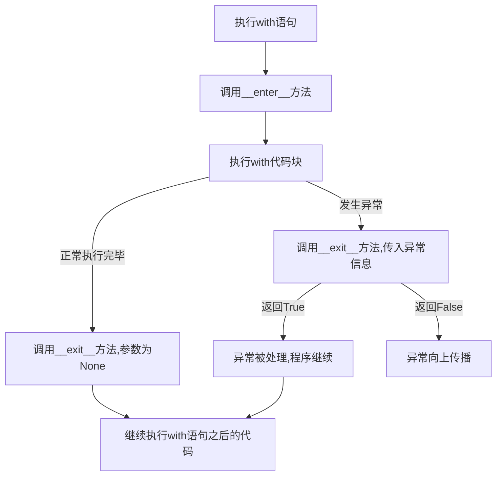

# Python 上下文管理器

## 什么是上下文管理器？

上下文管理器是Python中一种特殊的对象，它定义了在执行代码块时要建立的运行时上下文。上下文管理器的主要作用是在进入代码块之前进行一些准备工作（如打开文件、获取资源），并在退出代码块时进行必要的清理工作（如关闭文件、释放资源），无论代码块是正常执行完毕还是发生异常。

上下文管理器通常与`with`语句一起使用，这大大简化了资源管理的代码编写。

## with语句基本语法

```python
with 上下文管理器表达式 as 变量:
    # 代码块
    # 在这个代码块中可以使用上下文管理器分配的资源
```

当执行`with`语句时，会发生以下过程：
1. 执行上下文管理器表达式，获取上下文管理器对象
2. 调用上下文管理器的`__enter__()`方法
3. 将`__enter__()`方法的返回值赋值给`as`后面的变量（如果有的话）
4. 执行`with`语句体内的代码
5. 无论代码执行是否出现异常，都会调用上下文管理器的`__exit__()`方法

## 文件操作中的上下文管理器

文件对象是Python中最常见的上下文管理器之一。使用`with`语句处理文件可以确保文件在使用完毕后被正确关闭，即使发生异常也是如此。

### 传统文件操作 vs. 使用上下文管理器

传统方式打开和关闭文件：

```python
# 传统方式打开文件
try:
    file = open('example.txt', 'r')
    content = file.read()
    # 处理文件内容
finally:
    file.close()  # 确保文件被关闭
```

使用上下文管理器：

```python
# 使用with语句（上下文管理器）
with open('example.txt', 'r') as file:
    content = file.read()
    # 处理文件内容
# 文件会自动关闭，无需显式调用close()
```

:::tip
使用上下文管理器处理文件有以下优势：
- 代码更加简洁易读
- 自动处理异常情况
- 确保资源正确释放，防止资源泄露
:::

## 创建自定义上下文管理器

有两种方式可以创建自定义的上下文管理器：
1. 创建一个包含`__enter__()`和`__exit__()`方法的类
2. 使用`contextlib`模块中的装饰器`@contextmanager`

### 使用类创建上下文管理器

要创建一个上下文管理器类，需要实现以下两个方法：
- `__enter__()`: 在进入`with`语句块时调用，返回值会被赋给`as`后的变量
- `__exit__(exc_type, exc_val, exc_tb)`: 在离开`with`语句块时调用，负责处理异常和清理资源

```python
class MyFileManager:
    def __init__(self, filename, mode):
        self.filename = filename
        self.mode = mode
        self.file = None
        
    def __enter__(self):
        self.file = open(self.filename, self.mode)
        return self.file
    
    def __exit__(self, exc_type, exc_val, exc_tb):
        if self.file:
            self.file.close()
        # 返回True表示异常已处理，False表示异常需要传播
        return False

# 使用自定义的上下文管理器
with MyFileManager('example.txt', 'r') as f:
    content = f.read()
    print(content)
```

#### `__exit__` 方法参数解析:

- `exc_type`: 异常类型（如果有的话）
- `exc_val`: 异常值
- `exc_tb`: 异常的追踪信息

如果`with`代码块正常执行结束，这三个参数都是`None`。如果发生异常，则会包含相应的异常信息。

### 使用contextlib模块

`contextlib`模块提供了`@contextmanager`装饰器，可以更简单地创建上下文管理器。使用这个装饰器，只需要编写一个包含`yield`语句的生成器函数：

```python
from contextlib import contextmanager

@contextmanager
def my_file_manager(filename, mode):
    try:
        file = open(filename, mode)
        yield file  # yield语句之前的代码相当于__enter__部分
    finally:
        file.close()  # yield语句之后的代码相当于__exit__部分

# 使用自定义的上下文管理器
with my_file_manager('example.txt', 'r') as f:
    content = f.read()
    print(content)
```

`@contextmanager`装饰器将一个生成器函数转换为上下文管理器：
- `yield`语句之前的代码会在进入`with`语句块时执行
- `yield`表达式的值会赋给`as`后的变量
- `yield`语句之后的代码会在离开`with`语句块时执行，无论是否发生异常

## 实际应用场景

### 1. 数据库连接管理

```python
import sqlite3
from contextlib import contextmanager

@contextmanager
def db_connection(db_name):
    conn = sqlite3.connect(db_name)
    try:
        yield conn
    finally:
        conn.close()

# 使用上下文管理器管理数据库连接
with db_connection('example.db') as conn:
    cursor = conn.cursor()
    cursor.execute('SELECT * FROM users')
    for row in cursor.fetchall():
        print(row)
# 连接会在此处自动关闭
```

### 2. 锁的获取与释放

```python
import threading
from contextlib import contextmanager

@contextmanager
def acquire_lock(lock):
    lock.acquire()
    try:
        yield
    finally:
        lock.release()

# 使用上下文管理器管理锁
lock = threading.Lock()

with acquire_lock(lock):
    # 临界区代码
    print("在锁保护的临界区内执行操作")
# 锁会在此处自动释放
```

### 3. 临时修改设置

```python
import os
from contextlib import contextmanager

@contextmanager
def change_directory(path):
    old_dir = os.getcwd()
    os.chdir(path)
    try:
        yield
    finally:
        os.chdir(old_dir)

# 使用上下文管理器临时切换目录
with change_directory('/tmp'):
    print(f"当前工作目录: {os.getcwd()}")
    # 在临时目录中执行操作
print(f"返回到原始目录: {os.getcwd()}")
```

### 4. 计时器

```python
import time
from contextlib import contextmanager

@contextmanager
def timer(name):
    start = time.time()
    try:
        yield
    finally:
        end = time.time()
        print(f"{name} 耗时: {end - start:.2f} 秒")

# 使用上下文管理器计时
with timer("处理数据"):
    # 执行一些耗时操作
    time.sleep(2)  # 模拟耗时操作
```

## 上下文管理器的常用标准库例子

Python 标准库中有许多内置的上下文管理器：

1. `open()` - 文件操作
2. `threading.Lock()` - 线程锁
3. `tempfile.NamedTemporaryFile()` - 临时文件
4. `decimal.localcontext()` - 本地小数上下文
5. `contextlib.suppress()` - 忽略特定异常

```python
import contextlib

# 使用 suppress 忽略特定异常
with contextlib.suppress(FileNotFoundError):
    open('不存在的文件.txt').read()  # 不会抛出异常
    
print("程序继续执行")
```

## 上下文管理器嵌套

可以在一个`with`语句中使用多个上下文管理器：

```python
# 方式一：嵌套的with语句
with open('input.txt', 'r') as infile:
    with open('output.txt', 'w') as outfile:
        for line in infile:
            outfile.write(line)

# 方式二：在一个with语句中使用多个上下文管理器
with open('input.txt', 'r') as infile, open('output.txt', 'w') as outfile:
    for line in infile:
        outfile.write(line)
```

## 上下文管理器执行流程图



## 总结

Python上下文管理器是一种优雅的资源管理机制，通过`with`语句实现。它确保在代码执行前后正确地获取和释放资源，即使发生异常也能妥善处理。主要优势包括：

1. **自动资源管理**：无需手动关闭文件、释放锁或关闭数据库连接
2. **简化异常处理**：确保资源在异常情况下也能正确释放
3. **代码更加简洁**：减少样板代码，提高可读性
4. **防止资源泄露**：避免因忘记关闭资源导致的问题

上下文管理器既可以通过实现`__enter__`和`__exit__`方法的类创建，也可以使用`contextlib`模块的`@contextmanager`装饰器更简洁地创建。

## 练习

1. 创建一个上下文管理器，用于在执行代码块前后打印消息
2. 实现一个上下文管理器，用于在操作过程中禁止标准输出
3. 编写一个上下文管理器，用于在代码执行期间临时修改环境变量
4. 编写一个上下文管理器，用于在操作过程中捕获和记录特定类型的异常

## 扩展资源

- [Python官方文档 - with语句](https://docs.python.org/3/reference/compound_stmts.html#with)
- [Python官方文档 - contextlib模块](https://docs.python.org/3/library/contextlib.html)
- [PEP 343 – The "with" Statement](https://peps.python.org/pep-0343/)

:::note
上下文管理器是Python中实现RAII（Resource Acquisition Is Initialization，资源获取即初始化）模式的主要方式，这是一种确保资源正确管理的设计模式。
:::