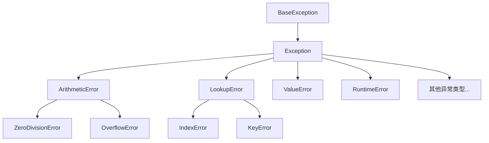

# Python Try Except

## 什么是异常处理？

在程序运行过程中，各种异常情况可能发生 - 文件可能不存在、网络连接可能中断、用户输入可能无效。如果不妥善处理这些异常，程序将会崩溃。Python的`try-except`机制提供了一种优雅处理这些意外情况的方法，让我们能够捕获错误并采取适当的措施。

:::note
异常处理是编写稳健程序的关键技能，它让程序能够"优雅地失败"而不是突然崩溃。
:::

## Try-Except 基础语法

Python异常处理的基本结构由`try`和`except`块组成：

```python
try:
    # 可能引发异常的代码
    # ...
except:
    # 处理异常的代码
    # ...
```

当`try`块中的代码执行过程中发生错误时，程序会立即跳转到`except`块，执行异常处理代码。

### 基本示例

```python
try:
    number = int(input("请输入一个整数: "))
    print(f"您输入的数字是: {number}")
except:
    print("输入无效，请确保输入的是整数")
```

**输出示例：**
```
请输入一个整数: abc
输入无效，请确保输入的是整数
```

## 捕获特定异常

在实际开发中，我们通常需要针对不同类型的异常采取不同的处理措施。Python允许我们指定要捕获的异常类型：

```python
try:
    # 可能引发异常的代码
    # ...
except ExceptionType:
    # 处理特定类型异常的代码
    # ...
```

### 多种异常类型示例

```python
try:
    number = int(input("请输入一个整数: "))
    result = 100 / number
    print(f"100 除以 {number} 的结果是 {result}")
except ValueError:
    print("输入无效，请确保输入的是整数")
except ZeroDivisionError:
    print("错误：不能除以零")
```

**输出示例1：**
```
请输入一个整数: abc
输入无效，请确保输入的是整数
```

**输出示例2：**
```
请输入一个整数: 0
错误：不能除以零
```

## 同时捕获多个异常

如果多种异常需要相同的处理逻辑，可以在一个except语句中列出多个异常类型：

```python
try:
    number = int(input("请输入一个整数: "))
    result = 100 / number
    print(f"100 除以 {number} 的结果是 {result}")
except (ValueError, ZeroDivisionError):
    print("发生错误：请输入一个非零整数")
```

## 获取异常信息

在处理异常时，我们通常需要了解具体发生了什么错误。可以通过在except后使用`as`关键字来获取异常对象：

```python
try:
    number = int(input("请输入一个整数: "))
    result = 100 / number
    print(f"100 除以 {number} 的结果是 {result}")
except Exception as e:
    print(f"发生错误：{e}")
```

**输出示例：**
```
请输入一个整数: 0
发生错误：division by zero
```

## else 和 finally 子句

Python的异常处理还包括`else`和`finally`子句，它们分别在不同的情况下执行：

```python
try:
    # 可能引发异常的代码
except ExceptionType:
    # 处理异常
else:
    # 如果try块没有引发异常，则执行此代码
finally:
    # 无论是否发生异常，都会执行此代码
```

### 完整示例

```python
try:
    file = open("example.txt", "r")
    content = file.read()
    print(content)
except FileNotFoundError:
    print("文件不存在")
else:
    print("文件读取成功")
finally:
    print("操作完成")
    # 确保文件关闭，即使发生异常
    if 'file' in locals():
        file.close()
```

## 异常层次结构

Python的异常是有层次结构的，所有异常都继承自`BaseException`。了解这个层次结构对于正确捕获异常非常重要。



:::tip
在处理异常时，应该从最具体的异常开始捕获，到最一般的异常结束。因为一旦异常被捕获，就不会再被后续的except块处理。
:::

## 自定义异常

在更复杂的应用程序中，我们可能需要定义自己的异常类型来表示特定的错误条件：

```python
class CustomError(Exception):
    """自定义异常类"""
    pass

try:
    x = -5
    if x < 0:
        raise CustomError("不允许使用负数")
    print(f"x的值是: {x}")
except CustomError as e:
    print(f"捕获到自定义异常：{e}")
```

**输出：**
```
捕获到自定义异常：不允许使用负数
```

## 实际应用案例

### 案例1：网络请求处理

在实际开发中，网络请求可能因多种原因失败。以下是使用try-except处理网络请求的例子：

```python
import requests

def get_data_from_api(url):
    try:
        response = requests.get(url, timeout=5)
        response.raise_for_status()  # 如果响应状态码不是200，将引发HTTPError
        return response.json()
    except requests.exceptions.HTTPError as e:
        print(f"HTTP错误：{e}")
    except requests.exceptions.ConnectionError:
        print("网络连接错误，请检查您的网络连接")
    except requests.exceptions.Timeout:
        print("请求超时，服务器可能响应过慢")
    except requests.exceptions.RequestException as e:
        print(f"请求出现未知错误：{e}")
    except ValueError:
        print("无法解析JSON响应")
    return None

# 使用示例
data = get_data_from_api("https://api.example.com/data")
if data:
    print("成功获取数据:", data)
else:
    print("获取数据失败")
```

### 案例2：文件处理

文件操作是另一个需要异常处理的常见场景：

```python
def read_and_process_file(filename):
    try:
        with open(filename, "r") as file:
            data = file.readlines()
        
        # 处理数据
        processed_data = [line.strip().upper() for line in data]
        return processed_data
    
    except FileNotFoundError:
        print(f"错误：文件 '{filename}' 不存在")
    except PermissionError:
        print(f"错误：没有权限读取文件 '{filename}'")
    except UnicodeDecodeError:
        print(f"错误：文件 '{filename}' 编码格式不支持")
    except Exception as e:
        print(f"处理文件时发生未知错误：{e}")
    
    return []

# 使用示例
lines = read_and_process_file("data.txt")
if lines:
    print(f"处理了 {len(lines)} 行数据")
    print("前3行:", lines[:3])
else:
    print("没有数据可处理")
```

## 最佳实践

在使用Python异常处理时，请遵循以下最佳实践：

1. **不要捕获所有异常** - 避免使用`except:`而不指定异常类型，这可能会掩盖程序中的严重问题。
2. **按照具体到一般的顺序捕获异常** - 先捕获特定异常，再捕获一般异常。
3. **只在真正需要处理异常的地方使用try-except** - 不要过度使用异常处理。
4. **保持异常处理代码简洁** - 大型代码块不应放在异常处理中。
5. **利用finally确保资源释放** - 无论异常是否发生，都确保释放诸如文件句柄或数据库连接等资源。
6. **提供有意义的错误信息** - 当异常发生时，给出清晰的错误消息。

:::caution
不要使用异常处理来控制正常的程序流程。异常处理应该用于处理"异常"情况，而不是预期的条件。
:::

## 总结

Python的try-except机制是一个强大的工具，可以帮助我们编写更加健壮的程序。通过正确处理异常，我们可以：

- 防止程序因错误而崩溃
- 提供友好的错误信息给用户
- 优雅地处理意外情况
- 确保资源正确释放

掌握异常处理是成为熟练Python开发者的重要一步。记住，好的异常处理不仅仅是捕获错误，而是以有意义且有用的方式响应错误。

## 练习题

为了巩固所学知识，尝试完成以下练习：

1. 编写一个函数，接受一个文件名和一个数字n，返回文件的第n行内容。处理所有可能的异常情况。
2. 创建一个简单的计算器程序，处理用户输入的各种错误（除零、无效输入等）。
3. 写一个从网站下载文件的程序，处理网络连接、文件写入等可能出现的异常。

## 扩展阅读

- [Python官方文档 - 错误和异常](https://docs.python.org/3/tutorial/errors.html)
- [Python内置异常层次结构](https://docs.python.org/3/library/exceptions.html)
- [Python with语句和上下文管理器](https://docs.python.org/3/reference/compound_stmts.html#the-with-statement)

通过持续实践和学习，你将能够编写出更加健壮和可靠的Python程序。异常处理是编程技能的重要组成部分，掌握它将使你的代码质量显著提高。