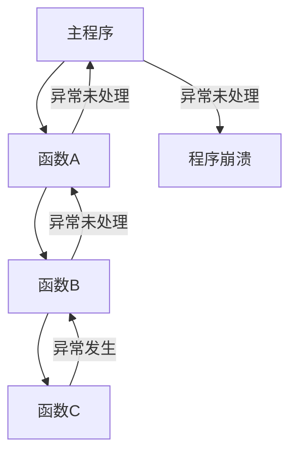

# Python 异常传播

在Python程序执行过程中，当出现错误时，会引发异常。理解异常如何在程序中传播对于编写健壮的代码至关重要。本文将带你深入理解Python异常传播机制，并通过实例展示如何合理地处理它们。

## 什么是异常传播？

异常传播是指当在函数或方法内部发生异常时，如果该异常没有在当前函数内被捕获和处理，它会向上"冒泡"到调用该函数的地方，一直传递直到被处理或导致程序终止。



## 异常传播的基本原理

当Python解释器执行代码时，会维护一个称为"调用栈"的结构。每当调用一个函数，就会在栈顶添加一个新的"帧"。当函数执行完毕后，其帧会从栈中移除。

如果函数执行过程中发生异常，Python会：

1. 立即停止当前函数的执行
2. 在调用栈中向上查找能够处理该异常的异常处理器（try-except块）
3. 如果找到了合适的异常处理器，则执行对应的处理代码
4. 如果到达栈底都没找到处理器，程序会终止并显示错误信息

让我们通过一个简单的例子来说明：

```python
def function_c():
    print("进入function_c")
    # 除零错误
    result = 10 / 0
    print("离开function_c")  # 这行不会执行

def function_b():
    print("进入function_b")
    function_c()
    print("离开function_b")  # 这行不会执行

def function_a():
    print("进入function_a")
    function_b()
    print("离开function_a")  # 这行不会执行

# 主程序
try:
    print("开始程序")
    function_a()
    print("程序正常结束")  # 这行不会执行
except ZeroDivisionError:
    print("捕获到除零错误")

print("程序继续执行")
```

**输出：**
```
开始程序
进入function_a
进入function_b
进入function_c
捕获到除零错误
程序继续执行
```

在这个例子中：
1. 异常发生在`function_c`中
2. 由于`function_c`没有处理这个异常，它传播到`function_b`
3. `function_b`也没有处理，继续传播到`function_a`
4. `function_a`同样没有处理，异常传播到主程序
5. 主程序中的try-except块捕获并处理了这个异常

## 异常传播过程中的清理操作

当异常传播时，Python提供了一种机制来确保即使发生异常，特定的清理代码也能执行，这就是`finally`子句。

```python
def process_file(filename):
    try:
        file = open(filename, 'r')
        content = file.read()
        return content
    except FileNotFoundError:
        print(f"文件 {filename} 不存在")
        return None
    finally:
        # 无论是否发生异常，此代码块都会执行
        print("清理资源...")
        # 如果文件成功打开，则关闭它
        if 'file' in locals() and not file.closed:
            file.close()
            print("文件已关闭")

def process_data():
    try:
        data = process_file("不存在的文件.txt")
        # 处理数据...
    except Exception as e:
        print(f"处理数据时出错: {e}")
    
process_data()
```

**输出：**
```
文件 不存在的文件.txt 不存在
清理资源...
```

在这个例子中，即使`process_file`函数中发生了`FileNotFoundError`异常，`finally`块中的代码仍然会执行，确保资源被正确释放。

## 显式抛出和重新引发异常

有时，你可能需要在捕获异常后再次抛出它，或者抛出一个全新的异常。

### 重新引发当前异常

```python
def validate_age(age):
    try:
        if not isinstance(age, int):
            raise TypeError("年龄必须是整数")
        if age < 0:
            raise ValueError("年龄不能为负数")
        if age > 150:
            raise ValueError("年龄不太可能超过150")
    except (TypeError, ValueError) as e:
        print(f"验证失败: {e}")
        # 重新引发当前异常
        raise

try:
    validate_age(200)
except Exception as e:
    print(f"捕获到异常: {e}")
```

**输出：**
```
验证失败: 年龄不太可能超过150
捕获到异常: 年龄不太可能超过150
```

### 抛出不同的异常

```python
def divide(a, b):
    try:
        return a / b
    except ZeroDivisionError:
        # 捕获特定异常，但抛出更有意义的异常
        raise ValueError("除数不能为零") from None

try:
    result = divide(10, 0)
except ValueError as e:
    print(f"错误: {e}")
```

**输出：**
```
错误: 除数不能为零
```

### 链接异常

默认情况下，当你在一个`except`块中引发新异常时，Python会自动链接原始异常作为新异常的"__cause__"。如果你不想这样，可以使用`from None`来抑制这种行为。

```python
def process_data(data):
    try:
        # 假设这里可能会出现错误
        value = data['key']
        return value / 0  # 这会引发ZeroDivisionError
    except ZeroDivisionError as e:
        # 创建新异常，并链接原始异常
        raise ValueError("无法处理数据") from e

try:
    process_data({'key': 10})
except ValueError as e:
    print(f"捕获到ValueError: {e}")
    print(f"原始异常: {e.__cause__}")
```

**输出：**
```
捕获到ValueError: 无法处理数据
原始异常: division by zero
```

## 实际应用案例

### 案例1：Web API调用中的异常传播

```python
import requests
import json
from time import sleep

def call_api(url):
    try:
        response = requests.get(url, timeout=5)
        response.raise_for_status()  # 如果状态码不是200，会引发HTTPError
        return response.json()
    except requests.exceptions.HTTPError as e:
        print(f"HTTP错误: {e}")
        raise
    except requests.exceptions.ConnectionError:
        print("网络连接错误，尝试重新连接...")
        raise
    except requests.exceptions.Timeout:
        print("请求超时")
        raise
    except requests.exceptions.RequestException as e:
        print(f"请求异常: {e}")
        raise
    except json.JSONDecodeError:
        print("返回的数据不是有效的JSON格式")
        raise

def get_user_data(user_id):
    max_retries = 3
    retry_count = 0
    
    while retry_count < max_retries:
        try:
            url = f"https://api.example.com/users/{user_id}"
            data = call_api(url)
            return data
        except requests.exceptions.ConnectionError:
            retry_count += 1
            if retry_count < max_retries:
                sleep(2)  # 等待2秒后重试
            else:
                print("已达到最大重试次数")
                raise
        except Exception as e:
            print(f"获取用户数据失败: {e}")
            raise

# 使用示例
try:
    user_data = get_user_data(123)
    print(f"用户名: {user_data['name']}")
except Exception as e:
    print(f"程序失败: {e}")
```

这个例子展示了在实际应用中如何通过异常传播来处理API调用中可能出现的各种错误，并实现了重试机制。

### 案例2：多层次异常处理的数据库操作

```python
class DatabaseError(Exception):
    """数据库操作相关错误的基类"""
    pass

class ConnectionError(DatabaseError):
    """数据库连接错误"""
    pass

class QueryError(DatabaseError):
    """数据库查询错误"""
    pass

def connect_to_database():
    # 模拟数据库连接过程
    import random
    if random.random() < 0.2:
        raise ConnectionError("无法连接到数据库服务器")
    return "数据库连接对象"

def execute_query(connection, query):
    # 模拟查询执行
    import random
    if random.random() < 0.3:
        raise QueryError(f"执行查询失败: {query}")
    return ["结果1", "结果2", "结果3"]

def get_user_records(user_id):
    connection = None
    try:
        connection = connect_to_database()
        query = f"SELECT * FROM users WHERE id = {user_id}"
        results = execute_query(connection, query)
        return results
    except ConnectionError as e:
        print(f"数据库连接错误: {e}")
        raise
    except QueryError as e:
        print(f"查询执行错误: {e}")
        raise
    finally:
        if connection:
            print("关闭数据库连接")
            # connection.close()  # 实际代码中这里会关闭连接

# 在应用程序层处理数据库异常
def safe_get_user_data(user_id):
    try:
        return get_user_records(user_id)
    except DatabaseError as e:
        print(f"数据库操作失败: {e}")
        return []

# 调用示例
records = safe_get_user_data(42)
print(f"获取到的记录: {records}")
```

这个例子展示了如何创建自定义异常层次结构，以及如何在多层函数调用间处理异常传播。

## 异常传播的最佳实践

1. **只在适当的抽象层级处理异常**
   - 底层函数应该抛出精确的异常
   - 高层函数应该捕获并根据需要转换异常

2. **使用异常层次结构**
   - 创建自定义异常时，遵循继承体系
   - 从最具体到最通用的异常顺序捕获

3. **保持透明的异常传递**
   - 在文档中明确函数可能抛出的异常
   - 使用"from"语法保留异常链

4. **避免过度使用try-except**
   - 不要使用异常控制正常的程序流
   - 不要捕获所有异常再静默忽略

5. **总是清理资源**
   - 使用`finally`或更好的`with`语句确保资源释放
   - 即使在异常传播过程中也要关闭文件和连接

:::tip 提示
在Python中，使用`with`语句可以确保资源在使用后被正确释放，即使发生异常。这比手动在`try-finally`块中管理资源更加简洁和安全。
:::

```python
# 推荐的文件处理方式
with open('file.txt', 'r') as file:
    content = file.read()
    # 即使这里发生异常，文件也会被自动关闭
```

## 小结

异常传播是Python错误处理机制的核心概念。理解异常如何在调用栈中传播，能够帮助你编写更健壮的代码，并有效地处理各种错误情况。合理使用异常传播机制，可以实现：

- 将异常处理与正常业务逻辑分离
- 在适当的抽象层级处理异常
- 确保资源在所有情况下都能被正确释放
- 提供有意义的错误信息给用户或日志系统

## 练习

1. 创建一个函数调用链（至少包含3个函数），在最内层函数中引发异常，然后在外层函数中捕获并处理它。
2. 修改上述代码，在中间函数中添加部分异常处理，但让某些异常继续传播。
3. 实现一个简单的文件处理程序，包含异常处理和资源清理，使用`try-except-finally`和`with`语句两种方式，比较它们的差异。
4. 创建自定义异常类层次结构，并编写代码演示异常的传播和适当的处理方式。

:::caution 注意
异常处理应该是程序设计的重要部分，而不是事后添加的功能。在编写函数时就应考虑可能的异常情况，并设计相应的处理策略。
:::

通过本文的学习，你应该能够理解Python异常传播的工作原理，并在自己的代码中合理地处理异常。记住，好的异常处理能使你的程序更加健壮，提供更好的用户体验。