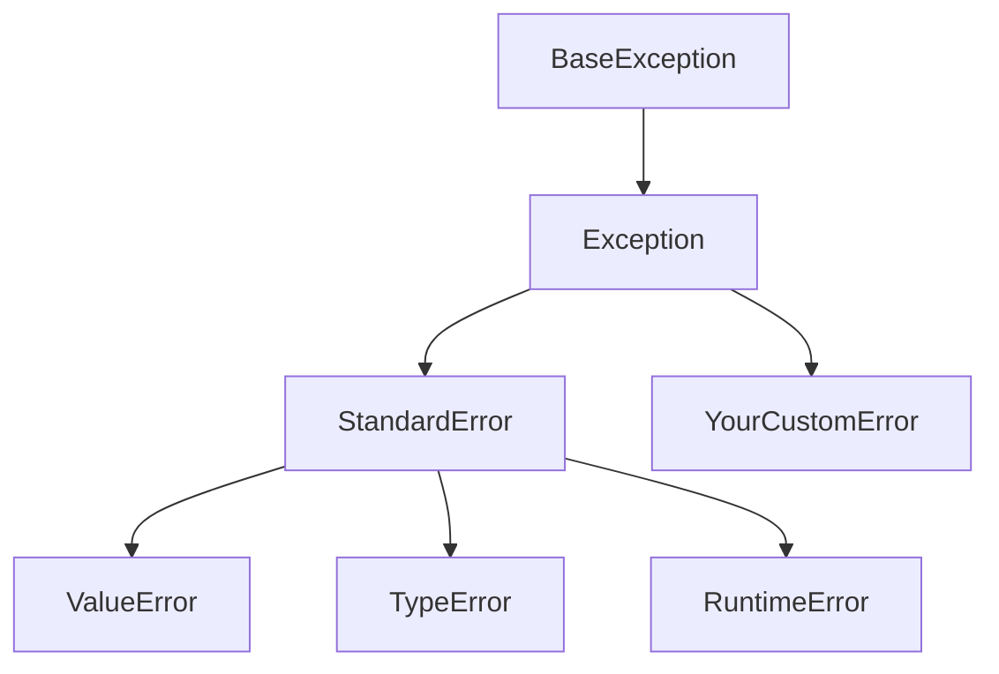

# Python 自定义异常

## 什么是自定义异常？

在Python编程中，内置的异常类型（如`ValueError`、`TypeError`等）可以处理大多数常见错误情况。但当我们需要表达特定于应用程序的错误条件时，创建自定义异常类是更好的选择。

自定义异常是通过继承Python的内置`Exception`类（或其子类）来创建的，它们允许我们：

- 为应用程序特定的错误定义有意义的名称
- 提供更精确的错误处理机制
- 使代码更加清晰和自文档化

## 为什么需要自定义异常？

:::tip 自定义异常的优势
1. **提高可读性** - 错误名称可以直接反映业务逻辑
2. **精确的错误捕获** - 可以只捕获特定类型的异常
3. **丰富异常信息** - 可以包含更多与应用程序相关的数据
:::

## 创建自定义异常

在Python中创建自定义异常非常简单，只需要创建一个继承自`Exception`的新类：

```python
class MyCustomError(Exception):
    pass

# 使用自定义异常
def check_value(value):
    if value < 0:
        raise MyCustomError("值不能为负数")

try:
    check_value(-5)
except MyCustomError as e:
    print(f"捕获到自定义异常: {e}")
```

输出:
```
捕获到自定义异常: 值不能为负数
```

## 为自定义异常添加功能

自定义异常也可以有自己的属性和方法，使其更加功能丰富：

```python
class ValueTooSmallError(Exception):
    def __init__(self, value, min_value):
        self.value = value
        self.min_value = min_value
        self.message = f"提供的值 {value} 小于最小允许值 {min_value}"
        super().__init__(self.message)
    
    def get_value(self):
        return self.value
    
    def get_min_value(self):
        return self.min_value

def process_value(value):
    min_value = 10
    if value < min_value:
        raise ValueTooSmallError(value, min_value)
    return value * 2

try:
    result = process_value(5)
    print(f"处理结果: {result}")
except ValueTooSmallError as e:
    print(f"错误: {e}")
    print(f"您提供的值: {e.get_value()}")
    print(f"最小允许值: {e.get_min_value()}")
```

输出:
```
错误: 提供的值 5 小于最小允许值 10
您提供的值: 5
最小允许值: 10
```

## 异常层次结构

创建自定义异常时，选择正确的父类非常重要。以下是Python异常层次结构的简化版本：



通常，我们会直接从`Exception`类继承，但有时从更具体的异常类继承更有意义：

```python
# 从ValueError继承，表示这是一种值错误的特殊情况
class NegativeValueError(ValueError):
    pass

# 从TypeError继承，表示这是一种类型错误的特殊情况
class InvalidUserTypeError(TypeError):
    pass
```

## 实际应用案例

### 案例1：用户管理系统

```python
class UserError(Exception):
    """用户相关的基本异常类"""
    pass

class UserNotFoundError(UserError):
    """用户不存在时的异常"""
    def __init__(self, username):
        self.username = username
        super().__init__(f"用户 '{username}' 不存在")

class UserAlreadyExistsError(UserError):
    """用户已存在时的异常"""
    def __init__(self, username):
        self.username = username
        super().__init__(f"用户 '{username}' 已存在")

class InsufficientPermissionsError(UserError):
    """权限不足时的异常"""
    def __init__(self, username, required_role):
        self.username = username
        self.required_role = required_role
        super().__init__(f"用户 '{username}' 没有所需的 '{required_role}' 角色")

# 用户管理类
class UserManager:
    def __init__(self):
        self.users = {}  # 用户名 -> (密码, 角色)
    
    def add_user(self, username, password, role="user"):
        if username in self.users:
            raise UserAlreadyExistsError(username)
        self.users[username] = (password, role)
        return True
    
    def get_user(self, username):
        if username not in self.users:
            raise UserNotFoundError(username)
        return self.users[username]
    
    def delete_user(self, username, current_user):
        # 获取当前用户信息
        try:
            _, current_role = self.get_user(current_user)
        except UserNotFoundError:
            raise UserNotFoundError(current_user)
        
        # 检查权限
        if current_role != "admin":
            raise InsufficientPermissionsError(current_user, "admin")
        
        # 删除用户
        if username not in self.users:
            raise UserNotFoundError(username)
        
        del self.users[username]
        return True

# 使用示例
def main():
    manager = UserManager()
    
    try:
        # 添加用户
        manager.add_user("admin", "admin123", "admin")
        manager.add_user("user1", "password123")
        
        print("用户添加成功")
        
        # 尝试添加已存在的用户
        manager.add_user("user1", "newpassword")
    except UserAlreadyExistsError as e:
        print(f"错误: {e}")
    
    try:
        # 尝试以普通用户身份删除其他用户
        manager.delete_user("admin", "user1")
    except InsufficientPermissionsError as e:
        print(f"权限错误: {e}")
    
    try:
        # 尝试获取不存在的用户
        manager.get_user("user2")
    except UserNotFoundError as e:
        print(f"查找错误: {e}")

if __name__ == "__main__":
    main()
```

输出:
```
用户添加成功
错误: 用户 'user1' 已存在
权限错误: 用户 'user1' 没有所需的 'admin' 角色
查找错误: 用户 'user2' 不存在
```

### 案例2：文件处理系统

```python
class FileError(Exception):
    """文件处理基本异常类"""
    pass

class FileNotFoundError(FileError):
    """文件不存在异常"""
    def __init__(self, filename):
        self.filename = filename
        super().__init__(f"文件 '{filename}' 不存在")

class FileFormatError(FileError):
    """文件格式错误异常"""
    def __init__(self, filename, expected_format):
        self.filename = filename
        self.expected_format = expected_format
        super().__init__(f"文件 '{filename}' 不是有效的 {expected_format} 格式")

class FileSizeError(FileError):
    """文件大小错误异常"""
    def __init__(self, filename, size, max_size):
        self.filename = filename
        self.size = size
        self.max_size = max_size
        super().__init__(f"文件 '{filename}' 大小 ({size} 字节) 超过最大限制 ({max_size} 字节)")

# 文件处理类
class FileProcessor:
    def __init__(self, max_size=1024*1024):  # 默认最大1MB
        self.max_size = max_size
    
    def process_file(self, filename, expected_format=None):
        # 检查文件是否存在
        import os
        if not os.path.exists(filename):
            raise FileNotFoundError(filename)
        
        # 检查文件大小
        file_size = os.path.getsize(filename)
        if file_size > self.max_size:
            raise FileSizeError(filename, file_size, self.max_size)
        
        # 检查文件格式
        if expected_format:
            file_ext = filename.split('.')[-1].lower()
            if file_ext != expected_format.lower():
                raise FileFormatError(filename, expected_format)
        
        # 处理文件...
        print(f"成功处理文件 '{filename}'")
        return True

# 模拟使用示例 (不实际访问文件系统)
def simulate_file_processing():
    processor = FileProcessor(max_size=500)  # 设置最大500字节
    
    # 模拟文件数据
    mock_files = {
        "document.txt": {"exists": True, "size": 200, "ext": "txt"},
        "image.jpg": {"exists": True, "size": 1000, "ext": "jpg"},
        "missing.pdf": {"exists": False, "size": 0, "ext": "pdf"},
        "wrong_format.png": {"exists": True, "size": 300, "ext": "png"}
    }
    
    # 重写os.path模块的函数以便模拟
    import os
    original_exists = os.path.exists
    original_getsize = os.path.getsize
    
    os.path.exists = lambda f: mock_files.get(f, {"exists": False})["exists"]
    os.path.getsize = lambda f: mock_files.get(f, {"size": 0})["size"]
    
    try:
        # 测试不同场景
        try:
            processor.process_file("document.txt", "txt")  # 应该成功
        except FileError as e:
            print(f"错误: {e}")
            
        try:
            processor.process_file("image.jpg", "jpg")  # 应该失败，文件太大
        except FileError as e:
            print(f"错误: {e}")
            
        try:
            processor.process_file("missing.pdf", "pdf")  # 应该失败，文件不存在
        except FileError as e:
            print(f"错误: {e}")
            
        try:
            processor.process_file("wrong_format.png", "txt")  # 应该失败，格式不对
        except FileError as e:
            print(f"错误: {e}")
    
    finally:
        # 还原原始函数
        os.path.exists = original_exists
        os.path.getsize = original_getsize

simulate_file_processing()
```

输出:
```
成功处理文件 'document.txt'
错误: 文件 'image.jpg' 大小 (1000 字节) 超过最大限制 (500 字节)
错误: 文件 'missing.pdf' 不存在
错误: 文件 'wrong_format.png' 不是有效的 txt 格式
```

## 最佳实践

1. **有意义的命名**: 异常类名应该清晰表达错误的性质
2. **创建异常层次结构**: 为相关异常创建基类，便于捕获相关错误
3. **保持轻量级**: 异常对象应该简单，避免过重的初始化
4. **提供有用信息**: 异常消息应该提供足够的信息帮助调试
5. **文档化**: 为自定义异常类添加文档字符串

```python
class ConfigError(Exception):
    """配置文件相关错误的基类。"""
    pass

class ConfigNotFoundError(ConfigError):
    """当配置文件不存在时抛出。"""
    def __init__(self, filename):
        self.filename = filename
        super().__init__(f"配置文件 '{filename}' 不存在")

class ConfigParseError(ConfigError):
    """当配置文件格式错误时抛出。"""
    def __init__(self, filename, line_number, details):
        self.filename = filename
        self.line_number = line_number
        self.details = details
        super().__init__(f"配置文件 '{filename}' 第 {line_number} 行解析错误: {details}")
```

## 总结

Python自定义异常为我们提供了一种扩展Python错误处理系统的强大方式，可以帮助我们：

- 创建特定于应用的错误类型
- 构建更有意义的异常层次结构
- 提供更详细的错误信息
- 使代码更加可读和可维护

通过合理设计和使用自定义异常，我们可以使应用程序的错误处理更加优雅和健壮，从而提高代码质量。

## 练习

1. 创建一个银行账户类，定义自定义异常以处理各种错误情况（如余额不足、账户不存在等）
2. 设计一个购物车系统，使用自定义异常处理库存不足、无效商品等情况
3. 实现一个简单的用户认证系统，使用自定义异常处理登录失败、密码错误等情况

## 扩展资源

- Python官方文档：[内置异常层次结构](https://docs.python.org/zh-cn/3/library/exceptions.html)
- 《Python Cookbook》第8章：异常处理
- 《Effective Python》项目14：用异常处理代替返回None

:::caution
记住，虽然自定义异常很有用，但不应过度使用。对于标准错误情况，优先使用Python内置异常。只有当内置异常不足以清晰表达应用程序特定错误时，才考虑自定义异常。
:::