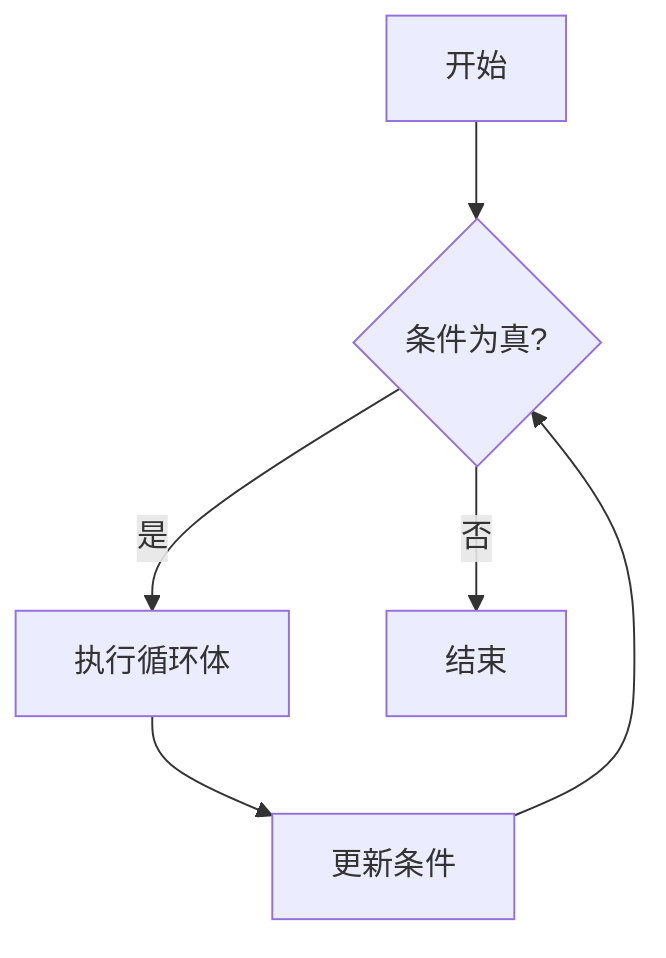

# Swift While 循环

在编程中，循环是一种强大的工具，允许我们重复执行一段代码，直到满足特定条件为止。Swift 提供了几种类型的循环，其中 `while` 循环是最基础的一种。本文将详细介绍 `while` 循环的工作原理、语法以及实际应用场景。

## 什么是 While 循环？

`while` 循环是一种条件循环，它会重复执行一段代码块，直到指定的条件不再为 `true`。与 `for` 循环不同，`while` 循环不需要预先知道循环的次数，它只依赖于条件的真假。

### 基本语法

```swift
while 条件 {
    // 要执行的代码
}
```

- **条件**：这是一个布尔表达式。只要这个条件为 `true`，循环就会继续执行。
- **代码块**：这是循环体，包含需要重复执行的代码。

### 示例：简单的 While 循环

让我们从一个简单的例子开始，使用 `while` 循环打印数字 1 到 5。

```swift
var counter = 1

while counter <= 5 {
    print("当前数字是 \(counter)")
    counter += 1
}
```

**输出：**

```
当前数字是 1
当前数字是 2
当前数字是 3
当前数字是 4
当前数字是 5
```

在这个例子中，`counter` 变量初始值为 1。每次循环执行时，`counter` 的值都会增加 1，直到 `counter` 的值大于 5 时，循环停止。

## While 循环的执行流程

为了更好地理解 `while` 循环的执行流程，我们可以使用 Mermaid 图表来可视化。



1. **开始**：程序进入 `while` 循环。
2. **条件检查**：检查条件是否为 `true`。
3. **执行循环体**：如果条件为 `true`，则执行循环体内的代码。
4. **更新条件**：在循环体执行完毕后，更新条件。
5. **重复**：再次检查条件，重复上述步骤。
6. **结束**：当条件为 `false` 时，循环结束。

## 实际应用场景

### 案例 1：用户输入验证

假设我们需要用户输入一个有效的年龄（1 到 120 岁之间）。我们可以使用 `while` 循环来不断提示用户，直到输入一个有效的年龄。

```swift
var age: Int?

while age == nil || age! < 1 || age! > 120 {
    print("请输入您的年龄（1 到 120 岁之间）：")
    age = Int(readLine() ?? "")
}

print("您输入的年龄是 \(age!) 岁。")
```

**输出示例：**

```
请输入您的年龄（1 到 120 岁之间）：
150
请输入您的年龄（1 到 120 岁之间）：
0
请输入您的年龄（1 到 120 岁之间）：
25
您输入的年龄是 25 岁。
```

在这个例子中，`while` 循环会一直运行，直到用户输入一个有效的年龄。

### 案例 2：游戏中的生命值检测

假设我们正在开发一个游戏，玩家有 3 条生命。我们可以使用 `while` 循环来检测玩家的生命值，直到生命值为 0。

```swift
var lives = 3

while lives > 0 {
    print("你还有 \(lives) 条生命。")
    lives -= 1
}

print("游戏结束！")
```

**输出：**

```
你还有 3 条生命。
你还有 2 条生命。
你还有 1 条生命。
游戏结束！
```

在这个例子中，`while` 循环会一直运行，直到玩家的生命值为 0。

## 注意事项

:::caution
在使用 `while` 循环时，务必确保循环条件最终会变为 `false`，否则会导致无限循环，程序将无法终止。
:::

例如，以下代码会导致无限循环：

```swift
var counter = 1

while counter > 0 {
    print("无限循环中...")
    counter += 1
}
```

为了避免这种情况，请确保循环条件能够在某个时刻变为 `false`。

## 总结

`while` 循环是 Swift 中一种强大的工具，允许我们重复执行代码块，直到条件不再满足。它特别适用于那些不需要预先知道循环次数的场景。通过本文的学习，你应该已经掌握了 `while` 循环的基本语法、执行流程以及实际应用场景。

## 附加资源与练习

- **练习 1**：编写一个 `while` 循环，计算从 1 到 100 的所有整数的和。
- **练习 2**：使用 `while` 循环实现一个简单的猜数字游戏，程序随机生成一个数字，用户不断猜测，直到猜中为止。

:::tip
如果你对 `while` 循环还有疑问，可以尝试在 Swift Playground 中运行本文的示例代码，并修改它们以观察不同的结果。
:::

希望本文对你理解 Swift 中的 `while` 循环有所帮助！继续练习，你将很快掌握这一重要的编程概念。