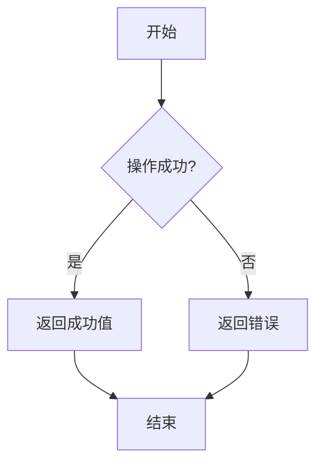

## 介绍

在 Swift 中，处理异步操作或可能失败的操作时，传统的错误处理方式（如 `try-catch`）可能不够直观或灵活。为了解决这个问题，Swift 引入了 **结果类型（Result Type）**。结果类型是一种枚举，用于表示操作的成功或失败，并允许你以更清晰的方式处理这两种情况。

结果类型的定义如下：

```swift
enum Result<Success, Failure: Error> {
    case success(Success)
    case failure(Failure)
}
```

- `Success` 表示操作成功时返回的值。
- `Failure` 表示操作失败时返回的错误，且必须遵循 `Error` 协议。

## 结果类型的基本用法

让我们从一个简单的例子开始，假设我们有一个函数 `divide(_:_:)`，它接受两个整数并返回它们的除法结果。如果除数为零，函数将返回一个错误。

```swift
enum DivisionError: Error {
    case divisionByZero
}

func divide(_ a: Int, _ b: Int) -> Result<Int, DivisionError> {
    guard b != 0 else {
        return .failure(.divisionByZero)
    }
    return .success(a / b)
}
```

在这个例子中，`divide(_:_:)` 函数返回一个 `Result<Int, DivisionError>` 类型的值。如果除数为零，函数返回 `.failure(.divisionByZero)`，否则返回 `.success(a / b)`。

### 处理结果类型

我们可以使用 `switch` 语句来处理结果类型：

```swift
let result = divide(10, 0)

switch result {
case .success(let value):
    print("Result: \(value)")
case .failure(let error):
    print("Error: \(error)")
}
```

输出：
```
Error: divisionByZero
```

## 结果类型的优势

结果类型的主要优势在于它能够清晰地分离成功和失败的情况，并且可以在编译时强制处理这两种情况。与传统的 `try-catch` 相比，结果类型更适合处理异步操作，因为它可以避免嵌套的 `do-catch` 块。

### 异步操作中的结果类型

假设我们有一个异步函数 `fetchData(from:)`，它从网络请求数据并返回结果类型：

```swift
func fetchData(from url: URL, completion: @escaping (Result<Data, Error>) -> Void) {
    URLSession.shared.dataTask(with: url) { data, response, error in
        if let error = error {
            completion(.failure(error))
        } else if let data = data {
            completion(.success(data))
        }
    }.resume()
}
```

我们可以这样调用这个函数并处理结果：

```swift
let url = URL(string: "https://example.com/data")!
fetchData(from: url) { result in
    switch result {
    case .success(let data):
        print("Data received: \(data)")
    case .failure(let error):
        print("Error: \(error)")
    }
}
```

## 实际应用场景

结果类型在实际开发中非常有用，尤其是在处理网络请求、文件操作或其他可能失败的操作时。以下是一些常见的应用场景：

1. **网络请求**：如上面的例子所示，结果类型非常适合处理网络请求的成功和失败情况。
2. **文件操作**：读取或写入文件时，可能会遇到文件不存在或权限不足等错误。
3. **数据解析**：解析 JSON 或其他格式的数据时，可能会遇到格式错误或数据缺失。

## 总结

结果类型是 Swift 中处理可能失败的操作的强大工具。它通过明确区分成功和失败的情况，使代码更加清晰和易于维护。无论是同步还是异步操作，结果类型都能提供一种优雅的方式来处理错误。

:::tip 提示
如果你正在处理异步操作，考虑使用 `Result` 类型来简化错误处理流程。
:::

## 附加资源与练习

1. **练习**：尝试编写一个函数，该函数接受一个字符串并将其转换为整数。如果字符串无法转换为整数，返回一个错误。
2. **进一步学习**：阅读 Swift 官方文档中关于 [Result](https://developer.apple.com/documentation/swift/result) 的更多内容。



通过以上内容，你应该对 Swift 中的结果类型有了全面的了解。继续练习并尝试在实际项目中使用它，以加深理解！