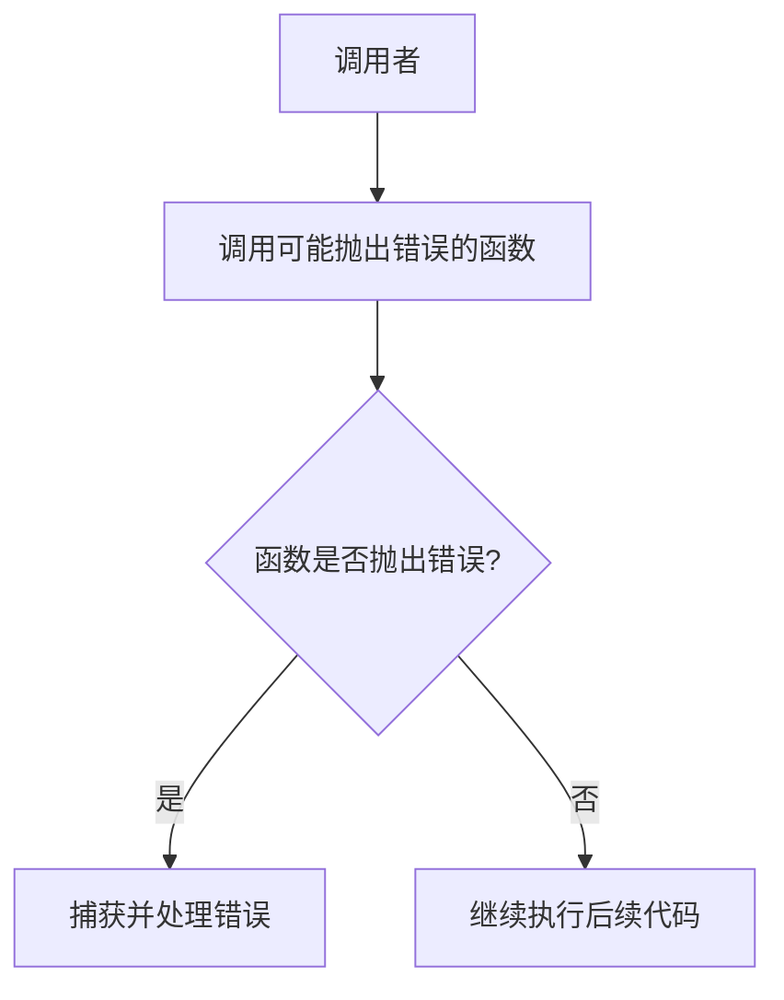

# Swift 传播错误

在Swift中，错误处理是一个非常重要的概念，尤其是在编写健壮且可维护的代码时。传播错误（Propagating Errors）是指将错误从函数中抛出，让调用者来处理这些错误。这种方式使得代码更加模块化，错误处理逻辑更加清晰。

## 什么是错误传播？

在Swift中，函数可以通过使用 `throws` 关键字来标记可能抛出错误。当函数内部发生错误时，可以使用 `throw` 关键字抛出错误。调用者可以通过 `try` 关键字来调用这些可能抛出错误的函数，并使用 `do-catch` 语句来捕获和处理错误。

### 基本语法

```swift
func canThrowErrors() throws -> String {
    // 可能抛出错误的代码
    if someCondition {
        throw SomeError.errorCase
    }
    return "Success"
}
```

在上面的代码中，`canThrowErrors` 函数可能会抛出 `SomeError` 类型的错误。调用者需要使用 `try` 关键字来调用这个函数，并在 `do-catch` 语句中处理可能的错误。

## 错误传播的实际应用

让我们通过一个实际的例子来理解错误传播的概念。

### 示例：读取文件内容

假设我们有一个函数 `readFileContent`，它尝试读取文件的内容。如果文件不存在或无法读取，函数将抛出错误。

```swift
enum FileError: Error {
    case fileNotFound
    case unreadable
}

func readFileContent(atPath path: String) throws -> String {
    guard let file = FileHandle(forReadingAtPath: path) else {
        throw FileError.fileNotFound
    }
    
    let data = file.readDataToEndOfFile()
    guard let content = String(data: data, encoding: .utf8) else {
        throw FileError.unreadable
    }
    
    return content
}
```

在这个例子中，`readFileContent` 函数可能会抛出 `FileError.fileNotFound` 或 `FileError.unreadable` 错误。调用者可以通过以下方式处理这些错误：

```swift
do {
    let content = try readFileContent(atPath: "/path/to/file.txt")
    print(content)
} catch FileError.fileNotFound {
    print("文件未找到")
} catch FileError.unreadable {
    print("文件无法读取")
} catch {
    print("发生了未知错误: \(error)")
}
```

### 错误传播的流程



在这个流程图中，调用者调用了一个可能抛出错误的函数。如果函数抛出错误，调用者会捕获并处理错误；如果没有错误，调用者将继续执行后续代码。

## 总结

通过错误传播，我们可以将错误处理的责任从函数内部转移到调用者，从而使代码更加模块化和易于维护。使用 `throws` 和 `try` 关键字，我们可以轻松地在Swift中实现错误传播。

:::tip 提示
在实际开发中，建议为每种可能的错误情况定义明确的错误类型，并在文档中详细说明每种错误的含义和处理方式。
:::

## 附加资源

- [Swift官方文档 - 错误处理](https://docs.swift.org/swift-book/LanguageGuide/ErrorHandling.html)
- [Swift错误处理的最佳实践](https://www.raywenderlich.com/books/swift-apprentice/v6.0/chapters/20-error-handling)

## 练习

1. 编写一个函数 `divideNumbers`，接受两个整数参数并返回它们的商。如果除数为零，抛出 `DivisionError.divisionByZero` 错误。
2. 在 `main` 函数中调用 `divideNumbers`，并使用 `do-catch` 语句处理可能的错误。

```swift
enum DivisionError: Error {
    case divisionByZero
}

func divideNumbers(_ a: Int, _ b: Int) throws -> Int {
    // 你的代码
}

// 调用并处理错误
do {
    let result = try divideNumbers(10, 0)
    print(result)
} catch DivisionError.divisionByZero {
    print("除数不能为零")
} catch {
    print("发生了未知错误: \(error)")
}
```

通过完成这些练习，你将更好地理解Swift中的错误传播机制。