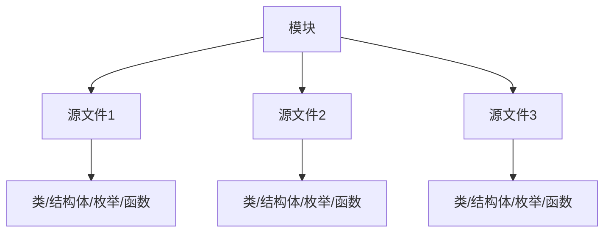

# Swift 模块与源文件

在Swift编程中，**模块**和**源文件**是两个非常重要的概念。它们不仅帮助我们组织代码，还在访问控制中扮演着关键角色。本文将详细介绍这两个概念，并通过实际案例帮助你更好地理解它们。

## 什么是模块？

在Swift中，**模块**是一个独立的代码分发单元。它可以是一个框架（Framework）或一个应用程序（Application）。模块可以被导入到其他模块中，以便使用其中定义的代码。

:::note
模块是一个独立的代码单元，可以包含多个源文件。
:::

### 模块的特点

- **独立性**：模块是独立的，可以单独编译和分发。
- **可导入性**：模块可以被其他模块导入，以便使用其中的功能。
- **封装性**：模块内部的实现细节可以被隐藏，只暴露必要的接口。

## 什么是源文件？

**源文件**是Swift代码的基本单位。一个模块可以包含多个源文件，每个源文件可以包含多个类、结构体、枚举、函数等。

:::tip
源文件是Swift代码的基本单位，通常以 `.swift` 为扩展名。
:::

### 源文件的特点

- **基本单位**：源文件是Swift代码的基本单位。
- **组织性**：通过将代码分散到多个源文件中，可以提高代码的可读性和可维护性。
- **访问控制**：源文件内部的代码可以访问同一模块中的其他代码，但访问控制级别决定了哪些代码可以被外部模块访问。

## 模块与源文件的关系

模块和源文件之间的关系可以用以下图表表示：



:::caution
模块和源文件之间的关系是层次化的，模块包含多个源文件，源文件包含多个代码单元。
:::

## 实际案例

假设我们有一个名为 `MyFramework` 的模块，其中包含两个源文件：`FileA.swift` 和 `FileB.swift`。

### FileA.swift

```swift
// FileA.swift
public class MyClassA {
    public func sayHello() {
        print("Hello from MyClassA!")
    }
}
```

### FileB.swift

```swift
// FileB.swift
import Foundation

class MyClassB {
    func sayHello() {
        let instanceA = MyClassA()
        instanceA.sayHello()
    }
}
```

在这个案例中，`MyClassA` 被定义为 `public`，因此它可以在 `FileB.swift` 中被访问。`MyClassB` 则只能在 `FileB.swift` 中被访问，因为它没有指定访问控制级别，默认为 `internal`。

## 总结

- **模块**是独立的代码分发单元，可以包含多个源文件。
- **源文件**是Swift代码的基本单位，通常以 `.swift` 为扩展名。
- 模块和源文件之间的关系是层次化的，模块包含多个源文件，源文件包含多个代码单元。
- 访问控制级别决定了哪些代码可以被外部模块访问。

## 附加资源与练习

- **练习**：尝试创建一个包含多个源文件的模块，并在不同的源文件中定义不同的类、结构体和函数。使用不同的访问控制级别，观察它们在不同源文件中的可见性。
- **资源**：阅读Swift官方文档中关于[访问控制](https://docs.swift.org/swift-book/LanguageGuide/AccessControl.html)的部分，深入了解模块和源文件在访问控制中的作用。

通过本文的学习，你应该对Swift中的模块和源文件有了更深入的理解。继续练习和探索，你将能够更好地组织和管理你的Swift代码。