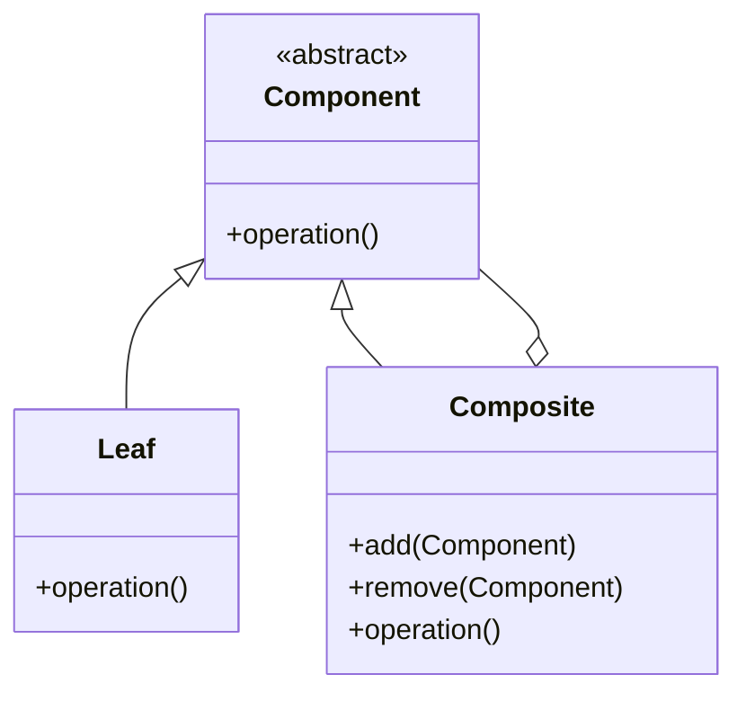

# Swift 组合模式

组合模式（Composite Pattern）是一种结构型设计模式，它允许你将对象组合成树形结构以表示“部分-整体”的层次结构。组合模式使得客户端可以统一处理单个对象和组合对象，从而简化了代码结构。

## 什么是组合模式？

组合模式的核心思想是将对象组织成树形结构，使得客户端可以一致地处理单个对象和组合对象。这种模式通常用于表示层次结构，例如文件系统中的文件和文件夹，或者图形界面中的控件和容器。

在组合模式中，有两种主要类型的对象：
1. **叶子节点（Leaf）**：表示树形结构中的叶子节点，它没有子节点。
2. **组合节点（Composite）**：表示树形结构中的分支节点，它可以包含其他叶子节点或组合节点。

通过这种方式，组合模式使得客户端可以统一处理单个对象和组合对象，而不需要关心它们的具体类型。

## 组合模式的结构

让我们通过一个简单的类图来理解组合模式的结构：



- **Component**：这是一个抽象类或协议，定义了所有组件的通用接口。它通常包含一个 `operation()` 方法，用于执行组件的操作。
- **Leaf**：这是叶子节点类，它实现了 `Component` 接口，但没有子节点。
- **Composite**：这是组合节点类，它实现了 `Component` 接口，并且可以包含其他 `Component` 对象（可以是 `Leaf` 或 `Composite`）。

## Swift 中的组合模式实现

让我们通过一个简单的例子来演示如何在Swift中实现组合模式。假设我们正在构建一个文件系统，其中包含文件和文件夹。

### 定义组件协议

首先，我们定义一个 `FileSystemComponent` 协议，它表示文件系统中的所有组件：

```swift
protocol FileSystemComponent {
    var name: String { get }
    func display()
}
```

### 实现叶子节点

接下来，我们实现一个 `File` 类，它表示文件系统中的文件：

```swift
class File: FileSystemComponent {
    var name: String
    
    init(name: String) {
        self.name = name
    }
    
    func display() {
        print("File: \(name)")
    }
}
```

### 实现组合节点

然后，我们实现一个 `Folder` 类，它表示文件系统中的文件夹。文件夹可以包含其他文件或文件夹：

```swift
class Folder: FileSystemComponent {
    var name: String
    private var children: [FileSystemComponent] = []
    
    init(name: String) {
        self.name = name
    }
    
    func add(_ component: FileSystemComponent) {
        children.append(component)
    }
    
    func remove(_ component: FileSystemComponent) {
        children.removeAll { $0.name == component.name }
    }
    
    func display() {
        print("Folder: \(name)")
        for child in children {
            child.display()
        }
    }
}
```

### 使用组合模式

现在，我们可以使用组合模式来构建一个文件系统的层次结构：

```swift
let rootFolder = Folder(name: "Root")
let documentsFolder = Folder(name: "Documents")
let photosFolder = Folder(name: "Photos")

let file1 = File(name: "file1.txt")
let file2 = File(name: "file2.txt")
let photo1 = File(name: "photo1.jpg")

rootFolder.add(documentsFolder)
rootFolder.add(photosFolder)

documentsFolder.add(file1)
documentsFolder.add(file2)
photosFolder.add(photo1)

rootFolder.display()
```

### 输出结果

运行上述代码后，输出结果如下：

```
Folder: Root
Folder: Documents
File: file1.txt
File: file2.txt
Folder: Photos
File: photo1.jpg
```

## 实际应用场景

组合模式在许多实际场景中都非常有用，例如：
- **文件系统**：文件和文件夹的层次结构。
- **图形界面**：控件和容器的层次结构。
- **组织结构**：公司和部门的层次结构。

在这些场景中，组合模式使得我们可以统一处理单个对象和组合对象，从而简化了代码结构。

## 总结

组合模式是一种强大的设计模式，它允许我们将对象组织成树形结构，并统一处理单个对象和组合对象。通过使用组合模式，我们可以简化代码结构，并使其更具可扩展性。

在Swift中，我们可以通过定义组件协议、实现叶子节点和组合节点来实现组合模式。这种模式在许多实际场景中都非常有用，例如文件系统、图形界面和组织结构。

## 附加资源与练习

- **练习**：尝试扩展上述文件系统的例子，添加更多的功能，例如计算文件夹的大小或搜索文件。
- **资源**：阅读更多关于组合模式的内容，了解它在其他编程语言中的实现方式。

:::tip
组合模式非常适合处理层次结构数据，但在某些情况下可能会导致性能问题，特别是在处理大型树形结构时。因此，在使用组合模式时，请确保考虑到性能问题。
:::