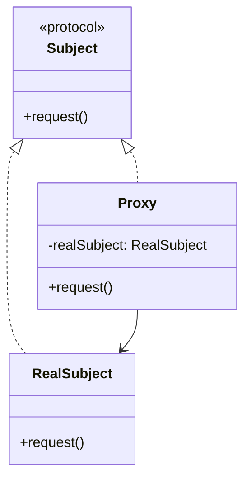

# Swift 代理模式

代理模式（Proxy Pattern）是一种结构型设计模式，它允许一个对象（代理）代表另一个对象（真实对象）来控制对其的访问。代理模式常用于延迟初始化、访问控制、日志记录等场景。在Swift中，代理模式通常通过协议（Protocol）来实现。

## 什么是代理模式？

代理模式的核心思想是**通过一个代理对象来控制对真实对象的访问**。代理对象和真实对象通常实现相同的接口或协议，因此客户端代码无需关心使用的是代理还是真实对象。

代理模式的主要用途包括：
1. **延迟初始化**：当创建真实对象的成本较高时，可以使用代理对象来延迟初始化。
2. **访问控制**：代理对象可以在访问真实对象之前进行权限检查。
3. **日志记录**：代理对象可以在访问真实对象之前或之后记录日志。

## 代理模式的结构

代理模式通常包含以下角色：
- **Subject（主题）**：定义真实对象和代理对象的共同接口。
- **RealSubject（真实主题）**：实现具体的业务逻辑。
- **Proxy（代理）**：控制对真实对象的访问，并可能负责创建和销毁真实对象。



## Swift 中的代理模式实现

在Swift中，代理模式通常通过协议来实现。以下是一个简单的示例，展示了如何使用代理模式来控制对真实对象的访问。

### 定义协议

首先，我们定义一个协议 `Subject`，它包含一个 `request()` 方法。

```swift
protocol Subject {
    func request()
}
```

### 实现真实对象

接下来，我们实现真实对象 `RealSubject`，它遵循 `Subject` 协议并实现具体的业务逻辑。

```swift
class RealSubject: Subject {
    func request() {
        print("RealSubject: Handling request.")
    }
}
```

### 实现代理对象

然后，我们实现代理对象 `Proxy`，它也遵循 `Subject` 协议。代理对象在访问真实对象之前可以进行一些额外的操作，例如权限检查或日志记录。

```swift
class Proxy: Subject {
    private var realSubject: RealSubject?

    func request() {
        // 延迟初始化真实对象
        if realSubject == nil {
            realSubject = RealSubject()
        }

        // 在访问真实对象之前进行一些操作
        print("Proxy: Checking access before forwarding request.")

        // 访问真实对象
        realSubject?.request()

        // 在访问真实对象之后进行一些操作
        print("Proxy: Logging the time of request.")
    }
}
```

### 使用代理模式

最后，我们可以在客户端代码中使用代理对象来访问真实对象。

```swift
let proxy = Proxy()
proxy.request()
```

**输出：**
```
Proxy: Checking access before forwarding request.
RealSubject: Handling request.
Proxy: Logging the time of request.
```

## 实际应用场景

代理模式在实际开发中有许多应用场景。以下是一些常见的例子：

1. **图片加载**：在iOS开发中，代理模式可以用于延迟加载图片。代理对象可以在图片真正需要显示时才从网络或磁盘加载图片。
2. **网络请求**：代理模式可以用于控制网络请求的访问权限。代理对象可以在发送请求之前检查用户的权限。
3. **日志记录**：代理模式可以用于记录方法的调用日志。代理对象可以在方法调用前后记录日志信息。

## 总结

代理模式是一种非常有用的设计模式，它允许我们通过代理对象来控制对真实对象的访问。在Swift中，代理模式通常通过协议来实现，这使得代码更加灵活和可扩展。

通过代理模式，我们可以实现延迟初始化、访问控制、日志记录等功能。代理模式在实际开发中有广泛的应用场景，特别是在需要控制对象访问权限或记录日志时。

## 附加资源与练习

- **练习**：尝试实现一个代理模式来控制对网络请求的访问权限。代理对象可以在发送请求之前检查用户的权限。
- **进一步阅读**：了解更多关于Swift中的设计模式，例如观察者模式、单例模式等。

:::tip
代理模式是设计模式中的一种基础模式，掌握它可以帮助你更好地理解其他设计模式。
:::