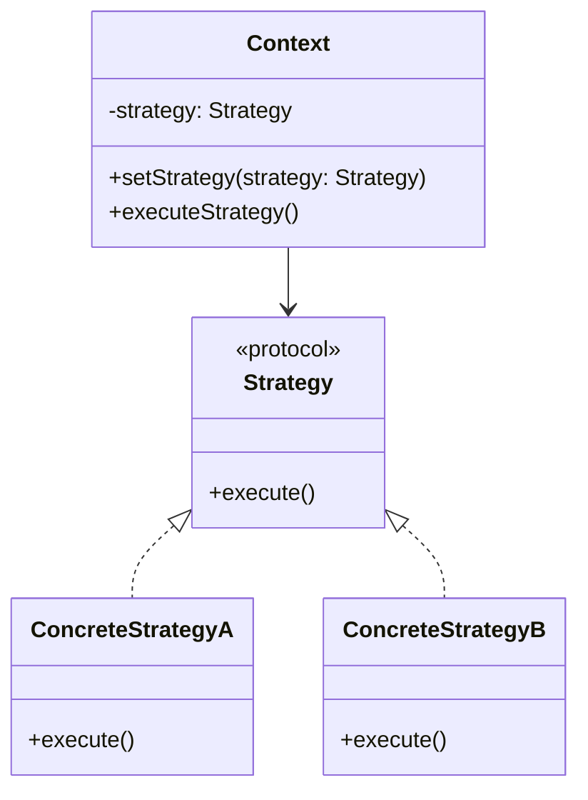

# Swift 策略模式

策略模式（Strategy Pattern）是一种行为设计模式，它允许你定义一系列算法或行为，并将它们封装在独立的类中，使得它们可以相互替换。策略模式使得算法可以独立于使用它的客户端而变化。

## 什么是策略模式？

策略模式的核心思想是将算法的定义与使用分离。通过将算法封装在独立的策略类中，你可以在运行时动态地切换算法，而不需要修改使用算法的客户端代码。这种模式非常适合处理需要在不同情况下使用不同算法的场景。

### 策略模式的结构

策略模式通常包含以下三个角色：

1. **策略接口（Strategy Protocol）**：定义所有具体策略类必须实现的方法。
2. **具体策略类（Concrete Strategy）**：实现策略接口，提供具体的算法实现。
3. **上下文类（Context）**：持有一个策略对象的引用，并通过策略接口调用具体策略的算法。



## 代码示例

让我们通过一个简单的例子来理解策略模式。假设我们有一个应用程序，需要根据不同的支付方式（如信用卡、支付宝、微信支付）来处理支付。

### 1. 定义策略接口

首先，我们定义一个策略接口 `PaymentStrategy`，它包含一个 `pay` 方法：

```swift
protocol PaymentStrategy {
    func pay(amount: Double)
}
```

### 2. 实现具体策略类

接下来，我们实现几个具体的支付策略类：

```swift
class CreditCardPayment: PaymentStrategy {
    func pay(amount: Double) {
        print("Paid \(amount) via Credit Card")
    }
}

class AlipayPayment: PaymentStrategy {
    func pay(amount: Double) {
        print("Paid \(amount) via Alipay")
    }
}

class WeChatPayment: PaymentStrategy {
    func pay(amount: Double) {
        print("Paid \(amount) via WeChat Pay")
    }
}
```

### 3. 实现上下文类

然后，我们实现一个上下文类 `PaymentContext`，它持有一个 `PaymentStrategy` 对象，并提供一个方法来执行支付：

```swift
class PaymentContext {
    private var strategy: PaymentStrategy
    
    init(strategy: PaymentStrategy) {
        self.strategy = strategy
    }
    
    func setStrategy(strategy: PaymentStrategy) {
        self.strategy = strategy
    }
    
    func executePayment(amount: Double) {
        strategy.pay(amount: amount)
    }
}
```

### 4. 使用策略模式

最后，我们可以在客户端代码中使用策略模式来动态切换支付方式：

```swift
let context = PaymentContext(strategy: CreditCardPayment())
context.executePayment(amount: 100.0) // 输出: Paid 100.0 via Credit Card

context.setStrategy(strategy: AlipayPayment())
context.executePayment(amount: 200.0) // 输出: Paid 200.0 via Alipay

context.setStrategy(strategy: WeChatPayment())
context.executePayment(amount: 300.0) // 输出: Paid 300.0 via WeChat Pay
```

## 实际应用场景

策略模式在现实生活中有很多应用场景。例如：

- **支付系统**：如上面的例子所示，支付系统可以根据用户选择的支付方式动态切换支付策略。
- **排序算法**：在一个需要根据不同的条件（如时间、价格等）进行排序的应用程序中，可以使用策略模式来动态选择排序算法。
- **游戏中的角色行为**：在游戏中，角色的行为（如攻击、防御、逃跑）可以根据不同的策略进行切换。

:::tip
策略模式的一个主要优点是它遵循了开闭原则（Open/Closed Principle），即对扩展开放，对修改封闭。你可以轻松地添加新的策略类，而不需要修改现有的代码。
:::

## 总结

策略模式是一种强大的设计模式，它允许你在运行时动态地切换算法或行为。通过将算法封装在独立的策略类中，你可以使代码更加灵活和可维护。策略模式特别适用于需要根据不同条件选择不同算法的场景。

### 附加资源

- [设计模式：可复用面向对象软件的基础](https://www.amazon.com/Design-Patterns-Elements-Reusable-Object-Oriented/dp/0201633612) - 一本经典的设计模式书籍，深入探讨了策略模式和其他设计模式。
- [Swift设计模式](https://refactoring.guru/design-patterns/swift) - 一个在线资源，提供了关于Swift中设计模式的详细解释和示例。

### 练习

1. 尝试实现一个新的支付策略类，例如 `PayPalPayment`，并将其集成到上面的代码中。
2. 思考在你的项目中是否有可以使用策略模式的地方，并尝试实现它。

通过实践这些练习，你将更好地理解策略模式的应用和优势。