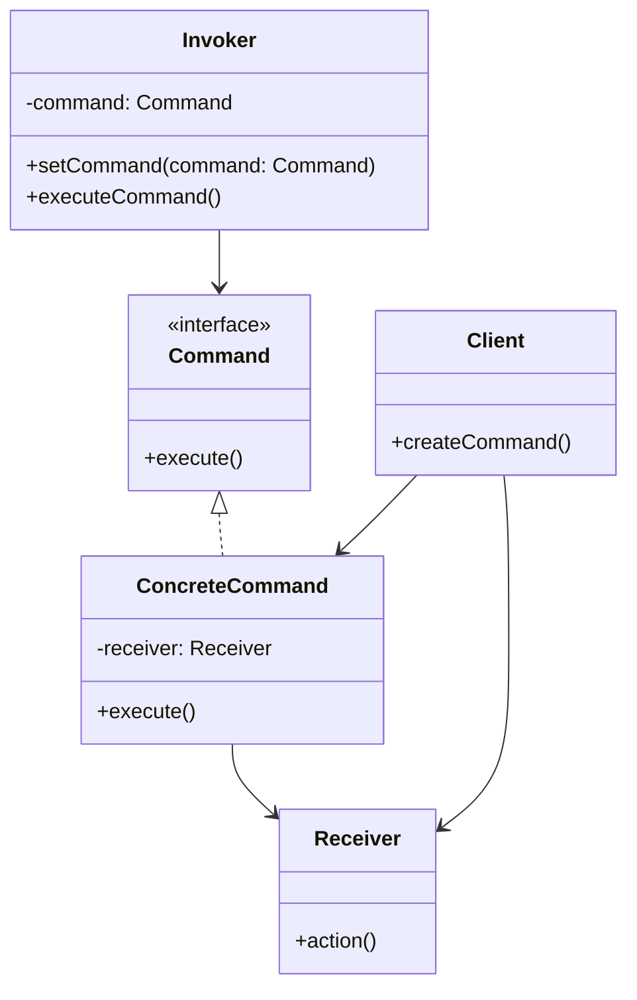

# Swift 命令模式

命令模式（Command Pattern）是一种行为设计模式，它将请求封装为对象，从而使你可以用不同的请求对客户进行参数化，并支持请求的排队、记录日志以及撤销操作。这种模式的核心思想是将“做什么”和“谁来做”解耦，使得系统更加灵活和可扩展。

## 什么是命令模式？

命令模式的核心是将一个请求封装为一个对象，从而使你可以用不同的请求对客户进行参数化。通过这种方式，你可以将请求的发送者和接收者解耦，使得系统更加灵活和可扩展。

在命令模式中，通常会涉及以下几个角色：

1. **命令（Command）**：定义执行操作的接口。
2. **具体命令（Concrete Command）**：实现命令接口，负责调用接收者的操作。
3. **接收者（Receiver）**：知道如何执行与请求相关的操作。
4. **调用者（Invoker）**：持有命令对象，并在适当的时候调用命令对象的执行方法。
5. **客户端（Client）**：创建命令对象并设置其接收者。

## 命令模式的结构



## Swift 中的命令模式实现

让我们通过一个简单的例子来理解命令模式在Swift中的实现。假设我们有一个遥控器，它可以控制电灯的开关。

### 1. 定义命令接口

首先，我们定义一个命令接口 `Command`，它包含一个 `execute` 方法。

```swift
protocol Command {
    func execute()
}
```

### 2. 创建具体命令

接下来，我们创建两个具体命令 `LightOnCommand` 和 `LightOffCommand`，分别用于打开和关闭电灯。

```swift
class LightOnCommand: Command {
    private let light: Light

    init(light: Light) {
        self.light = light
    }

    func execute() {
        light.turnOn()
    }
}

class LightOffCommand: Command {
    private let light: Light

    init(light: Light) {
        self.light = light
    }

    func execute() {
        light.turnOff()
    }
}
```

### 3. 创建接收者

接收者 `Light` 是实际执行操作的对象。

```swift
class Light {
    func turnOn() {
        print("Light is on")
    }

    func turnOff() {
        print("Light is off")
    }
}
```

### 4. 创建调用者

调用者 `RemoteControl` 持有一个命令对象，并在需要时调用其 `execute` 方法。

```swift
class RemoteControl {
    private var command: Command?

    func setCommand(command: Command) {
        self.command = command
    }

    func pressButton() {
        command?.execute()
    }
}
```

### 5. 客户端代码

最后，客户端代码创建命令对象并设置其接收者，然后将命令对象传递给调用者。

```swift
let light = Light()
let lightOnCommand = LightOnCommand(light: light)
let lightOffCommand = LightOffCommand(light: light)

let remoteControl = RemoteControl()

remoteControl.setCommand(command: lightOnCommand)
remoteControl.pressButton()  // 输出: Light is on

remoteControl.setCommand(command: lightOffCommand)
remoteControl.pressButton()  // 输出: Light is off
```

## 实际应用场景

命令模式在实际开发中有很多应用场景，例如：

- **撤销操作**：命令模式可以轻松实现撤销操作，只需在命令对象中保存状态即可。
- **任务队列**：可以将多个命令对象放入队列中，按顺序执行。
- **日志记录**：可以记录所有执行的命令，方便后续调试或回放。

## 总结

命令模式通过将请求封装为对象，使得请求的发送者和接收者解耦，从而提高了系统的灵活性和可扩展性。它适用于需要支持撤销操作、任务队列或日志记录的场景。

通过本文的学习，你应该已经掌握了命令模式的基本概念及其在Swift中的实现方法。希望你能在实际开发中灵活运用这一模式，提升代码的可维护性和可扩展性。

## 附加资源与练习

- **练习**：尝试扩展上述例子，实现一个支持撤销操作的遥控器。
- **进一步学习**：阅读更多关于设计模式的书籍或文章，深入理解其他设计模式的应用场景和实现方法。

:::tip
命令模式是设计模式中非常实用的一种，掌握它可以帮助你编写更加灵活和可维护的代码。建议你多动手实践，加深理解。
:::