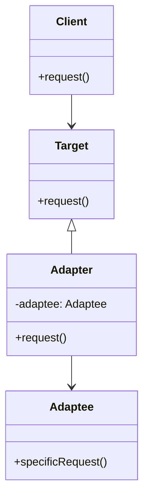

# Swift 适配器模式

适配器模式（Adapter Pattern）是一种结构型设计模式，它允许两个不兼容的接口协同工作。适配器模式通常用于将现有类的接口转换为客户端期望的接口，从而使原本不兼容的类能够一起工作。

## 什么是适配器模式？

适配器模式的核心思想是通过一个中间层（适配器）来转换接口，使得原本不兼容的类能够协同工作。适配器模式通常用于以下场景：

- 当你需要使用一个现有的类，但其接口与你的代码不兼容时。
- 当你希望创建一个可复用的类，该类可以与多个不相关的类协同工作。

适配器模式有两种实现方式：**类适配器**和**对象适配器**。在Swift中，我们通常使用对象适配器，因为它更加灵活。

## 适配器模式的结构

让我们通过一个简单的图表来理解适配器模式的结构：



在这个图中：

- **Client** 是使用目标接口的类。
- **Target** 是客户端期望的接口。
- **Adaptee** 是需要适配的类，它的接口与目标接口不兼容。
- **Adapter** 是适配器类，它将Adaptee的接口转换为Target接口。

## 代码示例

让我们通过一个实际的例子来理解适配器模式。假设我们有一个旧的类 `OldPrinter`，它有一个方法 `printText(_:)`，但我们希望使用一个新的接口 `NewPrinter`，它有一个方法 `print(_:)`。我们可以使用适配器模式来实现这一点。

### 1. 定义目标接口

首先，我们定义一个新的接口 `NewPrinter`，它是客户端期望的接口。

```swift
protocol NewPrinter {
    func print(_ text: String)
}
```

### 2. 定义需要适配的类

接下来，我们定义旧的类 `OldPrinter`，它的接口与 `NewPrinter` 不兼容。

```swift
class OldPrinter {
    func printText(_ text: String) {
        print("Old Printer: \(text)")
    }
}
```

### 3. 创建适配器类

现在，我们创建一个适配器类 `PrinterAdapter`，它将 `OldPrinter` 的接口转换为 `NewPrinter` 的接口。

```swift
class PrinterAdapter: NewPrinter {
    private let oldPrinter: OldPrinter

    init(oldPrinter: OldPrinter) {
        self.oldPrinter = oldPrinter
    }

    func print(_ text: String) {
        oldPrinter.printText(text)
    }
}
```

### 4. 使用适配器

最后，我们可以使用适配器来调用 `OldPrinter` 的功能，而不需要修改客户端代码。

```swift
let oldPrinter = OldPrinter()
let adapter = PrinterAdapter(oldPrinter: oldPrinter)

adapter.print("Hello, World!")
```

**输出：**

```
Old Printer: Hello, World!
```

## 实际应用场景

适配器模式在现实世界中有很多应用场景。例如：

- **第三方库集成**：当你需要使用一个第三方库，但其接口与你的代码不兼容时，可以使用适配器模式来集成。
- **遗留代码重用**：当你需要重用一些旧的代码，但其接口与新的系统不兼容时，可以使用适配器模式来适配旧代码。
- **多平台支持**：当你需要为不同的平台提供不同的实现时，可以使用适配器模式来统一接口。

## 总结

适配器模式是一种非常有用的设计模式，它可以帮助我们解决接口不兼容的问题。通过使用适配器模式，我们可以使现有的类与新的接口协同工作，而无需修改现有的代码。适配器模式特别适用于需要集成第三方库或重用遗留代码的场景。

## 附加资源与练习

- **练习**：尝试为一个现有的类创建一个适配器，使其能够与一个新的接口协同工作。
- **进一步阅读**：了解更多关于适配器模式的其他变体，如类适配器和双向适配器。

:::tip
适配器模式是设计模式中的一种重要模式，掌握它可以帮助你在实际开发中更好地处理接口不兼容的问题。
:::