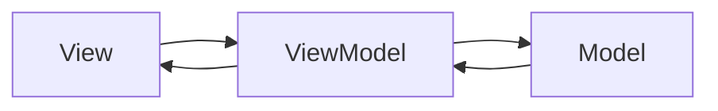

# Swift MVVM 模式

MVVM（Model-View-ViewModel）是一种广泛应用于现代应用程序开发的设计模式。它通过将应用程序的逻辑分为三个主要部分：**Model**、**View** 和 **ViewModel**，来帮助开发者构建更清晰、更易维护的代码。本文将详细介绍 MVVM 模式的概念、实现方法以及实际应用场景。

## 什么是 MVVM 模式？

MVVM 模式的核心思想是将应用程序的用户界面（View）与业务逻辑（ViewModel）和数据（Model）分离。这种分离使得代码更易于测试、维护和扩展。以下是 MVVM 模式的三个主要组成部分：

1. **Model**：负责管理应用程序的数据和业务逻辑。它通常是一个简单的数据结构或类，用于存储和操作数据。
2. **View**：负责显示用户界面并与用户交互。它通常是 UIKit 或 SwiftUI 中的视图组件。
3. **ViewModel**：充当 View 和 Model 之间的桥梁。它负责将 Model 中的数据转换为 View 可以使用的格式，并处理用户输入。

:::note
MVVM 模式的一个关键优势是它通过数据绑定（Data Binding）机制，使得 View 和 ViewModel 之间的通信更加高效和自动化。
:::

## MVVM 模式的工作原理

为了更好地理解 MVVM 模式的工作原理，我们可以通过一个简单的图表来展示它们之间的关系：



在这个图表中，View 与 ViewModel 进行交互，而 ViewModel 则与 Model 进行交互。View 不直接与 Model 通信，而是通过 ViewModel 来获取和更新数据。

## 实现 MVVM 模式的步骤

接下来，我们将通过一个简单的示例来演示如何在 Swift 中实现 MVVM 模式。假设我们正在开发一个显示用户信息的应用程序。

### 1. 创建 Model

首先，我们定义一个 `User` 结构体来表示用户数据：

```swift
struct User {
    let name: String
    let age: Int
}
```

### 2. 创建 ViewModel

接下来，我们创建一个 `UserViewModel`，它将负责将 `User` 数据转换为 View 可以使用的格式：

```swift
class UserViewModel {
    private let user: User
    
    init(user: User) {
        self.user = user
    }
    
    var userName: String {
        return "Name: \(user.name)"
    }
    
    var userAge: String {
        return "Age: \(user.age)"
    }
}
```

在这个 `UserViewModel` 中，我们将 `User` 对象的 `name` 和 `age` 属性转换为字符串，以便在 View 中显示。

### 3. 创建 View

最后，我们创建一个 `UserView` 来显示用户信息。假设我们使用 SwiftUI 来构建界面：

```swift
import SwiftUI

struct UserView: View {
    let viewModel: UserViewModel
    
    var body: some View {
        VStack {
            Text(viewModel.userName)
            Text(viewModel.userAge)
        }
    }
}
```

在这个 `UserView` 中，我们通过 `UserViewModel` 来获取用户信息，并将其显示在界面上。

### 4. 绑定 View 和 ViewModel

现在，我们可以将 `UserView` 和 `UserViewModel` 绑定在一起：

```swift
let user = User(name: "John Doe", age: 30)
let viewModel = UserViewModel(user: user)
let userView = UserView(viewModel: viewModel)
```

通过这种方式，`UserView` 将显示 `UserViewModel` 提供的用户信息。

## 实际应用场景

MVVM 模式在以下场景中特别有用：

1. **数据驱动的应用程序**：当应用程序需要根据数据动态更新界面时，MVVM 模式可以帮助将数据逻辑与界面逻辑分离。
2. **测试驱动开发**：由于 ViewModel 不依赖于具体的 View，因此可以更容易地对业务逻辑进行单元测试。
3. **跨平台开发**：在跨平台开发中，ViewModel 可以在不同的平台（如 iOS 和 macOS）之间共享，而 View 则可以根据平台的不同进行定制。

## 总结

MVVM 模式通过将应用程序的逻辑分为 Model、View 和 ViewModel 三个部分，使得代码更易于维护和测试。它特别适用于数据驱动的应用程序和跨平台开发。通过本文的示例，你应该已经掌握了如何在 Swift 中实现 MVVM 模式。

## 附加资源与练习

- **练习**：尝试扩展本文中的示例，添加更多的用户属性（如电子邮件地址），并在 View 中显示这些信息。
- **资源**：阅读 Apple 官方文档中关于 SwiftUI 和 Combine 框架的内容，了解如何在这些框架中更好地应用 MVVM 模式。

:::tip
如果你对 MVVM 模式还有疑问，可以尝试在项目中实践它，或者参考开源项目中的实现方式。
:::