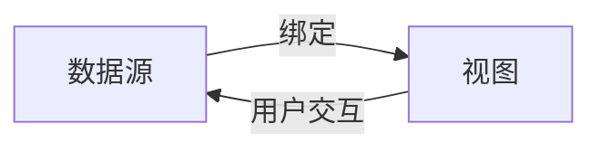

# Swift UI绑定

在 SwiftUI 中，**绑定（Binding）** 是一个非常重要的概念。它允许我们在视图和数据之间建立双向连接，使得数据的变化能够自动反映在视图上，同时视图的交互也能更新数据。绑定是 SwiftUI 实现声明式 UI 的核心机制之一。

## 什么是绑定？

绑定是一种特殊的数据类型，它允许视图与数据源之间进行双向通信。通过绑定，视图可以读取数据，并在数据发生变化时自动更新。同时，视图的交互（例如用户输入）也可以更新数据源。

在 SwiftUI 中，绑定通常用于表单控件（如 `TextField`、`Toggle` 等），这些控件需要与数据进行双向交互。

## 绑定的基本用法

要创建一个绑定，通常需要使用 `@State` 或 `@Binding` 属性包装器。`@State` 用于在视图内部管理状态，而 `@Binding` 用于将状态传递给子视图。

### 示例：使用 `@State` 和 `@Binding`

以下是一个简单的示例，展示了如何使用 `@State` 和 `@Binding` 来实现数据绑定：

```swift
import SwiftUI

struct ContentView: View {
    @State private var text: String = "Hello, SwiftUI!"

    var body: some View {
        VStack {
            TextField("Enter text", text: $text)
                .padding()
            Text("You entered: \(text)")
            ChildView(text: $text)
        }
    }
}

struct ChildView: View {
    @Binding var text: String

    var body: some View {
        Text("Child View: \(text)")
    }
}
```

在这个示例中，`ContentView` 使用 `@State` 来管理 `text` 状态。`TextField` 通过 `$text` 创建了一个绑定，使得用户输入能够更新 `text` 的值。同时，`ChildView` 通过 `@Binding` 接收 `text` 的绑定，并在子视图中显示该值。

:::note
`$text` 是 SwiftUI 中的语法糖，它创建了一个绑定到 `text` 的 `Binding<String>` 对象。
:::

## 绑定的工作原理

绑定的核心思想是**数据驱动视图**。当数据发生变化时，视图会自动更新；当视图发生变化时，数据也会自动更新。这种双向绑定机制使得开发者无需手动管理视图和数据之间的同步。

### 数据流图

以下是一个简单的数据流图，展示了绑定在 SwiftUI 中的工作原理：



在这个图中，数据源和视图通过绑定建立了双向连接。数据的变化会触发视图的更新，而用户的交互也会更新数据源。

## 实际应用场景

绑定在实际开发中有许多应用场景，特别是在需要处理用户输入的情况下。以下是一些常见的应用场景：

### 1. 表单输入

在表单中，用户需要输入各种信息（如姓名、电子邮件、密码等）。通过绑定，我们可以轻松地将用户输入与数据模型同步。

```swift
struct SignUpForm: View {
    @State private var name: String = ""
    @State private var email: String = ""
    @State private var password: String = ""

    var body: some View {
        Form {
            TextField("Name", text: $name)
            TextField("Email", text: $email)
            SecureField("Password", text: $password)
        }
    }
}
```

### 2. 开关控件

`Toggle` 控件通常用于表示布尔值（如开关状态）。通过绑定，我们可以将开关的状态与数据同步。

```swift
struct SettingsView: View {
    @State private var isDarkModeEnabled: Bool = false

    var body: some View {
        Toggle("Dark Mode", isOn: $isDarkModeEnabled)
            .padding()
    }
}
```

### 3. 列表选择

在列表中选择某个项目时，绑定可以帮助我们跟踪当前选中的项目。

```swift
struct ListSelectionView: View {
    @State private var selectedItem: String? = nil
    let items = ["Item 1", "Item 2", "Item 3"]

    var body: some View {
        List(items, id: \.self, selection: $selectedItem) { item in
            Text(item)
        }
    }
}
```

## 总结

绑定是 SwiftUI 中实现数据与视图同步的核心机制。通过 `@State` 和 `@Binding`，我们可以轻松地创建双向绑定，使得数据的变化能够自动反映在视图上，同时视图的交互也能更新数据。

在实际开发中，绑定广泛应用于表单输入、开关控件、列表选择等场景。掌握绑定的使用，能够帮助我们更高效地构建动态、交互式的用户界面。

## 附加资源与练习

- **官方文档**: 阅读 [SwiftUI 官方文档](https://developer.apple.com/documentation/swiftui/) 中关于 `@State` 和 `@Binding` 的部分。
- **练习**: 尝试创建一个包含多个输入字段的表单，并使用绑定将用户输入与数据模型同步。
- **进阶**: 探索如何使用 `@ObservedObject` 和 `@EnvironmentObject` 实现更复杂的数据绑定。

通过不断练习和探索，你将能够熟练掌握 SwiftUI 中的绑定机制，并构建出更加动态和交互式的应用。