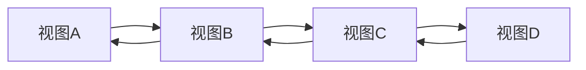

# Swift UI导航

在SwiftUI中，导航是构建多页面应用的核心功能之一。通过导航，用户可以在不同的视图之间切换，从而构建出复杂的应用结构。本文将详细介绍SwiftUI中的导航机制，包括导航栈、导航链接和导航视图的使用方法，并通过实际案例帮助你更好地理解这些概念。

## 什么是SwiftUI导航？

SwiftUI导航是一种用于在视图之间切换的机制。它通过导航栈（Navigation Stack）来管理视图的层级关系，用户可以通过点击按钮或其他交互方式在不同的视图之间跳转。SwiftUI提供了`NavigationView`和`NavigationLink`等组件来实现导航功能。

## 导航栈（Navigation Stack）

导航栈是SwiftUI导航的核心概念。它是一个后进先出（LIFO）的栈结构，用于存储当前显示的视图。每当用户导航到一个新视图时，该视图会被推入栈中；当用户返回时，栈顶的视图会被弹出。

### 导航栈的工作原理



如上图所示，导航栈的工作原理类似于一个栈结构。用户从视图A导航到视图B，再从视图B导航到视图C，依此类推。当用户返回时，视图会按照相反的顺序弹出。

## 导航视图（NavigationView）

`NavigationView`是SwiftUI中用于包裹导航内容的容器。它通常与`NavigationLink`一起使用，用于在视图之间进行导航。

### 基本用法

以下是一个简单的`NavigationView`示例：

```swift
import SwiftUI

struct ContentView: View {
    var body: some View {
        NavigationView {
            VStack {
                Text("首页")
                NavigationLink(destination: DetailView()) {
                    Text("跳转到详情页")
                }
            }
            .navigationTitle("首页")
        }
    }
}

struct DetailView: View {
    var body: some View {
        Text("这是详情页")
            .navigationTitle("详情页")
    }
}
```

在这个示例中，`NavigationView`包裹了一个`VStack`，其中包含一个`NavigationLink`。当用户点击“跳转到详情页”时，应用会导航到`DetailView`。

## 导航链接（NavigationLink）

`NavigationLink`是SwiftUI中用于触发导航的组件。它通常用于在用户点击某个元素时导航到另一个视图。

### 基本用法

以下是一个简单的`NavigationLink`示例：

```swift
import SwiftUI

struct ContentView: View {
    var body: some View {
        NavigationView {
            List {
                NavigationLink(destination: DetailView()) {
                    Text("跳转到详情页")
                }
            }
            .navigationTitle("首页")
        }
    }
}

struct DetailView: View {
    var body: some View {
        Text("这是详情页")
            .navigationTitle("详情页")
    }
}
```

在这个示例中，`NavigationLink`被放置在`List`中，用户点击列表项时会导航到`DetailView`。

## 实际案例：构建一个简单的任务列表应用

让我们通过一个实际案例来展示SwiftUI导航的应用场景。我们将构建一个简单的任务列表应用，用户可以在任务列表和任务详情之间进行导航。

### 实现步骤

1. **创建任务模型**：首先，我们需要定义一个任务模型。

```swift
struct Task: Identifiable {
    let id = UUID()
    let title: String
    let description: String
}
```

2. **创建任务列表视图**：接下来，我们创建一个任务列表视图。

```swift
struct TaskListView: View {
    let tasks = [
        Task(title: 任务1, description: "这是任务1的描述"),
        Task(title: 任务2, description: "这是任务2的描述"),
        Task(title: 任务3, description: "这是任务3的描述")
    ]

    var body: some View {
        NavigationView {
            List(tasks) { task in
                NavigationLink(destination: TaskDetailView(task: task)) {
                    Text(task.title)
                }
            }
            .navigationTitle("任务列表")
        }
    }
}
```

3. **创建任务详情视图**：最后，我们创建一个任务详情视图。

```swift
struct TaskDetailView: View {
    let task: Task

    var body: some View {
        VStack {
            Text(task.title)
                .font(.largeTitle)
            Text(task.description)
                .font(.body)
        }
        .navigationTitle(task.title)
    }
}
```

在这个案例中，用户可以在任务列表中选择一个任务，导航到任务详情页面查看任务的详细信息。

## 总结

SwiftUI导航是构建多页面应用的重要工具。通过`NavigationView`和`NavigationLink`，我们可以轻松实现视图之间的导航。本文介绍了导航栈、导航视图和导航链接的基本用法，并通过一个实际案例展示了如何在实际应用中使用这些概念。

## 附加资源与练习

- **练习**：尝试扩展任务列表应用，添加一个“添加任务”功能，允许用户添加新任务并导航到任务详情页面。
- **资源**：查看[SwiftUI官方文档](https://developer.apple.com/documentation/swiftui)以获取更多关于导航的详细信息。

希望本文能帮助你更好地理解SwiftUI导航，并在你的项目中灵活运用这些概念！