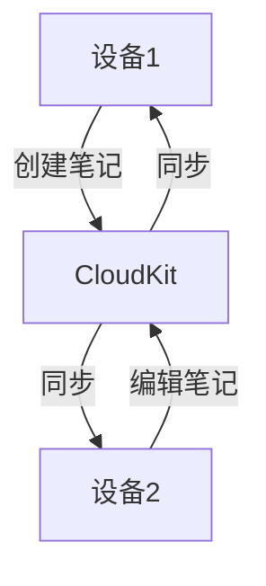

# Swift CloudKit 同步

在现代移动应用开发中，数据持久化和跨设备同步是至关重要的功能。Apple 提供的 **CloudKit** 框架为开发者提供了一种简单而强大的方式，将数据存储在云端并实现跨设备同步。本文将带你了解如何使用 Swift 和 CloudKit 实现数据持久化和同步。

## 什么是 CloudKit？

CloudKit 是 Apple 提供的一个云端数据库服务，允许开发者将应用数据存储在 iCloud 中。通过 CloudKit，开发者可以轻松实现数据的存储、检索和同步，而无需自己搭建服务器或管理复杂的后端逻辑。

CloudKit 的核心概念包括：
- **容器（Container）**：每个应用都有一个唯一的容器，用于存储数据。
- **数据库（Database）**：分为公共数据库和私有数据库，分别用于存储公开和用户私有的数据。
- **记录（Record）**：CloudKit 中的数据以记录的形式存储，类似于数据库中的行。
- **字段（Field）**：记录中的具体数据项，类似于数据库中的列。

## 设置 CloudKit

在开始使用 CloudKit 之前，你需要在 Xcode 项目中启用 iCloud 功能，并配置 CloudKit 容器。

1. 打开 Xcode 项目，选择你的应用目标。
2. 进入 **Signing & Capabilities** 选项卡。
3. 点击 **+ Capability**，添加 **iCloud**。
4. 在 iCloud 设置中，勾选 **CloudKit**，并确保选择了正确的容器。

## 使用 CloudKit 存储数据

CloudKit 使用 `CKRecord` 来表示数据记录。以下是一个简单的示例，展示如何将数据存储到 CloudKit 中。

```swift
import CloudKit

// 创建一条记录
let record = CKRecord(recordType: "Note")
record["title"] = "My First Note" as CKRecordValue
record["content"] = "This is the content of my first note." as CKRecordValue

// 获取默认的私有数据库
let privateDatabase = CKContainer.default().privateCloudDatabase

// 保存记录
privateDatabase.save(record) { (savedRecord, error) in
    if let error = error {
        print("Error saving record: \(error.localizedDescription)")
    } else {
        print("Record saved successfully!")
    }
}
```

:::note
在上面的代码中，我们创建了一个 `CKRecord` 对象，并将其保存到私有数据库中。`recordType` 是记录的类型，类似于数据库中的表名。
:::

## 从 CloudKit 检索数据

要从 CloudKit 中检索数据，可以使用 `CKQuery`。以下是一个示例，展示如何查询存储在 CloudKit 中的数据。

```swift
import CloudKit

// 创建查询
let predicate = NSPredicate(value: true) // 查询所有记录
let query = CKQuery(recordType: "Note", predicate: predicate)

// 获取默认的私有数据库
let privateDatabase = CKContainer.default().privateCloudDatabase

// 执行查询
privateDatabase.perform(query, inZoneWith: nil) { (records, error) in
    if let error = error {
        print("Error fetching records: \(error.localizedDescription)")
    } else if let records = records {
        for record in records {
            print("Title: \(record["title"] ?? "No Title")")
            print("Content: \(record["content"] ?? "No Content")")
        }
    }
}
```

:::tip
`NSPredicate` 用于定义查询条件。在上面的示例中，我们使用 `NSPredicate(value: true)` 来查询所有记录。
:::

## 数据同步与冲突处理

CloudKit 会自动处理数据的同步，但当多个设备同时修改同一条记录时，可能会发生冲突。CloudKit 提供了冲突处理机制，允许开发者决定如何处理冲突。

以下是一个简单的冲突处理示例：

```swift
import CloudKit

// 假设我们有一个记录 ID
let recordID = CKRecord.ID(recordName: "note-123")

// 获取默认的私有数据库
let privateDatabase = CKContainer.default().privateCloudDatabase

// 获取记录
privateDatabase.fetch(withRecordID: recordID) { (record, error) in
    if let error = error as? CKError, error.code == .serverRecordChanged {
        // 处理冲突
        let serverRecord = error.userInfo[CKRecordChangedErrorServerRecordKey] as? CKRecord
        let clientRecord = error.userInfo[CKRecordChangedErrorClientRecordKey] as? CKRecord
        let ancestorRecord = error.userInfo[CKRecordChangedErrorAncestorRecordKey] as? CKRecord
        
        // 合并冲突
        if let serverRecord = serverRecord, let clientRecord = clientRecord {
            // 这里可以根据业务逻辑决定如何合并数据
            let mergedRecord = clientRecord
            mergedRecord["title"] = serverRecord["title"]
            mergedRecord["content"] = serverRecord["content"]
            
            // 保存合并后的记录
            privateDatabase.save(mergedRecord) { (savedRecord, error) in
                if let error = error {
                    print("Error saving merged record: \(error.localizedDescription)")
                } else {
                    print("Merged record saved successfully!")
                }
            }
        }
    } else if let error = error {
        print("Error fetching record: \(error.localizedDescription)")
    } else if let record = record {
        print("Record fetched successfully: \(record)")
    }
}
```

:::caution
在实际应用中，冲突处理可能会更加复杂。你需要根据业务需求决定如何合并数据。
:::

## 实际应用场景

CloudKit 非常适合需要跨设备同步数据的应用，例如笔记应用、待办事项应用等。以下是一个简单的笔记应用的示例：

1. 用户在一台设备上创建笔记并保存到 CloudKit。
2. 用户在另一台设备上打开应用，自动从 CloudKit 同步笔记。
3. 用户在两台设备上同时编辑同一条笔记时，CloudKit 自动处理冲突。



## 总结

CloudKit 为 Swift 开发者提供了一种简单而强大的方式来实现数据持久化和跨设备同步。通过本文，你已经了解了如何使用 CloudKit 存储、检索和同步数据，并处理可能发生的冲突。

## 附加资源与练习

- **官方文档**：[CloudKit Documentation](https://developer.apple.com/documentation/cloudkit)
- **练习**：尝试创建一个简单的笔记应用，使用 CloudKit 存储和同步笔记数据。
- **进阶阅读**：了解如何使用 CloudKit 的公共数据库和订阅功能，实现更复杂的数据同步场景。

希望本文能帮助你更好地理解和使用 Swift 和 CloudKit 实现数据持久化和同步。Happy coding!