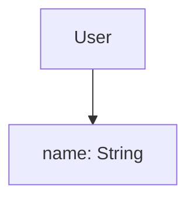

# Swift Core Data 模型

Core Data 是苹果提供的一个强大的数据持久化框架，它允许开发者以面向对象的方式管理应用中的数据。通过 Core Data，你可以轻松地将数据存储在本地数据库中，并在需要时进行检索和更新。本文将详细介绍如何在 Swift 中使用 Core Data 模型，帮助你掌握这一重要的数据管理工具。

## 什么是 Core Data 模型？

Core Data 模型是 Core Data 框架的核心部分，它定义了应用中的数据结构和关系。你可以将 Core Data 模型看作是一个数据库的蓝图，它描述了数据的实体（Entities）、属性（Attributes）以及实体之间的关系（Relationships）。

:::note
**实体（Entity）**：类似于数据库中的表，表示一种数据类型。例如，一个“用户”实体可能包含“姓名”、“年龄”等属性。
:::

:::note
**属性（Attribute）**：实体的字段，用于存储具体的数据。例如，“姓名”属性可以存储字符串类型的数据。
:::

:::note
**关系（Relationship）**：描述实体之间的关联。例如，一个“用户”实体可能与多个“订单”实体相关联。
:::

## 创建 Core Data 模型

### 1. 在 Xcode 中创建 Core Data 模型

首先，你需要在 Xcode 项目中创建一个 Core Data 模型文件。以下是具体步骤：

1. 打开 Xcode 项目。
2. 选择 `File` > `New` > `File...`。
3. 在弹出的窗口中选择 `Data Model`，然后点击 `Next`。
4. 为模型文件命名（例如 `MyDataModel.xcdatamodeld`），然后点击 `Create`。

### 2. 添加实体和属性

在创建了 Core Data 模型文件后，你可以开始添加实体和属性。以下是一个简单的例子：

1. 打开 `MyDataModel.xcdatamodeld` 文件。
2. 点击左下角的 `Add Entity` 按钮，创建一个新的实体。
3. 将实体命名为 `User`。
4. 在 `Attributes` 部分，点击 `+` 按钮添加属性。例如，添加一个名为 `name` 的属性，类型为 `String`。



### 3. 生成 NSManagedObject 子类

为了在代码中使用 Core Data 模型，你需要为实体生成 `NSManagedObject` 子类。以下是具体步骤：

1. 在 Xcode 中，选择 `Editor` > `Create NSManagedObject Subclass...`。
2. 选择你要生成子类的实体（例如 `User`），然后点击 `Next`。
3. 选择保存文件的位置，然后点击 `Create`。

生成的 `User` 类将如下所示：

```swift
import CoreData

@objc(User)
public class User: NSManagedObject {
    @NSManaged public var name: String?
}
```

## 使用 Core Data 模型

### 1. 初始化 Core Data 栈

在使用 Core Data 之前，你需要初始化 Core Data 栈。以下是一个简单的初始化代码示例：

```swift
import CoreData

class CoreDataStack {
    static let shared = CoreDataStack()

    lazy var persistentContainer: NSPersistentContainer = {
        let container = NSPersistentContainer(name: "MyDataModel")
        container.loadPersistentStores { (storeDescription, error) in
            if let error = error as NSError? {
                fatalError("Unresolved error \(error), \(error.userInfo)")
            }
        }
        return container
    }()

    var context: NSManagedObjectContext {
        return persistentContainer.viewContext
    }

    func saveContext() {
        if context.hasChanges {
            do {
                try context.save()
            } catch {
                let nserror = error as NSError
                fatalError("Unresolved error \(nserror), \(nserror.userInfo)")
            }
        }
    }
}
```

### 2. 插入数据

你可以使用生成的 `NSManagedObject` 子类来插入数据。以下是一个插入 `User` 实体的示例：

```swift
let context = CoreDataStack.shared.context

let user = User(context: context)
user.name = "John Doe"

CoreDataStack.shared.saveContext()
```

### 3. 查询数据

你可以使用 `NSFetchRequest` 来查询数据。以下是一个查询所有 `User` 实体的示例：

```swift
let fetchRequest: NSFetchRequest<User> = User.fetchRequest()

do {
    let users = try context.fetch(fetchRequest)
    for user in users {
        print("User name: \(user.name ?? "Unknown")")
    }
} catch {
    print("Failed to fetch users: \(error)")
}
```

## 实际案例：用户管理系统

假设你正在开发一个简单的用户管理系统，你需要存储用户的姓名和年龄。以下是使用 Core Data 模型实现该系统的步骤：

1. 创建一个 `User` 实体，包含 `name` 和 `age` 属性。
2. 生成 `NSManagedObject` 子类。
3. 使用 Core Data 栈插入、查询和更新用户数据。

```swift
// 插入用户
let user = User(context: CoreDataStack.shared.context)
user.name = "Alice"
user.age = 25
CoreDataStack.shared.saveContext()

// 查询用户
let fetchRequest: NSFetchRequest<User> = User.fetchRequest()
do {
    let users = try CoreDataStack.shared.context.fetch(fetchRequest)
    for user in users {
        print("User: \(user.name ?? "Unknown"), Age: \(user.age)")
    }
} catch {
    print("Failed to fetch users: \(error)")
}
```

## 总结

通过本文，你已经了解了如何在 Swift 中使用 Core Data 模型进行数据持久化。我们从基础概念入手，逐步讲解了如何创建和管理 Core Data 模型，并通过实际案例展示了其应用场景。Core Data 是一个功能强大的工具，掌握它将为你的应用开发带来极大的便利。

## 附加资源与练习

- **官方文档**：[Core Data Programming Guide](https://developer.apple.com/library/archive/documentation/Cocoa/Conceptual/CoreData/index.html)
- **练习**：尝试创建一个包含多个实体的 Core Data 模型，并实现实体之间的关系（例如，一个 `User` 实体与多个 `Order` 实体相关联）。
- **进阶阅读**：学习如何在 Core Data 中使用 `NSPredicate` 进行复杂的数据查询。

:::tip
**提示**：在实际开发中，建议将 Core Data 栈封装在一个单例类中，以便在整个应用中共享和管理数据上下文。
:::