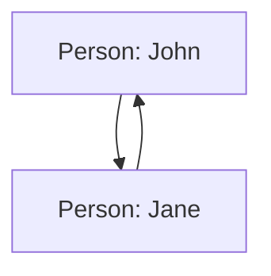

# Swift 内存图

在Swift编程中，理解内存管理是至关重要的。Swift使用自动引用计数（ARC）来管理内存，而内存图（Memory Graph）是一种可视化工具，可以帮助开发者更好地理解和管理内存中的对象关系。本文将详细介绍Swift内存图的概念、作用以及如何在实际开发中使用它。

## 什么是内存图？

内存图是一种可视化工具，用于展示应用程序在运行时的内存状态。它可以帮助开发者查看对象之间的引用关系，识别潜在的内存泄漏或循环引用问题。通过内存图，开发者可以更直观地了解内存中的对象是如何相互关联的。

## 内存图的作用

1. **识别内存泄漏**：内存泄漏是指应用程序中的对象在不再需要时仍然保留在内存中。内存图可以帮助开发者发现这些未被释放的对象。
2. **检测循环引用**：循环引用是指两个或多个对象相互引用，导致它们无法被释放。内存图可以清晰地展示这些引用关系。
3. **优化内存使用**：通过分析内存图，开发者可以找到内存使用中的瓶颈，并进行优化。

## 如何使用内存图

在Xcode中，开发者可以使用内存图调试工具来查看应用程序的内存状态。以下是使用内存图的基本步骤：

1. **运行应用程序**：在Xcode中运行你的应用程序。
2. **打开内存图调试工具**：在Xcode的调试导航栏中，点击“Memory Graph”按钮。
3. **查看内存图**：Xcode会显示当前内存中的对象及其引用关系。你可以通过点击对象来查看其详细信息。

### 示例代码

以下是一个简单的Swift代码示例，展示了如何创建对象并查看其内存图：

```swift
class Person {
    var name: String
    var friend: Person?

    init(name: String) {
        self.name = name
    }

    deinit {
        print("\(name) is being deinitialized")
    }
}

var john: Person? = Person(name: "John")
var jane: Person? = Person(name: "Jane")

john?.friend = jane
jane?.friend = john

john = nil
jane = nil
```

在这个示例中，`Person`类有两个实例`john`和`jane`，它们相互引用。如果我们在Xcode中运行这段代码并打开内存图调试工具，可以看到`john`和`jane`之间的引用关系。

### 内存图示例



在这个内存图中，`John`和`Jane`相互引用，形成了一个循环引用。这会导致它们无法被释放，从而造成内存泄漏。

## 实际应用场景

### 场景一：检测循环引用

在实际开发中，循环引用是一个常见的问题。例如，在使用闭包时，如果闭包捕获了`self`，而`self`又持有闭包，就会形成循环引用。通过内存图，开发者可以轻松地发现并解决这类问题。

### 场景二：优化内存使用

在开发大型应用程序时，内存使用是一个关键问题。通过内存图，开发者可以找到内存使用中的瓶颈，例如过多的临时对象或未释放的资源，并进行优化。

## 总结

Swift内存图是一个强大的工具，可以帮助开发者更好地理解和管理内存中的对象关系。通过内存图，开发者可以识别内存泄漏、检测循环引用，并优化内存使用。掌握内存图的使用，将有助于你编写更高效、更稳定的Swift应用程序。

## 附加资源与练习

- **练习**：尝试在你的项目中创建一个循环引用，并使用内存图调试工具来检测它。
- **资源**：阅读Apple官方文档中关于[内存管理](https://developer.apple.com/documentation/swift/memory_management)的部分，了解更多关于ARC和内存管理的知识。

:::tip
在使用内存图时，建议定期检查你的应用程序的内存状态，尤其是在添加新功能或修改现有代码时。这可以帮助你及时发现并解决潜在的内存问题。
:::