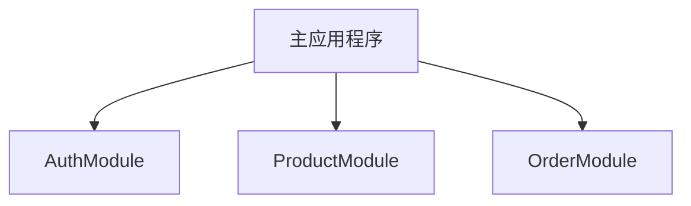

# Swift 模块化

## 介绍

在开发大型应用程序时，代码的组织和管理变得尤为重要。**模块化**是一种将代码分解为独立、可复用单元的设计方法。通过模块化，开发者可以将功能划分为多个独立的模块，每个模块负责特定的功能。这不仅提高了代码的可维护性，还使得团队协作更加高效。

在Swift中，模块化可以通过**模块（Module）**和**框架（Framework）**来实现。模块是一个独立的代码单元，可以包含类、结构体、枚举、协议等。框架则是一个或多个模块的集合，通常用于封装和共享代码。

## 为什么需要模块化？

1. **代码复用**：模块化允许你将通用的功能封装在独立的模块中，从而在不同的项目中复用这些模块。
2. **可维护性**：通过将代码分解为多个模块，每个模块的职责更加明确，便于调试和维护。
3. **团队协作**：模块化使得多个开发者可以同时工作在不同的模块上，减少代码冲突。
4. **测试**：独立的模块更容易进行单元测试，确保每个模块的功能正确。

## 如何实现模块化？

### 1. 创建模块

在Swift中，你可以通过创建**框架（Framework）**来实现模块化。框架是一个独立的代码单元，可以包含多个文件、资源和依赖。

```swift
// 创建一个名为 `Network` 的框架
import Foundation

public class NetworkManager {
    public static func fetchData(from url: URL, completion: @escaping (Data?) -> Void) {
        URLSession.shared.dataTask(with: url) { data, _, _ in
            completion(data)
        }.resume()
    }
}
```

在这个例子中，我们创建了一个名为 `NetworkManager` 的类，并将其封装在 `Network` 框架中。这个类负责从指定的URL获取数据。

### 2. 使用模块

在其他项目中，你可以通过导入模块来使用其中的功能。

```swift
import Network

let url = URL(string: "https://api.example.com/data")!
NetworkManager.fetchData(from: url) { data in
    if let data = data {
        print("Data received: \(data)")
    } else {
        print("Failed to fetch data")
    }
}
```

在这个例子中，我们导入了 `Network` 模块，并使用其中的 `NetworkManager` 类来获取数据。

### 3. 模块间的依赖

在实际开发中，模块之间可能会有依赖关系。例如，`Network` 模块可能依赖于 `Logger` 模块来记录日志。

```swift
// Logger 模块
import Foundation

public class Logger {
    public static func log(_ message: String) {
        print("[LOG] \(message)")
    }
}

// Network 模块
import Logger

public class NetworkManager {
    public static func fetchData(from url: URL, completion: @escaping (Data?) -> Void) {
        Logger.log("Fetching data from \(url)")
        URLSession.shared.dataTask(with: url) { data, _, _ in
            completion(data)
        }.resume()
    }
}
```

在这个例子中，`Network` 模块依赖于 `Logger` 模块。通过这种方式，模块之间的职责更加清晰，代码也更加易于维护。

## 实际案例

假设你正在开发一个电商应用，你需要处理用户认证、商品管理和订单处理等功能。通过模块化，你可以将这些功能划分为不同的模块：

- **AuthModule**：负责用户认证。
- **ProductModule**：负责商品管理。
- **OrderModule**：负责订单处理。

每个模块都可以独立开发和测试，最终通过主应用程序将它们整合在一起。



## 总结

模块化是Swift开发中的一个重要概念，它能够显著提升代码的可维护性、可复用性和团队协作效率。通过将功能划分为独立的模块，你可以更好地组织代码，减少重复劳动，并提高开发效率。

## 附加资源

- [Swift官方文档 - 模块和框架](https://developer.apple.com/documentation/swift/imported_c_and_objective-c_apis/importing_swift_into_objective-c)
- [Swift Package Manager](https://swift.org/package-manager/)：用于管理Swift模块和依赖的工具。

## 练习

1. 尝试创建一个名为 `Logger` 的模块，并在另一个模块中使用它来记录日志。
2. 将你的电商应用的功能划分为多个模块，并尝试将它们整合在一起。
