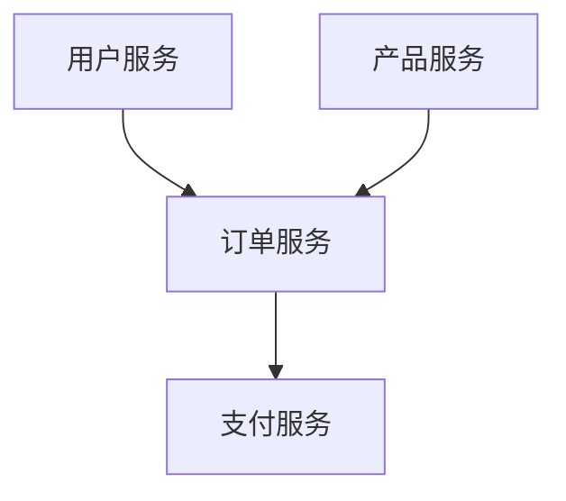

# TypeScript 微服务

## 介绍

微服务架构是一种将应用程序拆分为多个小型、独立服务的软件开发方法。每个服务都运行在自己的进程中，并通过轻量级的通信机制（如 HTTP 或消息队列）与其他服务交互。TypeScript 作为一种强类型的 JavaScript 超集，非常适合用于构建微服务，因为它提供了更好的代码可维护性和开发效率。

在本指南中，我们将逐步介绍如何使用 TypeScript 构建微服务，并通过实际案例展示其应用场景。

## 微服务的基本概念

### 什么是微服务？

微服务是一种架构风格，它将应用程序拆分为多个小型、独立的服务。每个服务都专注于完成特定的业务功能，并且可以独立开发、部署和扩展。微服务之间通过 API 或消息队列进行通信。

### 微服务的优势

- **模块化**：每个服务都是独立的，便于开发和维护。
- **可扩展性**：可以根据需求单独扩展某个服务。
- **技术多样性**：不同的服务可以使用不同的技术栈。
- **容错性**：一个服务的故障不会影响整个系统。

## 使用 TypeScript 构建微服务

### 1. 设置项目

首先，我们需要初始化一个 TypeScript 项目。假设你已经安装了 Node.js 和 npm，可以通过以下命令创建一个新的项目：

```bash
mkdir typescript-microservice
cd typescript-microservice
npm init -y
npm install typescript ts-node @types/node --save-dev
npx tsc --init
```

### 2. 创建第一个微服务

接下来，我们创建一个简单的 HTTP 微服务。我们将使用 `express` 作为 Web 框架。

```bash
npm install express @types/express --save
```

然后，创建一个 `index.ts` 文件：

```typescript
import express, { Request, Response } from 'express';

const app = express();
const port = 3000;

app.get('/', (req: Request, res: Response) => {
  res.send('Hello, this is a microservice!');
});

app.listen(port, () => {
  console.log(`Microservice is running on http://localhost:${port}`);
});
```

运行服务：

```bash
npx ts-node index.ts
```

访问 `http://localhost:3000`，你将看到 "Hello, this is a microservice!"。

### 3. 添加更多服务

假设我们有两个微服务：`user-service` 和 `order-service`。`user-service` 负责用户管理，`order-service` 负责订单管理。

#### user-service

```typescript
import express, { Request, Response } from 'express';

const app = express();
const port = 3001;

app.get('/users', (req: Request, res: Response) => {
  res.json([{ id: 1, name: 'John Doe' }]);
});

app.listen(port, () => {
  console.log(`User service is running on http://localhost:${port}`);
});
```

#### order-service

```typescript
import express, { Request, Response } from 'express';

const app = express();
const port = 3002;

app.get('/orders', (req: Request, res: Response) => {
  res.json([{ id: 1, product: 'Laptop', userId: 1 }]);
});

app.listen(port, () => {
  console.log(`Order service is running on http://localhost:${port}`);
});
```

### 4. 服务间通信

微服务之间通常通过 HTTP 或消息队列进行通信。以下是一个简单的 HTTP 通信示例，`order-service` 调用 `user-service` 获取用户信息。

```typescript
import express, { Request, Response } from 'express';
import axios from 'axios';

const app = express();
const port = 3002;

app.get('/orders', async (req: Request, res: Response) => {
  const { data: users } = await axios.get('http://localhost:3001/users');
  const orders = [{ id: 1, product: 'Laptop', userId: users[0].id }];
  res.json(orders);
});

app.listen(port, () => {
  console.log(`Order service is running on http://localhost:${port}`);
});
```

:::note
在实际生产环境中，建议使用更健壮的通信机制，如 gRPC 或消息队列（如 RabbitMQ、Kafka）。
:::

## 实际案例

假设我们正在构建一个电子商务平台，我们需要以下微服务：

1. **用户服务**：管理用户信息。
2. **订单服务**：处理订单。
3. **产品服务**：管理产品信息。
4. **支付服务**：处理支付。

每个服务都可以独立开发、部署和扩展。例如，当用户下单时，`order-service` 会调用 `user-service` 和 `product-service` 来验证用户和产品信息，然后调用 `payment-service` 完成支付。



## 总结

通过本指南，你已经了解了如何使用 TypeScript 构建微服务架构。我们从基本概念入手，逐步创建了多个微服务，并展示了它们之间的通信方式。微服务架构为现代应用程序提供了更高的灵活性和可扩展性，但也带来了复杂性。因此，在设计微服务时，需要仔细考虑服务边界、通信机制和部署策略。

## 附加资源

- [TypeScript 官方文档](https://www.typescriptlang.org/docs/)
- [Express.js 官方文档](https://expressjs.com/)
- [微服务架构设计模式](https://microservices.io/)

## 练习

1. 尝试创建一个新的微服务 `product-service`，并使其与 `order-service` 通信。
2. 使用消息队列（如 RabbitMQ）替换 HTTP 通信，观察其优缺点。
3. 探索如何在 Kubernetes 上部署这些微服务。

:::tip
在开发微服务时，建议使用 Docker 容器化每个服务，以便于部署和管理。
:::