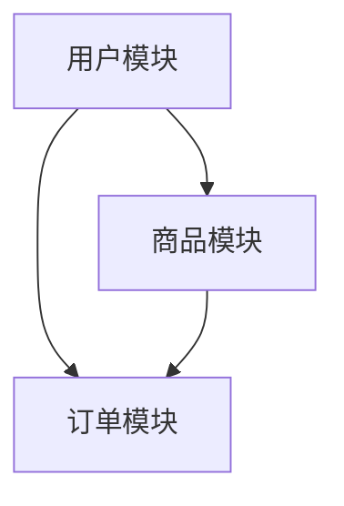

## 介绍

TypeScript 是一种强类型的 JavaScript 超集，近年来在后端开发中得到了广泛应用。它不仅提供了静态类型检查，还增强了代码的可读性和可维护性。在构建后端应用时，合理的架构设计是确保系统高效、可扩展和易于维护的关键。

本文将介绍 TypeScript 后端架构的核心概念，包括分层架构、模块化设计、依赖注入等，并通过实际案例展示如何将这些概念应用到真实项目中。

---

## 分层架构

分层架构是后端开发中最常见的架构模式之一。它将应用程序划分为多个层次，每一层都有明确的职责。常见的分层包括：

1. **表现层（Presentation Layer）**：处理 HTTP 请求和响应。
2. **业务逻辑层（Business Logic Layer）**：实现核心业务逻辑。
3. **数据访问层（Data Access Layer）**：负责与数据库或其他数据源交互。

### 代码示例

以下是一个简单的分层架构示例：

```typescript
// 表现层
import express from 'express';
import { UserService } from './services/UserService';

const app = express();
const userService = new UserService();

app.get('/users/:id', async (req, res) => {
  const userId = parseInt(req.params.id, 10);
  const user = await userService.getUserById(userId);
  res.json(user);
});

// 业务逻辑层
export class UserService {
  constructor(private userRepository: UserRepository) {}

  async getUserById(id: number) {
    return this.userRepository.findById(id);
  }
}

// 数据访问层
export class UserRepository {
  async findById(id: number) {
    // 模拟数据库查询
    return { id, name: 'John Doe' };
  }
}
```

:::note
分层架构的优势在于职责分离，使得代码更易于测试和维护。
:::

---

## 模块化设计

模块化设计是将应用程序划分为多个独立模块的过程。每个模块负责特定的功能，并通过清晰的接口与其他模块交互。这种设计方式有助于提高代码的可复用性和可维护性。

### 实际案例

假设我们正在开发一个电商平台，可以将其划分为以下模块：

- **用户模块**：处理用户注册、登录等功能。
- **商品模块**：管理商品信息。
- **订单模块**：处理订单创建、支付等功能。

每个模块可以独立开发和测试，并通过接口与其他模块交互。



:::tip
模块化设计的关键是定义清晰的接口和依赖关系，避免模块之间的紧耦合。
:::

---

## 依赖注入

依赖注入（Dependency Injection, DI）是一种设计模式，用于管理类之间的依赖关系。通过依赖注入，我们可以将依赖项从类中解耦，从而提高代码的可测试性和灵活性。

### 代码示例

以下是一个使用依赖注入的示例：

```typescript
// 用户服务类
export class UserService {
  constructor(private userRepository: UserRepository) {}

  async getUserById(id: number) {
    return this.userRepository.findById(id);
  }
}

// 用户仓库类
export class UserRepository {
  async findById(id: number) {
    // 模拟数据库查询
    return { id, name: 'John Doe' };
  }
}

// 依赖注入容器
const userRepository = new UserRepository();
const userService = new UserService(userRepository);
```

:::caution
依赖注入虽然提高了代码的灵活性，但也可能引入复杂性。建议在大型项目中使用 DI 框架（如 InversifyJS）来管理依赖。
:::

---

## 实际应用场景

假设我们正在开发一个博客平台的后端系统。以下是该系统的架构设计：

1. **表现层**：使用 Express.js 处理 HTTP 请求。
2. **业务逻辑层**：实现博客文章的创建、编辑、删除等功能。
3. **数据访问层**：使用 TypeORM 与数据库交互。

### 代码示例

```typescript
// 表现层
app.post('/posts', async (req, res) => {
  const { title, content } = req.body;
  const post = await postService.createPost(title, content);
  res.json(post);
});

// 业务逻辑层
export class PostService {
  constructor(private postRepository: PostRepository) {}

  async createPost(title: string, content: string) {
    const post = new Post();
    post.title = title;
    post.content = content;
    return this.postRepository.save(post);
  }
}

// 数据访问层
export class PostRepository {
  async save(post: Post) {
    // 保存到数据库
    return post;
  }
}
```

---

## 总结

TypeScript 后端架构设计是构建高效、可扩展应用的关键。通过分层架构、模块化设计和依赖注入，我们可以创建出易于维护和扩展的系统。本文通过实际案例和代码示例，帮助初学者理解这些概念并应用到实际项目中。

---

## 附加资源与练习

- **资源**：
  - [TypeScript 官方文档](https://www.typescriptlang.org/docs/)
  - [Express.js 官方指南](https://expressjs.com/)
  - [InversifyJS 依赖注入框架](https://inversify.io/)

- **练习**：
  1. 尝试将本文中的代码示例扩展为一个完整的博客平台后端。
  2. 使用依赖注入框架（如 InversifyJS）重构代码，使其更具灵活性。
  3. 设计一个电商平台的后端架构，并实现用户模块和商品模块。