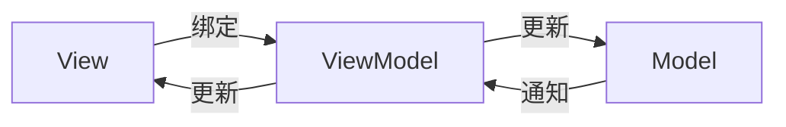

# TypeScript MVVM 模式

MVVM（Model-View-ViewModel）是一种广泛应用于现代前端开发的架构模式。它通过将用户界面（View）与业务逻辑（Model）分离，并通过 ViewModel 进行双向数据绑定，使得开发更加模块化和可维护。本文将详细介绍如何在 TypeScript 中实现 MVVM 模式，并通过实际案例帮助你理解其应用场景。

## 什么是 MVVM 模式？

MVVM 模式由三个核心部分组成：

1. **Model**：表示应用程序的数据和业务逻辑。
2. **View**：用户界面，负责展示数据和与用户交互。
3. **ViewModel**：连接 Model 和 View 的桥梁，负责处理 View 的展示逻辑，并将用户操作反馈给 Model。

MVVM 的核心思想是通过 **数据绑定** 实现 View 和 ViewModel 的自动同步，从而减少手动更新 UI 的代码量。

:::note
MVVM 模式特别适合需要频繁更新 UI 的应用程序，例如单页应用（SPA）。
:::

## MVVM 模式的工作原理

为了更好地理解 MVVM 模式，我们可以通过以下图表展示其工作原理：



1. **View** 通过数据绑定与 **ViewModel** 建立联系。
2. **ViewModel** 监听 **Model** 的变化，并将数据更新到 **View**。
3. 用户操作 **View** 时，**ViewModel** 将操作反馈给 **Model**。
4. **Model** 更新后，通知 **ViewModel**，**ViewModel** 再更新 **View**。

## 在 TypeScript 中实现 MVVM 模式

接下来，我们将通过一个简单的示例来演示如何在 TypeScript 中实现 MVVM 模式。

### 1. 定义 Model

Model 是应用程序的核心数据。以下是一个简单的 `User` 类：

```typescript
class User {
    constructor(public name: string, public age: number) {}
}
```

### 2. 定义 ViewModel

ViewModel 负责将 Model 的数据转换为 View 可以使用的格式。以下是一个 `UserViewModel` 示例：

```typescript
class UserViewModel {
    private user: User;

    constructor(user: User) {
        this.user = user;
    }

    get name(): string {
        return this.user.name;
    }

    set name(value: string) {
        this.user.name = value;
    }

    get age(): number {
        return this.user.age;
    }

    set age(value: number) {
        this.user.age = value;
    }

    get userInfo(): string {
        return `Name: ${this.name}, Age: ${this.age}`;
    }
}
```

### 3. 定义 View

View 是用户界面，通常由 HTML 和 CSS 组成。以下是一个简单的 HTML 示例：

```html
<div id="app">
    <input type="text" id="nameInput" placeholder="Enter name" />
    <input type="number" id="ageInput" placeholder="Enter age" />
    <button id="updateButton">Update</button>
    <p id="userInfo"></p>
</div>
```

### 4. 绑定 View 和 ViewModel

通过 TypeScript 将 View 和 ViewModel 绑定在一起：

```typescript
const user = new User("John Doe", 30);
const userViewModel = new UserViewModel(user);

const nameInput = document.getElementById("nameInput") as HTMLInputElement;
const ageInput = document.getElementById("ageInput") as HTMLInputElement;
const updateButton = document.getElementById("updateButton") as HTMLButtonElement;
const userInfo = document.getElementById("userInfo") as HTMLParagraphElement;

// 初始化 View
nameInput.value = userViewModel.name;
ageInput.value = userViewModel.age.toString();
userInfo.textContent = userViewModel.userInfo;

// 绑定事件
updateButton.addEventListener("click", () => {
    userViewModel.name = nameInput.value;
    userViewModel.age = parseInt(ageInput.value, 10);
    userInfo.textContent = userViewModel.userInfo;
});
```

### 5. 运行示例

当用户在输入框中输入数据并点击“Update”按钮时，`userInfo` 段落会实时更新，展示最新的用户信息。

:::tip
在实际开发中，可以使用框架（如 Angular、Vue.js）来简化 MVVM 模式的实现。
:::

## 实际应用场景

MVVM 模式在前端开发中非常常见，尤其是在以下场景中：

1. **表单处理**：通过 MVVM 模式可以轻松实现表单数据的双向绑定。
2. **实时数据展示**：例如股票价格、天气预报等需要频繁更新的数据。
3. **单页应用（SPA）**：MVVM 模式可以帮助管理复杂的 UI 状态。

## 总结

MVVM 模式通过将 View、ViewModel 和 Model 分离，使得前端开发更加模块化和可维护。在 TypeScript 中，我们可以通过定义 Model、ViewModel 和 View，并使用数据绑定将它们连接起来，从而实现 MVVM 模式。

:::caution
虽然 MVVM 模式有很多优点，但在小型项目中可能会增加复杂性。因此，请根据项目需求选择合适的架构模式。
:::

## 附加资源与练习

1. **练习**：尝试扩展上述示例，添加更多的字段（如邮箱、地址）并实现相应的 ViewModel 和 View。
2. **资源**：
   - [TypeScript 官方文档](https://www.typescriptlang.org/docs/)
   - [MVVM 模式详解](https://en.wikipedia.org/wiki/Model–view–viewmodel)

通过本文的学习，你应该已经掌握了 TypeScript 中 MVVM 模式的基本概念和实现方法。继续实践和探索，你将能够更好地应用这一模式到实际项目中！