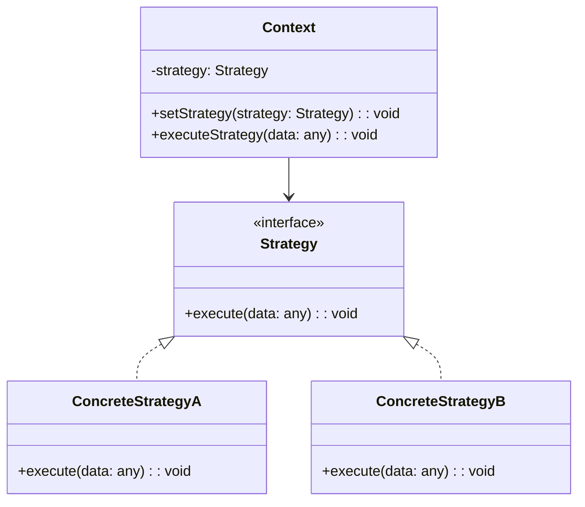

## 介绍

策略模式（Strategy Pattern）是一种行为设计模式，它允许你定义一系列算法或行为，并将它们封装在独立的类中，使得它们可以互换。这种模式使得算法可以独立于使用它的客户端而变化。

在 TypeScript 中，策略模式通常用于需要在运行时选择不同算法或行为的场景。通过将算法封装在独立的类中，你可以轻松地切换不同的策略，而不需要修改客户端代码。

## 策略模式的结构

策略模式通常由以下几个部分组成：

1. **策略接口（Strategy Interface）**：定义了所有具体策略类必须实现的方法。
2. **具体策略类（Concrete Strategies）**：实现了策略接口，提供了具体的算法或行为。
3. **上下文类（Context）**：持有一个策略对象的引用，并在需要时调用策略对象的方法。



## 代码示例

让我们通过一个简单的例子来理解策略模式。假设我们有一个应用程序，需要根据不同的排序策略对数组进行排序。

### 1. 定义策略接口

首先，我们定义一个策略接口 `SortStrategy`，它包含一个 `sort` 方法。

```typescript
interface SortStrategy {
    sort(data: number[]): number[];
}
```

### 2. 实现具体策略类

接下来，我们实现两个具体的排序策略类：`BubbleSortStrategy` 和 `QuickSortStrategy`。

```typescript
class BubbleSortStrategy implements SortStrategy {
    sort(data: number[]): number[] {
        console.log("Sorting using bubble sort");
        // 实现冒泡排序算法
        return data.slice().sort((a, b) => a - b);
    }
}

class QuickSortStrategy implements SortStrategy {
    sort(data: number[]): number[] {
        console.log("Sorting using quick sort");
        // 实现快速排序算法
        return data.slice().sort((a, b) => a - b);
    }
}
```

### 3. 创建上下文类

然后，我们创建一个上下文类 `Sorter`，它持有一个 `SortStrategy` 对象，并在需要时调用其 `sort` 方法。

```typescript
class Sorter {
    private strategy: SortStrategy;

    constructor(strategy: SortStrategy) {
        this.strategy = strategy;
    }

    setStrategy(strategy: SortStrategy): void {
        this.strategy = strategy;
    }

    sort(data: number[]): number[] {
        return this.strategy.sort(data);
    }
}
```

### 4. 使用策略模式

最后，我们可以在客户端代码中使用策略模式来动态切换排序策略。

```typescript
const data = [3, 1, 4, 1, 5, 9, 2, 6, 5, 3, 5];

const sorter = new Sorter(new BubbleSortStrategy());
console.log(sorter.sort(data)); // 使用冒泡排序

sorter.setStrategy(new QuickSortStrategy());
console.log(sorter.sort(data)); // 使用快速排序
```

:::note
在这个例子中，我们通过 `setStrategy` 方法动态地切换了排序策略，而不需要修改 `Sorter` 类的代码。
:::

## 实际应用场景

策略模式在许多实际应用中都非常有用。以下是一些常见的应用场景：

1. **支付系统**：在一个支付系统中，用户可以选择不同的支付方式（如信用卡、支付宝、微信支付等）。每种支付方式可以作为一个策略类，支付系统可以根据用户的选择动态切换支付策略。

2. **游戏开发**：在游戏中，角色的行为可能会根据不同的情境而变化。例如，一个角色在战斗时可能使用攻击策略，而在逃跑时使用防御策略。策略模式可以帮助开发者轻松地切换角色的行为。

3. **数据压缩**：在数据压缩工具中，用户可以选择不同的压缩算法（如 ZIP、RAR、7z 等）。每种压缩算法可以作为一个策略类，工具可以根据用户的选择动态切换压缩策略。

## 总结

策略模式是一种强大的设计模式，它允许你在运行时动态地选择算法或行为。通过将算法封装在独立的类中，你可以轻松地切换不同的策略，而不需要修改客户端代码。这种模式特别适用于需要根据不同条件选择不同行为的场景。

:::tip
**练习**：尝试实现一个简单的计算器应用程序，使用策略模式来支持不同的数学运算（如加法、减法、乘法、除法）。
:::

## 附加资源

- [TypeScript 官方文档](https://www.typescriptlang.org/docs/)
- [设计模式：可复用面向对象软件的基础](https://www.amazon.com/Design-Patterns-Elements-Reusable-Object-Oriented/dp/0201633612)

通过本文的学习，你应该对 TypeScript 中的策略模式有了更深入的理解。希望你能在实际项目中灵活运用这一模式，提升代码的可维护性和扩展性。