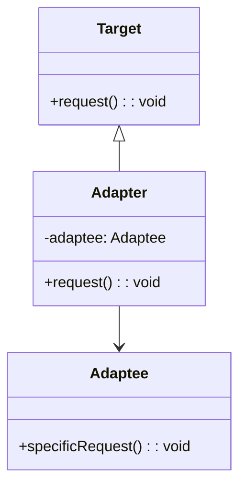

## 什么是适配器模式？

适配器模式（Adapter Pattern）是一种结构型设计模式，它允许两个不兼容的接口能够协同工作。适配器模式通常用于将一个类的接口转换成客户端期望的另一个接口，从而使原本由于接口不兼容而无法一起工作的类能够协同工作。

简单来说，适配器模式就像是一个“转接头”，它可以让原本不匹配的接口变得匹配。

## 适配器模式的结构

适配器模式通常涉及以下角色：

1. **目标接口（Target）**：客户端期望的接口。
2. **适配者（Adaptee）**：需要被适配的类或接口。
3. **适配器（Adapter）**：将适配者的接口转换成目标接口的类。



在上面的类图中，`Target` 是客户端期望的接口，`Adaptee` 是需要被适配的类，`Adapter` 则是将 `Adaptee` 的接口转换成 `Target` 接口的适配器。

## 适配器模式的实现

让我们通过一个简单的例子来理解适配器模式的实现。

### 示例：适配器模式

假设我们有一个旧的类 `OldPrinter`，它有一个方法 `printText`，但我们希望使用一个新的接口 `Printer`，它有一个方法 `print`。我们可以通过适配器模式来实现这一点。

```typescript
// 目标接口
interface Printer {
    print(): void;
}

// 适配者
class OldPrinter {
    printText(text: string): void {
        console.log(`Printing: ${text}`);
    }
}

// 适配器
class PrinterAdapter implements Printer {
    private oldPrinter: OldPrinter;

    constructor(oldPrinter: OldPrinter) {
        this.oldPrinter = oldPrinter;
    }

    print(): void {
        this.oldPrinter.printText("Hello, World!");
    }
}

// 客户端代码
const oldPrinter = new OldPrinter();
const printerAdapter = new PrinterAdapter(oldPrinter);

printerAdapter.print(); // 输出: Printing: Hello, World!
```

在这个例子中，`PrinterAdapter` 将 `OldPrinter` 的 `printText` 方法适配成了 `Printer` 接口的 `print` 方法。

## 实际应用场景

适配器模式在实际开发中有很多应用场景，特别是在以下情况下：

1. **集成第三方库**：当你需要使用一个第三方库，但它的接口与你的代码不兼容时，可以使用适配器模式来适配它的接口。
2. **遗留代码的复用**：当你有一些旧的代码需要在新系统中复用，但它们的接口与新系统不兼容时，可以使用适配器模式来适配这些旧的接口。
3. **接口标准化**：当你需要将多个不同的接口统一成一个标准接口时，可以使用适配器模式。

### 示例：集成第三方库

假设我们有一个第三方库 `ThirdPartyLogger`，它有一个方法 `logMessage`，但我们希望使用一个统一的日志接口 `Logger`，它有一个方法 `log`。我们可以通过适配器模式来实现这一点。

```typescript
// 目标接口
interface Logger {
    log(message: string): void;
}

// 适配者
class ThirdPartyLogger {
    logMessage(message: string): void {
        console.log(`[ThirdPartyLogger] ${message}`);
    }
}

// 适配器
class LoggerAdapter implements Logger {
    private thirdPartyLogger: ThirdPartyLogger;

    constructor(thirdPartyLogger: ThirdPartyLogger) {
        this.thirdPartyLogger = thirdPartyLogger;
    }

    log(message: string): void {
        this.thirdPartyLogger.logMessage(message);
    }
}

// 客户端代码
const thirdPartyLogger = new ThirdPartyLogger();
const loggerAdapter = new LoggerAdapter(thirdPartyLogger);

loggerAdapter.log("This is a log message."); // 输出: [ThirdPartyLogger] This is a log message.
```

在这个例子中，`LoggerAdapter` 将 `ThirdPartyLogger` 的 `logMessage` 方法适配成了 `Logger` 接口的 `log` 方法。

## 总结

适配器模式是一种非常有用的设计模式，它可以帮助我们解决接口不兼容的问题。通过适配器模式，我们可以将旧的接口适配成新的接口，或者将第三方库的接口适配成我们自己的接口，从而实现代码的复用和集成。

在实际开发中，适配器模式的应用场景非常广泛，特别是在需要集成第三方库或复用遗留代码时，适配器模式可以帮助我们轻松地解决接口不兼容的问题。

## 附加资源与练习

- **练习**：尝试为一个已有的类创建一个适配器，使其能够适配一个新的接口。
- **阅读**：了解更多关于适配器模式的内容，可以参考《设计模式：可复用面向对象软件的基础》一书。

:::tip
适配器模式不仅适用于类之间的适配，还可以用于函数、对象等之间的适配。在实际开发中，灵活运用适配器模式可以大大提高代码的可维护性和可扩展性。
:::