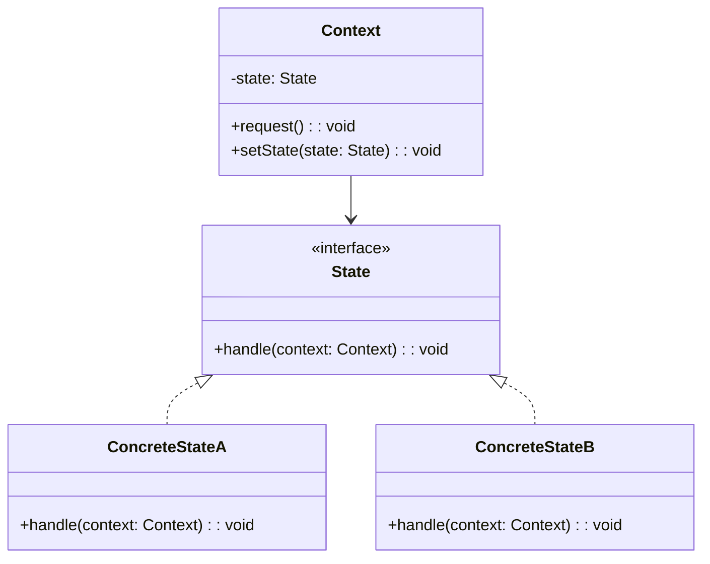

# TypeScript 状态模式

状态模式（State Pattern）是一种行为设计模式，它允许对象在其内部状态改变时改变其行为。这种模式将状态相关的逻辑封装在独立的类中，使得对象的行为可以根据其当前状态动态变化，而不需要使用大量的条件语句。

## 什么是状态模式？

状态模式的核心思想是将对象的状态抽象为一个独立的类，并将与状态相关的行为委托给这些类。这样，当对象的状态发生变化时，它的行为也会随之改变，而不需要修改对象本身的代码。

状态模式通常用于以下场景：
- 对象的行为依赖于它的状态，并且状态可能在运行时频繁变化。
- 对象的状态转换逻辑复杂，且包含大量的条件语句。

## 状态模式的结构

状态模式通常包含以下几个角色：
- **Context（上下文）**：定义客户端感兴趣的接口，并维护一个当前状态的实例。
- **State（状态）**：定义一个接口，用于封装与Context的特定状态相关的行为。
- **ConcreteState（具体状态）**：实现State接口，定义与Context的特定状态相关的行为。



## 代码示例

让我们通过一个简单的例子来理解状态模式。假设我们有一个电灯开关，它有两种状态：开和关。我们可以使用状态模式来实现这个电灯开关的行为。

### 定义状态接口

首先，我们定义一个状态接口 `State`，它包含一个 `handle` 方法，用于处理状态相关的行为。

```typescript
interface State {
    handle(context: Context): void;
}
```

### 实现具体状态类

接下来，我们实现两个具体状态类 `OnState` 和 `OffState`，分别表示电灯的“开”和“关”状态。

```typescript
class OnState implements State {
    handle(context: Context): void {
        console.log("电灯已经打开");
        context.setState(new OffState());
    }
}

class OffState implements State {
    handle(context: Context): void {
        console.log("电灯已经关闭");
        context.setState(new OnState());
    }
}
```

### 定义上下文类

然后，我们定义上下文类 `Context`，它维护一个当前状态的实例，并提供一个 `request` 方法来触发状态转换。

```typescript
class Context {
    private state: State;

    constructor(state: State) {
        this.state = state;
    }

    setState(state: State): void {
        this.state = state;
    }

    request(): void {
        this.state.handle(this);
    }
}
```

### 使用状态模式

最后，我们可以使用状态模式来控制电灯的状态变化。

```typescript
const context = new Context(new OffState());

context.request(); // 输出: 电灯已经关闭
context.request(); // 输出: 电灯已经打开
context.request(); // 输出: 电灯已经关闭
```

:::note
在这个例子中，每次调用 `request` 方法时，电灯的状态都会在“开”和“关”之间切换。状态模式使得状态转换逻辑更加清晰和易于维护。
:::

## 实际应用场景

状态模式在实际开发中有广泛的应用。以下是一些常见的应用场景：

1. **订单状态管理**：在电商系统中，订单的状态可能会经历“待支付”、“已支付”、“已发货”、“已完成”等多个状态。使用状态模式可以方便地管理订单状态的变化。
2. **游戏角色状态**：在游戏中，角色的状态可能会在“站立”、“行走”、“奔跑”、“跳跃”等之间切换。状态模式可以帮助管理这些状态及其对应的行为。
3. **工作流引擎**：在工作流系统中，任务的状态可能会在“待处理”、“处理中”、“已完成”等之间切换。状态模式可以简化状态转换逻辑。

## 总结

状态模式是一种强大的设计模式，它通过将状态相关的逻辑封装在独立的类中，使得对象的行为可以根据其当前状态动态变化。这种模式不仅简化了代码结构，还提高了代码的可维护性和可扩展性。

:::tip
如果你在项目中遇到需要频繁切换状态的情况，不妨考虑使用状态模式来简化你的代码。
:::

## 附加资源与练习

- **练习**：尝试实现一个简单的交通灯系统，使用状态模式来管理交通灯的状态变化（红、黄、绿）。
- **进一步阅读**：你可以阅读《设计模式：可复用面向对象软件的基础》一书，了解更多关于状态模式和其他设计模式的详细信息。

希望本文能帮助你理解并掌握TypeScript中的状态模式。如果你有任何问题或建议，欢迎在评论区留言！