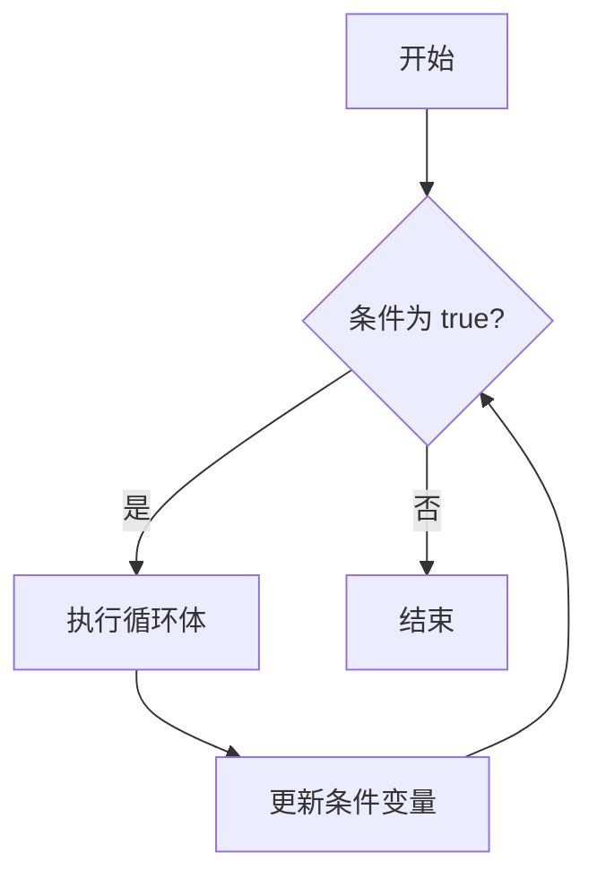

# TypeScript While 循环

在编程中，循环是一种重复执行某段代码的结构。TypeScript 提供了多种循环结构，其中 `while` 循环是最基础且常用的一种。本文将详细介绍 `while` 循环的语法、工作原理以及实际应用场景，帮助你掌握这一重要概念。

## 什么是 While 循环？

`while` 循环是一种条件循环，它会重复执行一段代码，直到指定的条件不再满足为止。与 `for` 循环不同，`while` 循环更适合在不确定循环次数的情况下使用。

### 基本语法

```typescript
while (condition) {
  // 循环体
}
```

- `condition`：一个布尔表达式，每次循环开始前都会检查该条件。如果条件为 `true`，则执行循环体；如果为 `false`，则退出循环。
- `循环体`：需要重复执行的代码块。

### 示例：简单的 While 循环

以下是一个简单的 `while` 循环示例，它会从 1 数到 5：

```typescript
let count = 1;

while (count <= 5) {
  console.log(count);
  count++;
}
```

**输出：**

```
1
2
3
4
5
```

在这个例子中，`count` 的初始值为 1。每次循环开始时，都会检查 `count <= 5` 是否为 `true`。如果是，则执行循环体中的代码，打印当前的 `count` 值，并将 `count` 增加 1。当 `count` 变为 6 时，条件不再满足，循环结束。

:::tip
确保在循环体中更新条件变量，否则可能会导致无限循环。
:::

## While 循环的工作原理

为了更好地理解 `while` 循环的工作原理，我们可以将其分解为以下几个步骤：

1. **条件检查**：在每次循环开始前，检查 `condition` 是否为 `true`。
2. **执行循环体**：如果条件为 `true`，则执行循环体中的代码。
3. **更新条件变量**：在循环体中更新条件变量，以便在下一次循环时重新检查条件。
4. **重复或退出**：重复上述步骤，直到条件为 `false`，循环结束。

### 流程图



## 实际应用场景

`while` 循环在许多实际场景中都非常有用，尤其是在需要重复执行某段代码，但不确定具体次数的情况下。以下是一些常见的应用场景：

### 1. 用户输入验证

在处理用户输入时，通常需要确保输入符合特定要求。`while` 循环可以用来反复提示用户输入，直到输入有效为止。

```typescript
let userInput: string | null = null;

while (!userInput || userInput.trim() === "") {
  userInput = prompt("请输入您的名字：");
}

console.log(`您好，${userInput}！`);
```

在这个例子中，`while` 循环会一直提示用户输入，直到用户输入了非空字符串为止。

### 2. 游戏循环

在游戏开发中，`while` 循环常用于实现游戏的主循环，直到游戏结束为止。

```typescript
let isGameOver = false;

while (!isGameOver) {
  // 更新游戏状态
  // 渲染游戏画面
  // 检查游戏是否结束
  isGameOver = checkGameOver();
}
```

在这个例子中，`while` 循环会一直运行，直到 `isGameOver` 变为 `true`。

### 3. 数据处理

在处理数据时，`while` 循环可以用来遍历数据，直到满足特定条件为止。

```typescript
let data = [1, 2, 3, 4, 5];
let index = 0;

while (index < data.length) {
  console.log(data[index]);
  index++;
}
```

在这个例子中，`while` 循环会遍历数组 `data`，并打印每个元素。

## 总结

`while` 循环是 TypeScript 中一种强大的控制流结构，适用于需要重复执行某段代码，但不确定具体次数的场景。通过本文的学习，你应该已经掌握了 `while` 循环的基本语法、工作原理以及实际应用场景。

:::note
记住，在使用 `while` 循环时，务必确保条件变量能够被正确更新，以避免无限循环。
:::

## 附加资源与练习

- **练习 1**：编写一个 `while` 循环，计算从 1 到 100 的所有整数的和。
- **练习 2**：使用 `while` 循环实现一个简单的猜数字游戏，直到用户猜中为止。

通过不断练习，你将更加熟练地掌握 `while` 循环的使用。祝你学习愉快！