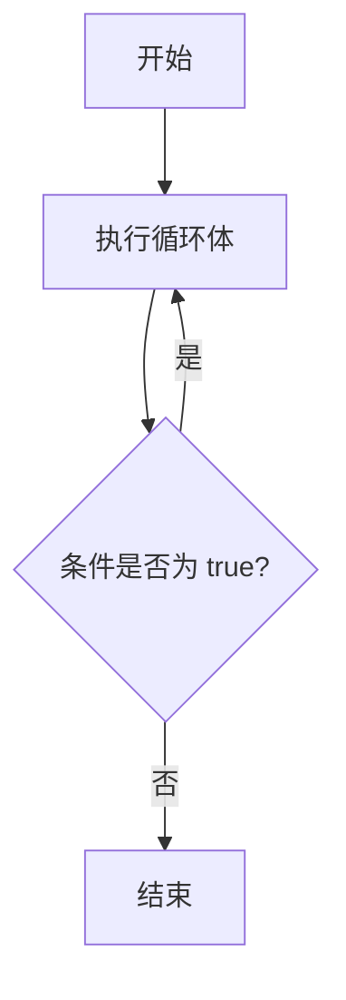

# TypeScript Do While 循环

在编程中，循环是一种重要的控制流结构，用于重复执行一段代码。TypeScript 提供了多种循环结构，其中之一就是 **Do While 循环**。本文将详细介绍 Do While 循环的语法、工作原理以及实际应用场景，帮助你更好地理解和掌握这一概念。

## 什么是 Do While 循环？

Do While 循环是一种后测试循环，这意味着它会先执行循环体中的代码，然后再检查循环条件。如果条件为 `true`，循环会继续执行；如果条件为 `false`，循环将终止。与 `while` 循环不同，`do while` 循环至少会执行一次，即使条件一开始就不满足。

### 语法

```typescript
do {
    // 循环体
} while (条件);
```

- **循环体**：需要重复执行的代码块。
- **条件**：一个布尔表达式，决定循环是否继续执行。

## 工作原理

Do While 循环的执行流程如下：

1. 首先执行循环体中的代码。
2. 然后检查条件是否为 `true`。
3. 如果条件为 `true`，返回步骤 1；如果条件为 `false`，退出循环。



## 代码示例

以下是一个简单的 TypeScript Do While 循环示例：

```typescript
let count: number = 1;

do {
    console.log(`Count is: ${count}`);
    count++;
} while (count <= 5);
```

**输出：**

```
Count is: 1
Count is: 2
Count is: 3
Count is: 4
Count is: 5
```

在这个示例中，循环体首先执行一次，然后检查 `count` 是否小于或等于 5。如果条件为 `true`，循环继续执行，直到 `count` 的值超过 5。

## 实际应用场景

### 1. 用户输入验证

Do While 循环非常适合用于用户输入验证，因为它至少会执行一次，确保用户有机会输入数据。

```typescript
let userInput: string;

do {
    userInput = prompt("请输入 'yes' 或 'no':") || "";
} while (userInput !== "yes" && userInput !== "no");

console.log(`你输入的是: ${userInput}`);
```

在这个例子中，程序会不断提示用户输入，直到用户输入 `"yes"` 或 `"no"` 为止。

### 2. 游戏循环

在游戏开发中，Do While 循环可以用于实现游戏的主循环，确保游戏逻辑至少执行一次。

```typescript
let isGameOver: boolean = false;
let playerHealth: number = 100;

do {
    console.log(`玩家生命值: ${playerHealth}`);
    playerHealth -= 10; // 模拟玩家受到伤害
    if (playerHealth <= 0) {
        isGameOver = true;
        console.log("游戏结束！");
    }
} while (!isGameOver);
```

**输出：**

```
玩家生命值: 100
玩家生命值: 90
玩家生命值: 80
玩家生命值: 70
玩家生命值: 60
玩家生命值: 50
玩家生命值: 40
玩家生命值: 30
玩家生命值: 20
玩家生命值: 10
游戏结束！
```

在这个例子中，游戏循环会一直执行，直到玩家的生命值降到 0 或以下。

## 总结

Do While 循环是一种非常有用的控制流结构，特别适用于需要至少执行一次循环体的场景。通过本文的学习，你应该已经掌握了 Do While 循环的基本语法、工作原理以及实际应用场景。

:::tip 提示
- 使用 Do While 循环时，确保循环条件最终会变为 `false`，否则会导致无限循环。
- Do While 循环适合用于需要至少执行一次的场景，如用户输入验证或游戏循环。
:::

## 附加资源与练习

为了巩固你对 Do While 循环的理解，建议你尝试以下练习：

1. 编写一个 TypeScript 程序，使用 Do While 循环计算 1 到 10 的和。
2. 修改用户输入验证的示例，使其支持更多的输入选项（如 `"maybe"`）。
3. 尝试在游戏循环示例中添加更多功能，如玩家攻击或恢复生命值。

通过这些练习，你将更加熟练地掌握 Do While 循环的使用。祝你编程愉快！