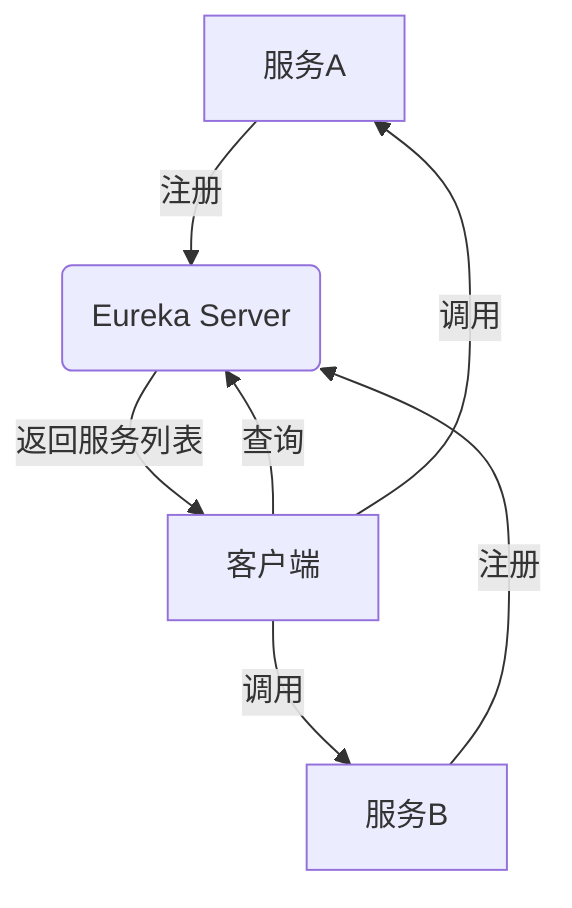

# Eureka 简介

Eureka是Netflix开源的一款服务发现工具，主要用于在微服务架构中实现服务的自动注册与发现。它帮助开发者轻松管理服务实例的动态变化，确保服务之间的通信始终高效可靠。

## 什么是Eureka？

Eureka是Netflix OSS（Open Source Software）的一部分，专门用于解决微服务架构中的服务发现问题。在微服务架构中，服务实例的数量和位置可能会频繁变化，Eureka通过提供一个中心化的服务注册表，帮助客户端动态发现可用的服务实例。

### 核心概念

- **Eureka Server**：服务注册中心，负责管理所有服务实例的注册与发现。
- **Eureka Client**：服务提供者或消费者，负责向Eureka Server注册自身信息，并从Eureka Server获取其他服务实例的信息。

## Eureka 的工作原理

Eureka的工作流程可以分为以下几个步骤：

1. **服务注册**：当一个服务启动时，它会向Eureka Server发送注册请求，包含自身的元数据（如IP地址、端口号、健康状态等）。
2. **服务续约**：注册成功后，服务会定期向Eureka Server发送心跳以保持注册信息的有效性。
3. **服务发现**：客户端通过查询Eureka Server获取所需服务的实例列表，并根据负载均衡策略选择一个实例进行调用。
4. **服务下线**：当服务关闭时，它会向Eureka Server发送下线请求，Eureka Server会将该服务实例从注册表中移除。



## 代码示例

以下是一个简单的Eureka Client注册示例：

```java
@SpringBootApplication
@EnableEurekaClient
public class MyServiceApplication {
    public static void main(String[] args) {
        SpringApplication.run(MyServiceApplication.class, args);
    }
}
```

在这个示例中，`@EnableEurekaClient`注解用于启用Eureka客户端功能，使服务能够自动注册到Eureka Server。

## 实际应用场景

Eureka广泛应用于微服务架构中，特别是在以下场景中表现出色：

1. **动态服务发现**：在服务实例频繁变化的场景中，Eureka能够自动更新服务注册表，确保客户端始终能够找到可用的服务实例。
2. **负载均衡**：Eureka与Ribbon等负载均衡工具结合使用，能够实现客户端负载均衡，提高系统的整体性能。
3. **故障恢复**：当某个服务实例不可用时，Eureka会将其从注册表中移除，避免客户端继续调用该实例。

:::tip
在实际项目中，Eureka通常与Spring Cloud生态系统中的其他组件（如Zuul、Feign等）结合使用，以构建完整的微服务解决方案。
:::

## 总结

Eureka作为服务发现的核心组件，在微服务架构中扮演着至关重要的角色。它通过自动化的服务注册与发现机制，简化了服务之间的通信管理，提高了系统的可靠性和可扩展性。

## 附加资源与练习

- **官方文档**：访问[Eureka GitHub仓库](https://github.com/Netflix/eureka)了解更多详细信息。
- **练习**：尝试在自己的Spring Boot项目中集成Eureka，并观察服务注册与发现的过程。

:::caution
在部署Eureka时，请确保Eureka Server的高可用性，避免单点故障问题。
:::