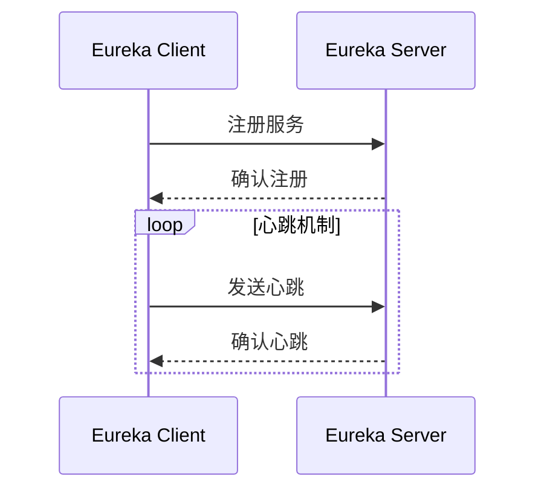

# Eureka 历史与发展

## 介绍

Eureka是Netflix开源的一款服务发现工具，主要用于微服务架构中服务的注册与发现。它的诞生源于Netflix在构建大规模分布式系统时面临的挑战。随着微服务架构的普及，Eureka逐渐成为服务发现领域的标杆工具之一。

## Eureka 的起源

Eureka最初由Netflix开发，旨在解决其内部微服务架构中的服务发现难题。在微服务架构中，服务数量庞大且动态变化，手动管理服务之间的通信变得不切实际。Eureka通过自动化的服务注册与发现机制，简化了这一过程。

:::note
**服务发现**：在分布式系统中，服务发现是指服务实例能够自动注册自己，并且其他服务能够动态地发现并与之通信。
:::

## Eureka 的发展历程

### 1. 早期阶段

Eureka最初是Netflix内部的一个项目，用于解决其流媒体平台中的服务发现问题。随着Netflix的微服务架构逐渐成熟，Eureka的功能也得到了不断的完善。

### 2. 开源与社区贡献

2012年，Netflix将Eureka开源，并迅速获得了广泛的关注。开源后，Eureka吸引了大量开发者参与贡献，功能不断增强，社区生态也逐渐丰富。

### 3. 与Spring Cloud的集成

随着Spring Cloud的兴起，Eureka成为了Spring Cloud生态中的重要组件。Spring Cloud Eureka提供了与Spring Boot的无缝集成，使得开发者能够更轻松地在Spring生态中使用Eureka。

:::tip
**Spring Cloud Eureka**：Spring Cloud Eureka是Spring Cloud对Eureka的封装，提供了更便捷的配置和使用方式。
:::

## Eureka 的核心概念

### 1. 服务注册

在Eureka中，服务实例启动时会向Eureka服务器注册自己。注册信息包括服务名称、IP地址、端口等。

```java
// 示例：Spring Boot应用中的Eureka客户端配置
@SpringBootApplication
@EnableEurekaClient
public class MyServiceApplication {
    public static void main(String[] args) {
        SpringApplication.run(MyServiceApplication.class, args);
    }
}
```

### 2. 服务发现

服务消费者通过Eureka服务器查询可用的服务实例，并根据负载均衡策略选择合适的实例进行通信。

```java
// 示例：通过RestTemplate调用其他服务
@RestController
public class MyController {
    @Autowired
    private RestTemplate restTemplate;

    @GetMapping("/call-service")
    public String callService() {
        return restTemplate.getForObject("http://MY-SERVICE/endpoint", String.class);
    }
}
```

### 3. 心跳机制

Eureka客户端会定期向Eureka服务器发送心跳，以表明自己仍然存活。如果Eureka服务器在一定时间内未收到心跳，则认为该服务实例已下线。



## Eureka 的实际应用场景

### 1. 微服务架构中的服务发现

在微服务架构中，服务数量庞大且动态变化，Eureka能够自动管理服务的注册与发现，极大地简化了服务之间的通信。

### 2. 高可用性

Eureka支持多节点部署，通过集群模式实现高可用性。即使某个Eureka节点宕机，其他节点仍然能够提供服务发现功能。

:::caution
**注意**：在生产环境中，建议至少部署两个Eureka节点以确保高可用性。
:::

### 3. 负载均衡

Eureka与Ribbon等负载均衡工具结合使用，能够实现客户端负载均衡，提高系统的整体性能。

## 总结

Eureka作为一款成熟的服务发现工具，在微服务架构中扮演着至关重要的角色。通过自动化的服务注册与发现机制，Eureka极大地简化了分布式系统的管理。随着Spring Cloud的普及，Eureka在开发者社区中的影响力也在不断扩大。

## 附加资源与练习

- **官方文档**：[Eureka GitHub](https://github.com/Netflix/eureka)
- **Spring Cloud Eureka文档**：[Spring Cloud Eureka](https://spring.io/projects/spring-cloud-netflix)
- **练习**：尝试在一个Spring Boot项目中集成Eureka，并实现服务注册与发现。

:::warning
**挑战**：尝试在一个多节点的Eureka集群中部署服务，并测试其高可用性。
:::