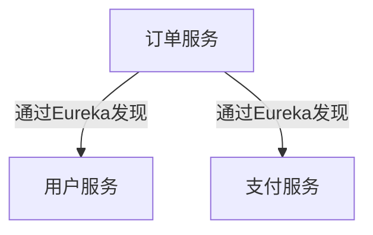

# Eureka 环境搭建

## 介绍

Eureka是Netflix开源的服务发现组件，主要用于微服务架构中服务的注册与发现。它可以帮助微服务之间动态地发现彼此，从而实现服务之间的通信。Eureka由两个主要组件组成：**Eureka Server**（服务端）和**Eureka Client**（客户端）。Eureka Server负责管理所有注册的服务实例，而Eureka Client则负责向Eureka Server注册自己，并从Server获取其他服务的信息。

在本教程中，我们将逐步搭建一个Eureka Server，并演示如何将Eureka Client注册到Server中。

---

## 环境准备

在开始之前，请确保你已经安装了以下工具：

- **Java JDK 8+**：Eureka是基于Java开发的，因此需要Java环境。
- **Maven**：用于构建和管理Java项目。
- **IDE**：如IntelliJ IDEA或Eclipse，用于编写和运行代码。

---

## 搭建Eureka Server

### 1. 创建Maven项目

首先，使用Maven创建一个新的Spring Boot项目。你可以通过以下命令生成项目：

```bash
mvn archetype:generate -DgroupId=com.example -DartifactId=eureka-server -DarchetypeArtifactId=maven-archetype-quickstart -DinteractiveMode=false
```

### 2. 添加Eureka Server依赖

在`pom.xml`文件中，添加Spring Cloud Netflix Eureka Server的依赖：

```xml
<dependencies>
    <dependency>
        <groupId>org.springframework.cloud</groupId>
        <artifactId>spring-cloud-starter-netflix-eureka-server</artifactId>
    </dependency>
    <dependency>
        <groupId>org.springframework.boot</groupId>
        <artifactId>spring-boot-starter-web</artifactId>
    </dependency>
</dependencies>
```

### 3. 配置Eureka Server

在`src/main/resources/application.yml`中，添加以下配置：

```yaml
server:
  port: 8761

eureka:
  client:
    register-with-eureka: false
    fetch-registry: false
```

- `server.port`：指定Eureka Server的端口号，默认是8761。
- `eureka.client.register-with-eureka`：设置为`false`，表示该服务不向自己注册。
- `eureka.client.fetch-registry`：设置为`false`，表示该服务不从自己获取注册表。

### 4. 启用Eureka Server

在Spring Boot的主类中，添加`@EnableEurekaServer`注解以启用Eureka Server：

```java
import org.springframework.boot.SpringApplication;
import org.springframework.boot.autoconfigure.SpringBootApplication;
import org.springframework.cloud.netflix.eureka.server.EnableEurekaServer;

@SpringBootApplication
@EnableEurekaServer
public class EurekaServerApplication {
    public static void main(String[] args) {
        SpringApplication.run(EurekaServerApplication.class, args);
    }
}
```

### 5. 启动Eureka Server

运行`EurekaServerApplication`，访问`http://localhost:8761`，你将看到Eureka Server的管理界面。

---

## 搭建Eureka Client

### 1. 创建Maven项目

同样，使用Maven创建一个新的Spring Boot项目：

```bash
mvn archetype:generate -DgroupId=com.example -DartifactId=eureka-client -DarchetypeArtifactId=maven-archetype-quickstart -DinteractiveMode=false
```

### 2. 添加Eureka Client依赖

在`pom.xml`文件中，添加Spring Cloud Netflix Eureka Client的依赖：

```xml
<dependencies>
    <dependency>
        <groupId>org.springframework.cloud</groupId>
        <artifactId>spring-cloud-starter-netflix-eureka-client</artifactId>
    </dependency>
    <dependency>
        <groupId>org.springframework.boot</groupId>
        <artifactId>spring-boot-starter-web</artifactId>
    </dependency>
</dependencies>
```

### 3. 配置Eureka Client

在`src/main/resources/application.yml`中，添加以下配置：

```yaml
server:
  port: 8080

spring:
  application:
    name: eureka-client

eureka:
  client:
    service-url:
      defaultZone: http://localhost:8761/eureka/
```

- `server.port`：指定Eureka Client的端口号。
- `spring.application.name`：指定服务的名称，Eureka Server将使用该名称来标识服务。
- `eureka.client.service-url.defaultZone`：指定Eureka Server的地址。

### 4. 启用Eureka Client

在Spring Boot的主类中，添加`@EnableEurekaClient`注解以启用Eureka Client：

```java
import org.springframework.boot.SpringApplication;
import org.springframework.boot.autoconfigure.SpringBootApplication;
import org.springframework.cloud.netflix.eureka.EnableEurekaClient;

@SpringBootApplication
@EnableEurekaClient
public class EurekaClientApplication {
    public static void main(String[] args) {
        SpringApplication.run(EurekaClientApplication.class, args);
    }
}
```

### 5. 启动Eureka Client

运行`EurekaClientApplication`，然后回到Eureka Server的管理界面，你将看到`eureka-client`服务已经注册到Eureka Server中。

---

## 实际应用场景

在一个典型的微服务架构中，多个服务需要相互通信。例如，一个订单服务需要调用用户服务来获取用户信息。通过Eureka，订单服务可以动态地发现用户服务的地址，而不需要硬编码服务地址。



---

## 总结

通过本教程，你已经学会了如何搭建Eureka Server和Eureka Client，并了解了Eureka在微服务架构中的作用。Eureka的核心功能是服务的注册与发现，它使得微服务之间的通信更加灵活和高效。

:::tip
如果你想进一步学习Eureka的高级功能，可以探索Eureka的高可用性配置、健康检查机制以及与Spring Cloud Gateway的集成。
:::

---

## 附加资源

- [Spring Cloud Netflix Eureka官方文档](https://spring.io/projects/spring-cloud-netflix)
- [微服务架构设计模式](https://microservices.io/)

## 练习

1. 尝试搭建多个Eureka Client，并观察它们在Eureka Server中的注册情况。
2. 修改Eureka Server的配置，使其支持高可用性（HA）。