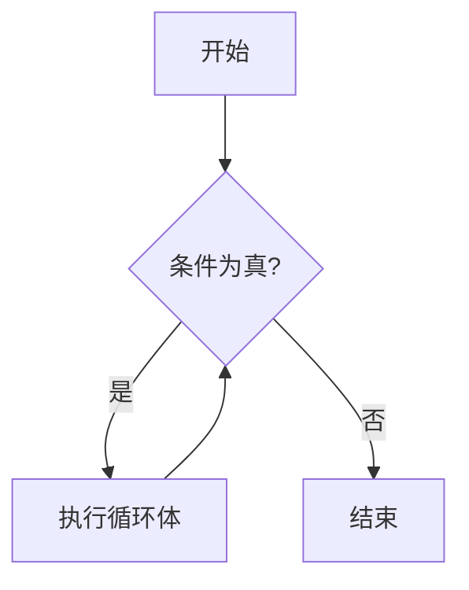

# Eureka While循环

在编程中，循环是一种重要的控制结构，它允许我们重复执行一段代码，直到满足某个条件为止。Eureka中的While循环正是这样一种结构，它会在条件为真时反复执行代码块。本文将详细介绍While循环的工作原理、语法以及实际应用。

## 什么是While循环？

While循环是一种条件循环，它会在指定的条件为真时重复执行代码块。与For循环不同，While循环不需要预先知道循环的次数，它只依赖于条件的真假状态。

### While循环的基本语法

在Eureka中，While循环的基本语法如下：

```eureka
while (条件) {
    // 循环体
}
```

- **条件**：这是一个布尔表达式，每次循环开始前都会检查这个条件。如果条件为真，循环体中的代码将被执行；如果条件为假，循环将终止。
- **循环体**：这是需要重复执行的代码块。

### While循环的执行流程

While循环的执行流程可以用以下步骤来描述：

1. 检查条件是否为真。
2. 如果条件为真，执行循环体中的代码。
3. 执行完循环体后，再次检查条件。
4. 重复上述步骤，直到条件为假，循环结束。



## While循环的代码示例

让我们通过一个简单的例子来理解While循环的工作原理。假设我们想要打印数字1到5，可以使用以下代码：

```eureka
let i = 1;
while (i <= 5) {
    print(i);
    i = i + 1;
}
```

**输出：**
```
1
2
3
4
5
```

在这个例子中，变量`i`初始值为1。每次循环开始时，都会检查`i`是否小于或等于5。如果条件为真，打印`i`的值，并将`i`增加1。当`i`的值超过5时，循环结束。

:::note
注意：在While循环中，确保循环条件最终会变为假，否则循环将无限进行下去，导致程序无法正常结束。
:::

## While循环的实际应用

While循环在实际编程中有广泛的应用场景。以下是一些常见的例子：

### 1. 用户输入验证

在需要用户输入时，可以使用While循环来确保用户输入的数据是有效的。例如，要求用户输入一个正整数：

```eureka
let input = -1;
while (input <= 0) {
    input = readInt("请输入一个正整数：");
}
print("你输入的正整数是：" + input);
```

在这个例子中，程序会不断提示用户输入，直到用户输入一个大于0的整数为止。

### 2. 游戏循环

在游戏开发中，While循环常用于实现游戏的主循环。例如，一个简单的游戏循环可能如下所示：

```eureka
let gameRunning = true;
while (gameRunning) {
    // 更新游戏状态
    updateGameState();
    
    // 渲染游戏画面
    renderGame();
    
    // 检查游戏是否结束
    if (isGameOver()) {
        gameRunning = false;
    }
}
```

在这个例子中，游戏会不断更新状态并渲染画面，直到游戏结束。

## 总结

While循环是Eureka中一种强大的控制流结构，它允许我们在条件为真时重复执行代码块。通过本文的学习，你应该已经掌握了While循环的基本语法、执行流程以及实际应用场景。

:::tip
练习：尝试编写一个While循环，计算1到100之间所有偶数的和。
:::

希望本文对你理解Eureka中的While循环有所帮助。继续练习并探索更多编程概念，你将逐渐成为一名熟练的开发者！