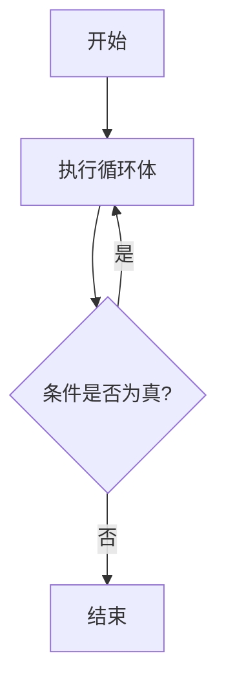

## 介绍

在编程中，循环是一种重要的控制结构，它允许我们重复执行一段代码，直到满足某个条件为止。Eureka 提供了多种循环结构，其中之一就是 **Do-While 循环**。与普通的 While 循环不同，Do-While 循环会先执行一次循环体，然后再检查条件是否满足。这意味着，无论条件如何，循环体至少会执行一次。

在本教程中，我们将深入探讨 Do-While 循环的语法、工作原理以及实际应用场景，帮助你更好地理解和使用它。

## Do-While 循环的语法

在 Eureka 中，Do-While 循环的基本语法如下：

```eureka
do {
    // 循环体
} while (条件);
```

- **`do`**：关键字，表示循环的开始。
- **`{}`**：花括号内的代码是循环体，会被重复执行。
- **`while (条件)`**：在每次循环结束后，检查条件是否为真。如果条件为真，循环会继续执行；否则，循环结束。

:::note
注意：Do-While 循环的循环体至少会执行一次，即使条件一开始就不满足。
:::

## 代码示例

让我们通过一个简单的例子来理解 Do-While 循环的工作原理。假设我们想要让用户输入一个数字，直到输入的数字大于 10 为止。

```eureka
int number;

do {
    print("请输入一个大于 10 的数字: ");
    number = readInt();
} while (number <= 10);

print("你输入的数字是: ", number);
```

### 输入与输出

假设用户依次输入 `5`, `8`, `12`，程序的输出将会是：

```
请输入一个大于 10 的数字: 5
请输入一个大于 10 的数字: 8
请输入一个大于 10 的数字: 12
你输入的数字是: 12
```

在这个例子中，即使用户一开始输入的数字不满足条件（`number <= 10`），循环体仍然会执行，直到用户输入一个大于 10 的数字为止。

## Do-While 循环的工作原理

为了更好地理解 Do-While 循环的工作原理，我们可以用以下流程图来表示：



1. **开始**：程序进入 Do-While 循环。
2. **执行循环体**：无论条件如何，循环体都会至少执行一次。
3. **检查条件**：在循环体执行完毕后，检查条件是否为真。
4. **条件为真**：如果条件为真，程序会回到循环体的开头，继续执行。
5. **条件为假**：如果条件为假，循环结束，程序继续执行循环之后的代码。

## 实际应用场景

Do-While 循环在许多实际场景中都非常有用，尤其是在需要至少执行一次操作的情况下。以下是一些常见的应用场景：

### 1. 用户输入验证

在需要用户输入数据时，通常需要确保输入的数据符合要求。Do-While 循环可以用于反复提示用户输入，直到输入的数据有效为止。

```eureka
string password;

do {
    print("请输入密码: ");
    password = readString();
} while (password != "secret");

print("密码正确，欢迎进入系统！");
```

在这个例子中，程序会不断提示用户输入密码，直到用户输入正确的密码 `"secret"` 为止。

### 2. 游戏循环

在游戏开发中，Do-While 循环可以用于实现游戏的主循环，确保游戏逻辑至少执行一次。

```eureka
bool gameOver = false;

do {
    // 游戏逻辑
    print("游戏进行中...");
    gameOver = checkGameOver();
} while (!gameOver);

print("游戏结束！");
```

在这个例子中，游戏逻辑会至少执行一次，直到 `gameOver` 为 `true` 时，游戏结束。

## 总结

Do-While 循环是 Eureka 中一种非常有用的控制结构，特别适用于需要至少执行一次循环体的场景。通过本教程，你已经了解了 Do-While 循环的语法、工作原理以及实际应用场景。

:::tip
练习：尝试编写一个程序，使用 Do-While 循环来实现一个简单的猜数字游戏。程序随机生成一个数字，用户需要不断猜测，直到猜中为止。
:::

## 附加资源

- [Eureka 官方文档 - 控制流](https://eureka-lang.org/docs/control-flow)
- [编程中的循环结构 - 初学者指南](https://example.com/loops-for-beginners)
