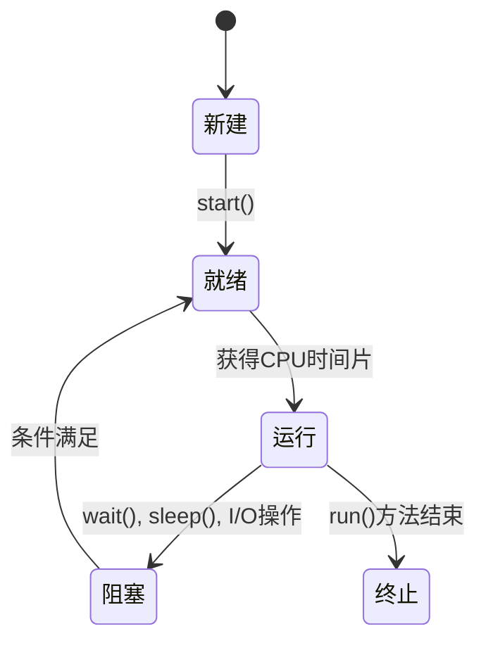

# Eureka 线程基础

在现代编程中，并发编程是一个非常重要的概念，尤其是在处理多任务、高性能计算和实时系统时。Eureka并发编程框架提供了一套强大的工具来帮助开发者轻松实现并发操作。而线程（Thread）是并发编程中最基础的概念之一。本文将带你深入了解线程的基础知识，并通过实际案例展示如何在实际编程中使用线程。

## 什么是线程？

线程是操作系统能够进行运算调度的最小单位。它被包含在进程之中，是进程中的实际运作单位。一个进程可以包含多个线程，这些线程共享进程的内存空间和资源，但每个线程有自己的程序计数器、栈和局部变量。

简单来说，线程是程序执行的一条路径。多线程编程允许程序同时执行多个任务，从而提高程序的效率和响应速度。

## 线程的创建与管理

在Eureka中，线程的创建和管理非常简单。我们可以通过继承 `Thread` 类或实现 `Runnable` 接口来创建线程。

### 通过继承 `Thread` 类创建线程

```java
class MyThread extends Thread {
    public void run() {
        System.out.println("线程正在运行");
    }
}

public class Main {
    public static void main(String[] args) {
        MyThread thread = new MyThread();
        thread.start(); // 启动线程
    }
}
```

**输出：**
```
线程正在运行
```

### 通过实现 `Runnable` 接口创建线程

```java
class MyRunnable implements Runnable {
    public void run() {
        System.out.println("线程正在运行");
    }
}

public class Main {
    public static void main(String[] args) {
        Thread thread = new Thread(new MyRunnable());
        thread.start(); // 启动线程
    }
}
```

**输出：**
```
线程正在运行
```

:::tip
推荐使用实现 `Runnable` 接口的方式创建线程，因为Java不支持多继承，而实现接口的方式更加灵活。
:::

## 线程的生命周期

线程在其生命周期中会经历多个状态。了解这些状态对于编写高效的并发程序非常重要。



- **新建（New）**：线程对象被创建，但尚未启动。
- **就绪（Runnable）**：线程已经启动，等待CPU分配时间片。
- **运行（Running）**：线程正在执行 `run()` 方法。
- **阻塞（Blocked）**：线程因为某些原因（如等待I/O操作）暂时停止执行。
- **终止（Terminated）**：线程执行完毕或被强制终止。

## 线程同步

在多线程环境中，多个线程可能会同时访问共享资源，这可能导致数据不一致的问题。为了解决这个问题，我们需要使用线程同步机制。

### 使用 `synchronized` 关键字

`synchronized` 关键字可以用来修饰方法或代码块，确保同一时间只有一个线程可以执行该代码。

```java
class Counter {
    private int count = 0;

    public synchronized void increment() {
        count++;
    }

    public int getCount() {
        return count;
    }
}

public class Main {
    public static void main(String[] args) throws InterruptedException {
        Counter counter = new Counter();

        Thread t1 = new Thread(() -> {
            for (int i = 0; i < 1000; i++) {
                counter.increment();
            }
        });

        Thread t2 = new Thread(() -> {
            for (int i = 0; i < 1000; i++) {
                counter.increment();
            }
        });

        t1.start();
        t2.start();

        t1.join();
        t2.join();

        System.out.println("最终计数: " + counter.getCount());
    }
}
```

**输出：**
```
最终计数: 2000
```

:::caution
如果不使用 `synchronized` 关键字，最终的计数可能会小于2000，因为两个线程可能会同时访问和修改 `count` 变量，导致数据不一致。
:::

## 实际案例：多线程下载器

假设我们需要编写一个多线程下载器，可以同时下载多个文件。我们可以为每个文件创建一个线程，并行下载。

```java
import java.io.*;
import java.net.URL;

class DownloadTask implements Runnable {
    private String url;
    private String fileName;

    public DownloadTask(String url, String fileName) {
        this.url = url;
        this.fileName = fileName;
    }

    public void run() {
        try (InputStream in = new URL(url).openStream();
             FileOutputStream out = new FileOutputStream(fileName)) {
            byte[] buffer = new byte[1024];
            int bytesRead;
            while ((bytesRead = in.read(buffer)) != -1) {
                out.write(buffer, 0, bytesRead);
            }
            System.out.println("下载完成: " + fileName);
        } catch (IOException e) {
            e.printStackTrace();
        }
    }
}

public class Main {
    public static void main(String[] args) {
        String[] urls = {
            "https://example.com/file1.zip",
            "https://example.com/file2.zip",
            "https://example.com/file3.zip"
        };

        for (int i = 0; i < urls.length; i++) {
            Thread thread = new Thread(new DownloadTask(urls[i], "file" + (i + 1) + ".zip"));
            thread.start();
        }
    }
}
```

**输出：**
```
下载完成: file1.zip
下载完成: file2.zip
下载完成: file3.zip
```

:::note
在实际应用中，我们可能需要限制同时下载的线程数量，以避免占用过多系统资源。可以使用线程池（ThreadPool）来管理线程。
:::

## 总结

线程是并发编程的基础，掌握线程的创建、管理和同步机制对于编写高效并发程序至关重要。通过本文的学习，你应该已经了解了线程的基本概念，并能够使用Eureka框架创建和管理线程。

## 附加资源与练习

- **练习1**：尝试修改多线程下载器，使其能够限制同时下载的线程数量。
- **练习2**：编写一个程序，使用线程池（ThreadPool）来管理线程。
- **附加资源**：
  - [Java线程官方文档](https://docs.oracle.com/javase/tutorial/essential/concurrency/)
  - [Eureka并发编程框架文档](https://eureka-concurrency-docs.com)

通过不断练习和探索，你将能够更加熟练地使用线程进行并发编程。祝你学习愉快！