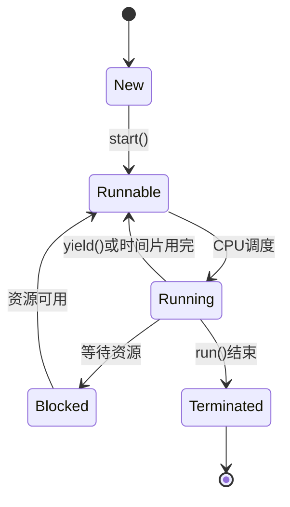

# Eureka 线程创建

在并发编程中，线程是执行任务的基本单位。Eureka作为一个强大的并发编程框架，提供了简单而强大的线程创建和管理机制。本文将详细介绍如何在Eureka中创建线程，并通过代码示例和实际案例帮助你理解这一概念。

## 什么是线程？

线程是操作系统能够进行运算调度的最小单位。它被包含在进程之中，是进程中的实际运作单位。一个进程可以包含多个线程，这些线程共享进程的内存空间和资源，但每个线程有自己的执行路径。

在Eureka中，线程的创建和管理是通过`Thread`类来实现的。通过创建线程，我们可以让多个任务并行执行，从而提高程序的效率。

## 创建线程的基本步骤

在Eureka中创建线程通常包括以下几个步骤：

1. **定义任务**：首先，你需要定义一个任务，这个任务通常是一个实现了`Runnable`接口的类。
2. **创建线程**：然后，你可以通过将任务传递给`Thread`类的构造函数来创建一个线程。
3. **启动线程**：最后，调用线程的`start()`方法来启动线程。

### 代码示例

以下是一个简单的代码示例，展示了如何在Eureka中创建并启动一个线程：

```java
// 定义一个任务
class MyTask implements Runnable {
    @Override
    public void run() {
        System.out.println("线程正在执行任务...");
    }
}

public class Main {
    public static void main(String[] args) {
        // 创建线程
        Thread thread = new Thread(new MyTask());
        
        // 启动线程
        thread.start();
        
        System.out.println("主线程继续执行...");
    }
}
```

**输出：**
```
主线程继续执行...
线程正在执行任务...
```

在这个示例中，我们定义了一个`MyTask`类，它实现了`Runnable`接口，并在`run()`方法中定义了线程要执行的任务。然后，我们创建了一个`Thread`对象，并将`MyTask`对象传递给它。最后，我们调用`start()`方法来启动线程。

:::note
`start()`方法会启动一个新的线程，并调用`run()`方法。如果你直接调用`run()`方法，它会在当前线程中执行，而不会启动新的线程。
:::

## 线程的生命周期

线程在其生命周期中会经历多个状态。了解这些状态对于编写高效的并发程序非常重要。以下是线程的主要状态：

1. **新建（New）**：线程被创建但尚未启动。
2. **就绪（Runnable）**：线程已经启动，正在等待CPU时间片。
3. **运行（Running）**：线程正在执行任务。
4. **阻塞（Blocked）**：线程因为某些原因（如等待I/O操作）暂时停止执行。
5. **终止（Terminated）**：线程执行完毕或被强制终止。



## 实际案例：多线程下载器

假设我们需要编写一个多线程下载器，它可以同时下载多个文件。我们可以为每个文件创建一个线程，让它们并行下载。

```java
class DownloadTask implements Runnable {
    private String fileUrl;

    public DownloadTask(String fileUrl) {
        this.fileUrl = fileUrl;
    }

    @Override
    public void run() {
        System.out.println("开始下载: " + fileUrl);
        // 模拟下载过程
        try {
            Thread.sleep(2000); // 假设下载需要2秒
        } catch (InterruptedException e) {
            e.printStackTrace();
        }
        System.out.println("下载完成: " + fileUrl);
    }
}

public class DownloadManager {
    public static void main(String[] args) {
        String[] fileUrls = {"http://example.com/file1", "http://example.com/file2", "http://example.com/file3"};
        
        for (String url : fileUrls) {
            Thread thread = new Thread(new DownloadTask(url));
            thread.start();
        }
    }
}
```

**输出：**
```
开始下载: http://example.com/file1
开始下载: http://example.com/file2
开始下载: http://example.com/file3
下载完成: http://example.com/file1
下载完成: http://example.com/file2
下载完成: http://example.com/file3
```

在这个案例中，我们为每个文件创建了一个线程，并让它们并行下载。这样可以显著提高下载效率。

## 总结

通过本文，你学习了如何在Eureka中创建线程，了解了线程的生命周期，并通过实际案例展示了线程创建的应用场景。线程是并发编程的基础，掌握线程的创建和管理对于编写高效的并发程序至关重要。

:::tip
如果你对并发编程感兴趣，可以进一步学习线程同步、线程池等高级主题，这些内容将在后续的文章中介绍。
:::

## 附加资源

- [Java并发编程实战](https://book.douban.com/subject/10484692/)
- [Eureka官方文档](https://eureka.example.com/docs)
- [并发编程网](http://ifeve.com/)

## 练习

1. 修改上面的多线程下载器示例，使其能够处理更多的文件（例如10个文件），并观察输出结果。
2. 尝试创建一个线程池，并使用线程池来管理下载任务，而不是为每个文件创建一个新的线程。
